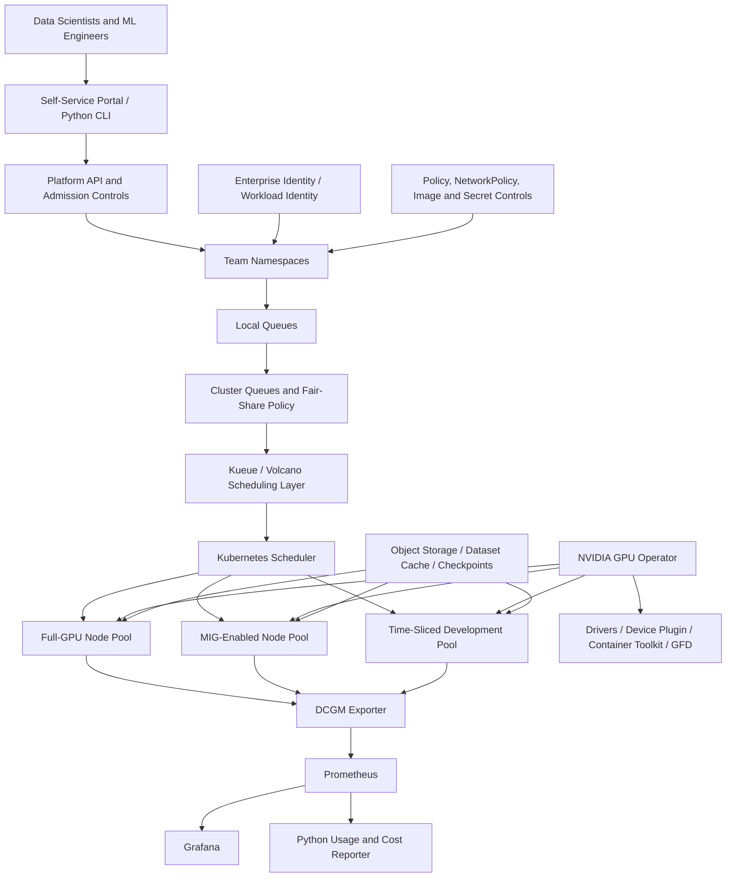

# L2-CS01 — Multi-Tenant Kubernetes GPU Platform

## Executive summary

A fictional enterprise AI lab has purchased a mixed pool of NVIDIA GPUs but is receiving poor business value from the investment. Teams reserve entire GPUs for lightly used notebooks, long-running training jobs block urgent experiments, project owners cannot explain utilization or cost, and platform administrators lack a consistent way to install drivers, schedule workloads, isolate teams and operate the environment.

This case study designs and implements an enterprise Kubernetes GPU platform that offers self-service access while enforcing fair-share allocation, quotas, priority, security, observability and cost accountability.

> **Portfolio status:** foundation and detailed design created. Implementation artifacts are being added incrementally. No licensed Run:ai execution or real multi-GPU performance result is claimed unless corresponding evidence is present.

## Why this case study matters

The platform demonstrates the practical difference between:

- adding GPU nodes to a Kubernetes cluster; and
- operating GPUs as a shared enterprise service.

The second requires driver lifecycle management, device discovery, partitioning, queueing, gang scheduling, pre-emption, workload identity, multi-tenancy, telemetry, chargeback and day-2 operations.

## Synthetic customer scenario

**Customer:** NorthStar Applied AI Research, a fictional regulated enterprise

**Current estate:**

- two on-premises Kubernetes clusters;
- one public-cloud Kubernetes environment for burst demand;
- mixed NVIDIA A100 and L40S capacity;
- twelve data-science teams;
- Jupyter notebooks, batch training and online inference workloads;
- no common GPU scheduling or cost-governance model.

**Business symptoms:**

- GPU utilization frequently below target;
- high-priority fraud and risk experiments wait behind low-value jobs;
- teams request whole GPUs when fractional capacity would be sufficient;
- driver and CUDA versions drift between nodes;
- no per-team showback;
- notebook pods remain active after users stop working;
- platform incidents require manual diagnosis.

## Target outcomes

1. Provide governed self-service GPU access for twelve teams.
2. Establish queue, quota, priority and fair-share behavior.
3. Support full GPU, MIG and time-sliced workload classes.
4. Reduce avoidable idle allocation through policy and telemetry.
5. Automate NVIDIA software installation and upgrades.
6. Protect tenant boundaries and sensitive datasets.
7. Produce per-team utilization and estimated-cost reports.
8. Maintain a CPU-safe local validation path for CI.

## Scope

### Included

- Kubernetes GPU-node architecture;
- NVIDIA GPU Operator lifecycle;
- GPU Feature Discovery and node labels;
- MIG and time-slicing design;
- Kueue and/or Volcano scheduling concepts;
- Run:ai capability mapping without claiming licensed execution;
- namespaces, RBAC, quotas, LimitRanges and NetworkPolicy;
- PriorityClass, pre-emption and gang-scheduling patterns;
- Jupyter, training and inference workload classes;
- DCGM Exporter, Prometheus and Grafana telemetry;
- Python workload submission and utilization-report automation;
- Terraform, Ansible and Helm/Kustomize structure;
- CI validation and synthetic scheduler tests;
- SRE, FinOps, security and operational runbooks.

### Excluded from the initial public implementation

- procurement of physical GPU servers;
- paid Run:ai licenses;
- production identity-provider integration;
- real customer data;
- unapproved public-cloud resource creation;
- unsupported claims about actual GPU savings or performance.

## Personas

| Persona | Need |
|---|---|
| Data scientist | Start notebooks and experiments without infrastructure tickets |
| ML engineer | Submit repeatable training jobs with checkpoints and resource requests |
| Platform engineer | Operate drivers, operators, quotas, upgrades and cluster health |
| Security engineer | Enforce tenant, network, image and identity controls |
| FinOps lead | Attribute GPU consumption and identify idle capacity |
| AI program owner | Prioritize strategic workloads and understand capacity demand |

## Functional requirements

| ID | Requirement | Priority |
|---|---|---|
| FR-01 | Discover GPU nodes and expose standardized labels/capabilities | Must |
| FR-02 | Install and manage NVIDIA drivers, container runtime integration and device plugins declaratively | Must |
| FR-03 | Allow whole-GPU requests | Must |
| FR-04 | Allow approved MIG profiles on supported hardware | Must |
| FR-05 | Allow time-sliced profiles for development workloads | Must |
| FR-06 | Provide project queues and cluster queues | Must |
| FR-07 | Enforce team quotas, borrowing limits and priority | Must |
| FR-08 | Support gang scheduling for distributed jobs | Should |
| FR-09 | Support controlled pre-emption of lower-priority jobs | Should |
| FR-10 | Provide Jupyter notebook, batch training and inference workload templates | Must |
| FR-11 | Record workload owner, team, model, environment and cost-centre metadata | Must |
| FR-12 | Export GPU utilization, memory, temperature, power and error telemetry | Must |
| FR-13 | Generate per-team usage and estimated-cost reports | Must |
| FR-14 | Provide automated validation and policy tests | Must |
| FR-15 | Support cloud burst through an environment overlay | Could |

## Non-functional requirements

| Dimension | Target |
|---|---|
| Availability | Control-plane design aligned to production HA; demo may use a smaller cluster |
| Security | Least privilege, namespace isolation, default-deny network policy, approved images and secrets controls |
| Auditability | Workload requests and queue decisions retain owner/team metadata |
| Scalability | Architecture supports multiple GPU pools and hundreds of queued jobs |
| Portability | Kubernetes-native implementation with cloud-specific overlays |
| Operability | Dashboards, alerts, runbooks and upgrade procedures included |
| Cost | No live cloud cost without explicit approval; estimates separated from measured figures |
| Reproducibility | Declarative configuration, pinned versions and CI validation |

## High-level architecture



## Run:ai capability mapping

The target role explicitly references Run:ai. A licensed Run:ai environment is not assumed in this public portfolio. Instead, the case study demonstrates the underlying concepts with open Kubernetes components and documents the commercial mapping.

| Capability | Open implementation evidence | Run:ai-aligned concept |
|---|---|---|
| Projects/teams | Namespaces, labels and RBAC | Projects/departments |
| Guaranteed quota | Kueue resource groups and nominal quota | Guaranteed GPU allocation |
| Borrowing | Cohorts and borrowing limits | Over-quota/fair-share access |
| Priority | PriorityClass and queue priority | Workload priority |
| Pre-emption | Kubernetes/Kueue/Volcano pre-emption policy | Reclaim capacity for higher priority |
| Gang scheduling | PodGroups or workload admission | All-or-nothing distributed-job scheduling |
| Fractional GPU | NVIDIA time-slicing or MIG | GPU fractions/sharing |
| Visibility | DCGM, Prometheus, Grafana and usage reporter | Utilization and allocation dashboards |
| Workload submission | Python CLI and Kubernetes custom resources | Run:ai CLI/API workflow |

## GPU workload classes

### Class A — Interactive development

- Jupyter or VS Code workspace;
- time-sliced GPU where appropriate;
- idle culling;
- lower scheduling priority;
- maximum runtime and storage quota;
- designed for experimentation, not benchmark claims.

### Class B — Standard model training

- full GPU or approved MIG profile;
- checkpoint storage mandatory;
- normal priority;
- resource request and limit required;
- experiment and dataset metadata required.

### Class C — Distributed training

- multiple workers admitted as a group;
- topology and network considerations;
- checkpoint/restart policy;
- high cost and explicit owner approval;
- queue admission before pod creation.

### Class D — Production inference

- dedicated or protected pool;
- anti-affinity and availability requirements;
- autoscaling and latency SLOs;
- no pre-emption by normal research workloads;
- controlled model-release path.

## MIG versus time-slicing decision

| Consideration | MIG | Time-slicing |
|---|---|---|
| Isolation | Hardware-level partitioning on supported GPUs | Logical sharing; weaker isolation |
| Predictability | Stronger resource predictability | Contention can affect performance |
| Best use | Stable inference, controlled training, regulated workloads | Development, notebooks, low-risk experiments |
| Flexibility | Fixed profiles and reconfiguration process | Easier oversubscription and sharing |
| Operational risk | Profile changes may affect node scheduling | No hard memory isolation between replicas |

The architecture keeps separate node pools so a workload cannot silently move from a strongly isolated class to a weaker sharing model.

## Security architecture

### Identity and access

- federated identity mapped to Kubernetes groups;
- namespace-scoped RoleBindings;
- workload identity for object storage and registries;
- no long-lived cloud keys in notebooks;
- break-glass administration logged and time-bound.

### Workload security

- restricted Pod Security profile;
- non-root containers where supported;
- read-only root filesystem where practical;
- dropped Linux capabilities;
- approved base images and signed artifacts;
- admission checks for mandatory owner/team/cost labels;
- default-deny ingress and egress policy;
- egress allowlists for package and data sources.

### Data protection

- separate raw, curated, checkpoint and model-artifact locations;
- encryption in transit and at rest;
- dataset access through workload identity;
- no sensitive data copied into container images;
- notebook persistent volumes governed by retention policy.

### Supply-chain controls

- dependency and container scanning;
- SBOM generation;
- image signing/verification target state;
- pinned Helm chart and container versions;
- policy checks in pull requests.

## Observability and SRE model

### Metrics

- GPU utilization percentage;
- GPU memory used and free;
- temperature and power;
- XID and ECC errors;
- allocated versus active GPU time;
- queue wait time;
- admitted, pending, pre-empted and failed workloads;
- per-team GPU-hours;
- notebook idle time;
- job completion and retry rate.

### Candidate SLOs

| SLO | Target concept |
|---|---|
| Platform API availability | 99.9% for production environment |
| Standard workload admission | 95% admitted or given actionable status within defined time |
| GPU telemetry freshness | 99% of samples available within monitoring interval |
| Driver/operator upgrade success | Validated canary pool before fleet rollout |
| High-priority queue wait | Tracked separately from normal/best-effort queues |

No production SLO attainment is claimed until deployed evidence exists.

## FinOps model

The unit of accountability is **GPU-hour by workload class**, augmented with storage and data-transfer estimates.

```text
Estimated workload cost =
  allocated GPU hours × GPU hourly rate
  + CPU/memory support cost
  + persistent storage
  + object storage requests
  + data transfer
  + platform overhead allocation
```

Reports distinguish:

- requested GPU time;
- scheduled/allocated time;
- active utilization time;
- idle allocated time;
- failed-job consumption;
- cost by team, environment, model and workload class.

## Planned repository structure

```text
cs01-kubernetes-gpu-platform/
├── README.md
├── ARCHITECT-GUIDE.md
├── docs/
│   ├── 01-requirements/
│   ├── 02-proposal/
│   ├── 03-solution-design/
│   ├── 04-security/
│   ├── 05-finops-sre/
│   ├── 06-implementation/
│   └── 07-demo/
├── src/gpu_platform_cli/
├── tests/
├── kubernetes/
│   ├── base/
│   ├── gpu-operator/
│   ├── scheduling/
│   ├── tenants/
│   ├── policies/
│   └── workloads/
├── helm/
├── terraform/
├── ansible/
├── observability/
├── evidence/
└── .github/workflows/
```

## Implementation backlog

### Phase 1 — CPU-safe platform simulation

- typed Python domain model for teams, queues, workloads and GPU profiles;
- admission/fair-share simulation;
- CLI to submit synthetic jobs;
- quota, priority and borrowing tests;
- usage and estimated-cost report;
- deterministic evidence output for CI.

### Phase 2 — Kubernetes manifests

- namespaces, RBAC, quotas and LimitRanges;
- PriorityClasses;
- Kueue or Volcano resources;
- notebook, training and inference sample workloads;
- default-deny and allowed-flow NetworkPolicies;
- policy checks for labels and resource requests.

### Phase 3 — GPU integration

- GPU Operator values;
- GPU Feature Discovery checks;
- MIG profiles and node labels;
- time-slicing configuration;
- DCGM dashboards and alerts;
- compatibility and upgrade runbook.

### Phase 4 — cloud/hybrid overlays

- Terraform module examples for a managed Kubernetes GPU node pool;
- Ansible preparation for on-premises GPU nodes;
- environment overlays and cost estimates;
- cloud-burst queue design.

## Acceptance criteria

- All YAML parses and passes schema/policy checks.
- Python package passes formatting, lint, type and unit tests.
- Synthetic scheduler test proves quota, borrowing, priority and rejection behavior.
- A team cannot request an undefined GPU profile.
- Every workload requires owner, team, environment and cost-centre metadata.
- Default-deny NetworkPolicy is present for each tenant namespace.
- GPU telemetry architecture and alert thresholds are documented.
- No secret, real account identifier or customer data is committed.
- Any unexecuted GPU/cloud capability is labelled accordingly.

## Evidence to capture

- CI run showing Python and manifest validation;
- sample queue/admission report;
- sample per-team GPU-hour report;
- architecture diagram;
- policy test output;
- example workload manifests;
- optional screenshots from a local Kubernetes demonstration;
- GPU validation only when suitable hardware is available.

## Interview demonstration

1. Start with the business problem: GPU scarcity is often an allocation and operating-model problem, not only a hardware problem.
2. Explain the three pool types: full GPU, MIG and time-sliced.
3. Walk through queue, quota, borrowing, priority and pre-emption.
4. Submit a synthetic workload through the Python CLI.
5. Show why the workload was admitted, queued or rejected.
6. Show usage and estimated-cost output.
7. Explain how the open scheduling implementation maps to Run:ai.
8. Close with security, upgrades, telemetry, incident response and FinOps.

## Profile proof statement

> Designed and implemented a multi-tenant Kubernetes GPU-platform blueprint with NVIDIA GPU Operator, MIG/time-slicing classes, Run:ai-aligned fair-share scheduling, quotas, priority and pre-emption, Python workload automation, DCGM observability, Terraform/Ansible foundations, security controls and GPU-hour showback. Public evidence clearly separates local simulation, validated manifests and hardware-dependent execution.

## Questions this case study prepares me to answer

- Why is the default Kubernetes scheduler insufficient for some AI training environments?
- How do Run:ai, Kueue and Volcano concepts overlap and differ?
- When would you use MIG versus time-slicing?
- How do you prevent notebooks from wasting GPU capacity?
- How do gang scheduling and pre-emption work for distributed training?
- Which metrics indicate true GPU efficiency rather than simple allocation?
- How would you upgrade NVIDIA drivers and the GPU Operator safely?
- How do you isolate teams and datasets in a shared AI platform?
- How would you build showback or chargeback for GPU use?
- What can be tested without a physical GPU, and what cannot?
