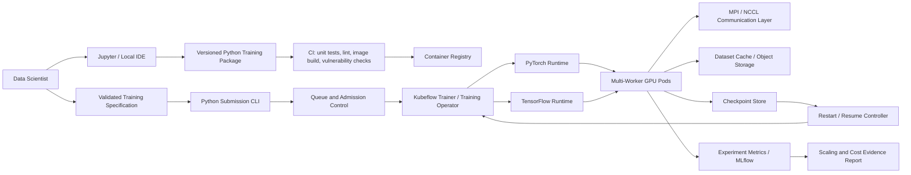

# L2-CS02 — Distributed PyTorch and TensorFlow Training Factory

## Executive summary

A fictional enterprise data-science organization has many notebooks and single-GPU training scripts but no reliable way to scale experiments across multiple GPUs or nodes. Every team handles dependencies, dataset access, checkpointing, retries and resource selection differently. Large jobs fail late, expensive GPU capacity is wasted, and results are difficult to reproduce.

This case study builds a distributed-training factory that turns an approved experiment specification into a repeatable PyTorch or TensorFlow training job with validated resources, queue admission, dataset staging, checkpoint recovery, experiment tracking and evidence of scaling behavior.

> **Portfolio status:** detailed requirements and implementation blueprint created. CPU-safe training and orchestration examples will be used for CI. Multi-GPU and multi-node results are not claimed without corresponding hardware evidence.

## Synthetic customer scenario

**Customer:** Meridian Risk Analytics, a fictional financial-services research organization

**Workloads:**

- computer-vision classification;
- tabular fraud models;
- natural-language classification;
- optional LLM fine-tuning experiments;
- nightly model retraining;
- ad hoc research jobs.

**Current problems:**

- scripts work only on a researcher's laptop or one GPU;
- dependency drift makes experiments irreproducible;
- no standard checkpoint or resume behavior;
- teams over-request GPUs because sizing guidance is absent;
- distributed jobs deadlock or fail because topology and rendezvous are misunderstood;
- datasets are repeatedly copied, increasing startup time and storage cost;
- no record connects code, data, configuration, metrics and model artifacts.

## Business objectives

1. Provide a supported path from single-process training to distributed execution.
2. Standardize PyTorch and TensorFlow job packaging.
3. Separate framework logic from platform configuration.
4. Enforce checkpointing and recoverability for expensive jobs.
5. Capture code, data, environment and metric lineage.
6. Measure scaling efficiency rather than assuming more GPUs are always better.
7. Support on-premises and cloud Kubernetes targets.
8. Keep basic validation executable without GPU infrastructure.

## Scope

### Included

- Python training package structure;
- PyTorch single-process and DistributedDataParallel patterns;
- TensorFlow single-worker and MultiWorkerMirroredStrategy patterns;
- Kubeflow Trainer / legacy Training Operator job examples as appropriate;
- MPI/NCCL architecture considerations;
- Kueue/Volcano-compatible queue admission;
- dataset staging and cache patterns;
- checkpoint, restart and interruption handling;
- experiment metadata and optional MLflow integration;
- hyperparameter-search blueprint;
- Terraform, Kubernetes and CI scaffolds;
- benchmark harness and evidence taxonomy;
- security, SRE and FinOps treatment.

### Excluded initially

- publication of a proprietary model;
- real financial/customer data;
- unapproved GPU cloud deployment;
- claims of specific multi-GPU speedup without measured output;
- production-grade feature engineering beyond what is needed to prove platform behavior.

## Personas

| Persona | Need |
|---|---|
| Data scientist | Minimal changes to move a script into a managed training job |
| ML engineer | Reusable components, packaging, lineage and promotion metadata |
| Platform engineer | Predictable resources, scheduling, retries and observability |
| Security engineer | Approved images, data access and workload identity |
| FinOps lead | Cost per experiment and scaling-efficiency evidence |
| AI lead | Reliable throughput and governance across research teams |

## Functional requirements

| ID | Requirement | Priority |
|---|---|---|
| FR-01 | Run the same training package in local CPU mode and managed cluster mode | Must |
| FR-02 | Support PyTorch single-process training | Must |
| FR-03 | Support PyTorch DDP configuration | Must |
| FR-04 | Support TensorFlow single-worker training | Must |
| FR-05 | Support TensorFlow multi-worker configuration | Must |
| FR-06 | Package jobs as Kubernetes-native training resources | Must |
| FR-07 | Store checkpoints at configurable intervals | Must |
| FR-08 | Resume from the latest valid checkpoint | Must |
| FR-09 | Capture run parameters, commit SHA, data version and metrics | Must |
| FR-10 | Enforce resource and queue metadata before submission | Must |
| FR-11 | Produce scaling-efficiency and estimated-cost reports | Must |
| FR-12 | Support hyperparameter-search integration | Should |
| FR-13 | Support interrupted/spot instance recovery | Should |
| FR-14 | Provide topology-aware and gang-scheduling design | Should |
| FR-15 | Provide NeMo-oriented fine-tuning extension design | Could |

## Non-functional requirements

- deterministic seed and reproducibility controls;
- typed configuration and schema validation;
- structured logs and machine-readable metrics;
- no credentials in code or notebooks;
- portable storage interfaces;
- explicit framework/container compatibility matrix;
- graceful failure when requested GPU capabilities are unavailable;
- CI must not require a GPU for core tests.

## High-level architecture



## PyTorch execution model

### Local mode

- CPU-compatible sample dataset;
- one process;
- deterministic seed;
- short epochs suitable for CI;
- checkpoint creation and recovery test;
- metrics written as JSON.

### Single-GPU mode

- CUDA availability check;
- mixed-precision option;
- explicit batch size and memory limits;
- no assumption that GPU execution exists in CI.

### DistributedDataParallel mode

- one process per GPU;
- rank, local rank and world size handled through environment/configuration;
- collective communication through NCCL for GPU targets or Gloo for CPU-safe testing;
- distributed sampler;
- synchronized validation metrics;
- rank-zero checkpoint and artifact writing;
- clean shutdown and failure propagation.

## TensorFlow execution model

### Local/single-worker mode

- CPU-safe model and synthetic dataset;
- saved checkpoint and metric output;
- reproducible configuration.

### Multi-worker mode

- `TF_CONFIG` generated from the training specification;
- `MultiWorkerMirroredStrategy` example;
- shared or object-backed checkpoint location;
- chief-worker responsibility documented;
- worker restart behavior considered.

## Distributed-training design decisions

### Why not add GPUs automatically?

Scaling benefit depends on model compute intensity, batch size, communication volume, data throughput and network topology. The platform therefore measures:

```text
speedup = single-worker duration / distributed duration
scaling efficiency = speedup / number of workers
```

A job should not be promoted to larger configurations merely because capacity exists.

### Collective communication

- NCCL is the preferred collective layer for NVIDIA GPU workloads;
- Gloo supports CPU-safe distributed tests;
- MPI may bootstrap multi-process/multi-node jobs and integrates with HPC patterns;
- topology, network bandwidth and placement materially affect training efficiency;
- timeouts and diagnostics are configured to avoid indefinite hangs.

### Gang scheduling

All required workers should be admitted together for tightly coupled training. Partial startup can waste resources or cause timeouts. The case study therefore maps distributed jobs to Kueue/Volcano workload groups and documents minimum-resource admission.

### Checkpointing

Checkpoint frequency balances recovery-point loss against storage and I/O overhead. The design records:

- model and optimizer state;
- epoch/step;
- random-number-generator state where practical;
- training configuration;
- code revision;
- dataset identifier;
- framework/runtime version.

## Dataset and I/O architecture

| Layer | Purpose |
|---|---|
| Source object storage | Authoritative versioned synthetic datasets |
| Staging job | Validates checksum, schema and access before training |
| Node/local cache | Reduces repeated remote reads where supported |
| Distributed cache option | Optimizes large-scale access in an advanced deployment |
| Checkpoint store | Durable recovery artifacts, separate from ephemeral pod storage |
| Model artifact store | Final candidate model and evaluation package |

Data locality is included in placement and cost decisions. A GPU waiting for data is an expensive idle resource.

## Training specification

A declarative specification will capture:

```yaml
metadata:
  experiment: fraud-classifier-v1
  owner: team-risk-ai
  cost_center: CC-1001
framework: pytorch
runtime:
  workers: 2
  gpus_per_worker: 1
  cpu_per_worker: 4
  memory_per_worker: 16Gi
training:
  epochs: 10
  batch_size: 128
  learning_rate: 0.001
checkpoint:
  enabled: true
  interval_steps: 100
  resume: latest
scheduling:
  queue: normal-training
  priority: standard
  max_runtime_minutes: 240
artifacts:
  dataset_uri: synthetic://fraud/v1
  output_uri: object://training-artifacts/fraud-classifier-v1
```

The CLI validates this specification before generating platform resources.

## Kubeflow integration

The case study uses Kubernetes-native training abstractions to keep framework topology out of hand-written pod manifests.

Planned evidence includes:

- PyTorch training resource;
- TensorFlow training resource or current Trainer runtime equivalent;
- queue labels and resource requests;
- pod-template security settings;
- checkpoint volume/object-store configuration;
- Prometheus metric exposure;
- failure-policy and retry examples;
- optional Kueue admission integration.

## MLOps integration boundary

This project focuses on training execution. It emits enough metadata for L2-CS03 to manage experiment tracking and promotion:

- run ID;
- code commit;
- container digest;
- dataset version/checksum;
- parameters;
- training and validation metrics;
- checkpoint and model artifact URI;
- resource configuration;
- duration and estimated cost;
- result status.

## Security controls

- workload identity instead of embedded storage credentials;
- approved container base images;
- dependency and image scanning;
- signed-model and artifact provenance target state;
- namespace isolation and NetworkPolicy;
- dataset access scoped by team and environment;
- restricted pod security context;
- protected checkpoint/model locations;
- no arbitrary privileged containers;
- audit metadata mandatory on every job.

## Observability

### Platform metrics

- queue wait time;
- pod startup time;
- worker readiness time;
- retry count;
- failed worker/rank;
- GPU utilization and memory;
- data-loader throughput;
- checkpoint duration;
- network/collective communication indicators.

### Training metrics

- training and validation loss;
- accuracy or task metric;
- examples/second;
- step time;
- epoch time;
- learning rate;
- gradient/overflow indicators where applicable.

### Evidence report

The benchmark harness produces a table like:

| Run | Workers | Device | Duration | Throughput | Speedup | Efficiency | Estimated cost | Evidence label |
|---|---:|---|---:|---:|---:|---:|---:|---|
| baseline | 1 | CPU/local | measured | measured | 1.0 | 1.0 | synthetic | Locally tested |
| distributed-cpu | 2 | CPU/Gloo | measured | measured | calculated | calculated | synthetic | Locally tested |
| gpu-target | 2 | GPU/NCCL | — | — | — | — | estimate only | Requires GPU |

## Reliability and failure handling

- fail fast on invalid topology;
- bounded retry count;
- checkpoint before planned termination where possible;
- resume test validates state continuity;
- stale/incomplete checkpoint detection;
- orphaned resource cleanup;
- timeout for rendezvous and collectives;
- pod and node failure runbooks;
- spot/pre-emptible node interruption strategy;
- model artifact written only after successful evaluation.

## FinOps model

The training report calculates:

```text
experiment cost estimate =
  worker count × runtime × GPU rate
  + CPU/memory support
  + dataset/checkpoint storage
  + data transfer
  + orchestration overhead allocation
```

The decision metric is not only lowest runtime; it includes cost per successful experiment and scaling efficiency.

## Planned repository structure

```text
cs02-distributed-training-factory/
├── README.md
├── ARCHITECT-GUIDE.md
├── pyproject.toml
├── src/training_factory/
│   ├── cli.py
│   ├── config.py
│   ├── submit.py
│   ├── reporting.py
│   └── frameworks/
│       ├── pytorch_train.py
│       └── tensorflow_train.py
├── tests/
├── notebooks/
├── kubernetes/
│   ├── pytorch/
│   ├── tensorflow/
│   ├── queueing/
│   └── policies/
├── pipelines/
├── terraform/
├── observability/
├── evidence/
└── .github/workflows/
```

## Implementation phases

### Phase 1 — local training proof

- synthetic classification dataset;
- PyTorch CPU training;
- TensorFlow CPU training;
- typed configuration;
- checkpoint creation and resume tests;
- metric and evidence JSON.

### Phase 2 — distributed CPU-safe proof

- PyTorch DDP with Gloo;
- worker launch script;
- aggregation and failure propagation;
- scaling report with honest limitations.

### Phase 3 — Kubernetes resources

- Kubeflow Trainer/Operator manifests;
- queue admission and gang-scheduling metadata;
- object/checkpoint storage configuration;
- security context and policies;
- schema validation.

### Phase 4 — GPU/HPC target

- NCCL settings and diagnostics;
- GPU images and compatibility matrix;
- topology considerations;
- optional NeMo fine-tuning extension;
- hardware evidence only when executed.

## Acceptance criteria

- local PyTorch and TensorFlow training complete successfully;
- checkpoint/restart test proves recovery;
- configuration errors fail before resource submission;
- distributed CPU test completes or produces actionable failure evidence;
- Kubernetes resources validate structurally;
- framework and CUDA compatibility is documented;
- benchmark report distinguishes measured and estimated values;
- no confidential data or credentials are present;
- profile claims link to evidence.

## Interview demonstration

1. Show the same training package running locally and represented as a cluster job.
2. Explain DDP rank/world-size and TensorFlow worker configuration.
3. Explain why gang scheduling matters.
4. Trigger or show a checkpoint-resume test.
5. Review scaling-efficiency output and explain when additional GPUs are uneconomic.
6. Discuss NCCL, topology, data locality and failure diagnosis.
7. Show how run metadata feeds the MLOps platform.

## Profile proof statement

> Built a portable distributed-training factory with typed Python configuration, PyTorch DDP and TensorFlow multi-worker patterns, Kubeflow-native job specifications, queue/gang-scheduling integration, checkpoint recovery, experiment metadata, CI tests and scaling/cost evidence. GPU/NCCL execution is explicitly separated from locally verified CPU-safe behavior.

## Questions this case study prepares me to answer

- How does PyTorch DDP work and why is one process per GPU common?
- When would you use NCCL, Gloo or MPI?
- How does TensorFlow configure multi-worker training?
- What is gang scheduling and why does distributed training need it?
- How do you design checkpointing for pre-emptible capacity?
- Why can adding GPUs make training more expensive without useful speedup?
- How do data loading and network topology limit GPU efficiency?
- How do you keep distributed experiments reproducible?
- Which parts can be validated without GPU hardware?
