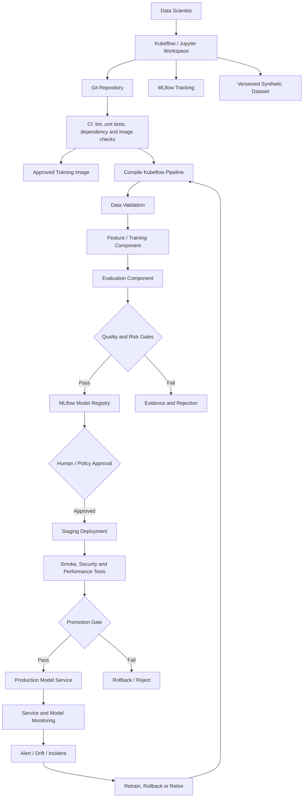

# L2-CS03 — Jupyter-to-Production MLOps Platform

## Executive summary

A fictional enterprise has hundreds of notebooks but very few models reaching dependable production. Experiments depend on local environments, datasets are not versioned consistently, metrics are copied into presentations, model approvals happen in email, and production teams cannot reconstruct how a model was created.

This case study creates a governed Jupyter-to-production platform using Kubernetes-native workspaces, MLflow experiment tracking and registry concepts, Kubeflow Pipelines, declarative CI/CD promotion, security gates, observability and rollback.

> **Portfolio status:** detailed lifecycle and implementation blueprint created. The public implementation will use synthetic data and CPU-safe models so the complete experiment-to-registry path can be validated without specialized hardware.

## Synthetic customer scenario

**Customer:** Atlas Insurance Analytics, a fictional regulated insurer

**Use case:** claims-triage risk classification using synthetic tabular and text-derived features

**Current problems:**

- notebooks contain hidden state and manual preprocessing;
- package versions differ between researchers;
- model metrics cannot be reproduced;
- no central registry or stage transitions;
- data scientists have broad credentials;
- security, bias and performance reviews happen late;
- deployment and rollback are manual;
- production monitoring is not connected to the training run.

## Business objectives

1. Make notebook experiments reproducible.
2. Capture lineage from code and data through model deployment.
3. Establish a governed model registry and approval process.
4. Convert notebooks into reusable pipeline components.
5. Automate testing, packaging, promotion and rollback.
6. Separate data-science freedom from production controls.
7. Provide audit evidence appropriate for a regulated environment.
8. Maintain a low-cost local demonstration path.

## Scope

### Included

- Jupyter/Kubeflow Notebook workspace design;
- reproducible Python environment and dependency lock;
- synthetic dataset generation and validation;
- MLflow experiment tracking and model registry;
- Kubeflow Pipelines components and compilation;
- training, evaluation, registration and deployment stages;
- model-quality, security and operational gates;
- artifact lineage and metadata;
- CI/CD with environment promotion;
- monitoring, drift, rollback and retirement;
- RBAC, secrets, network and supply-chain controls;
- Terraform/Kubernetes deployment blueprints;
- interview and profile evidence.

### Excluded initially

- real insurance/customer data;
- automated production decisions without human oversight;
- claims that a synthetic model is fit for real insurance use;
- cost-incurring cloud resources without approval;
- proprietary feature-store or governance products.

## Personas

| Persona | Need |
|---|---|
| Data scientist | Reproducible workspace with experiment tracking |
| ML engineer | Reusable components, build pipeline and registry integration |
| Model risk reviewer | Transparent metrics, lineage and approval evidence |
| Platform engineer | Secure, scalable workspaces and reliable pipelines |
| SRE/operations | Deployable artifact, health checks, monitoring and rollback |
| Product owner | Measurable business acceptance criteria and accountable owner |

## Lifecycle

```text
Business requirement
  -> dataset contract
  -> notebook exploration
  -> reusable training package
  -> pipeline compilation
  -> training and evaluation
  -> model registration
  -> review and approval
  -> staging deployment
  -> functional/performance/security validation
  -> production promotion
  -> monitoring, drift and incident response
  -> retraining, rollback or retirement
```

## Functional requirements

| ID | Requirement | Priority |
|---|---|---|
| FR-01 | Provision isolated notebook workspaces from approved images | Must |
| FR-02 | Mount or access datasets through workload identity | Must |
| FR-03 | Record parameters, metrics, tags and artifacts in MLflow | Must |
| FR-04 | Capture code revision, environment and dataset version | Must |
| FR-05 | Convert notebook logic into tested Python components | Must |
| FR-06 | Compile a Kubeflow Pipeline from reusable components | Must |
| FR-07 | Evaluate model against documented thresholds | Must |
| FR-08 | Register qualified models | Must |
| FR-09 | Require approval before production promotion | Must |
| FR-10 | Deploy to a staging endpoint and run smoke/load tests | Must |
| FR-11 | Monitor service and model behavior | Must |
| FR-12 | Roll back to the previously approved model | Must |
| FR-13 | Record all stage transitions and approvals | Must |
| FR-14 | Support scheduled or event-driven retraining | Should |
| FR-15 | Support optional GPU-backed training profiles | Could |

## Non-functional requirements

- reproducible builds;
- least-privilege identity;
- immutable model artifacts after registration;
- encrypted transport and storage;
- auditable stage transitions;
- environment separation;
- deterministic CPU-safe demonstration;
- rollback within an agreed operational window;
- no notebook-based direct production deployment;
- portable implementation across Kubernetes environments.

## High-level architecture



## Workspace design

### Approved workspace image

- pinned Python version;
- locked dependencies;
- JupyterLab;
- MLflow client;
- Kubeflow Pipelines SDK;
- test and formatting tools;
- no embedded cloud credentials;
- non-root runtime where supported;
- vulnerability scan and SBOM.

### Workspace controls

- namespace and RBAC per team;
- workload identity for data and artifact access;
- idle culling and maximum runtime;
- CPU/memory/GPU resource profiles;
- restricted egress;
- persistent home volume with retention policy;
- separate experiment data from durable model artifacts;
- notebook output cleared where it could contain sensitive data.

## Reproducibility contract

Every registered candidate must reference:

- Git commit SHA;
- container image digest;
- Python/dependency lock;
- pipeline version;
- dataset version or checksum;
- feature schema version;
- training parameters;
- random seed;
- evaluation results;
- owner and business use case;
- approval and deployment history.

## MLflow tracking and registry model

### Experiment tracking

Each run records:

```text
parameters  -> algorithm, feature set, seed, hyperparameters
metrics     -> task quality, calibration, fairness proxy, latency, size
artifacts   -> plots, schema report, model package, test report
lineage     -> code SHA, image digest, dataset checksum, pipeline run
ownership   -> team, model owner, risk reviewer, cost centre
```

### Registry stages

Rather than relying on ambiguous labels alone, the design uses model aliases/tags and an approval record:

- `candidate`;
- `reviewed`;
- `staging`;
- `production`;
- `rejected`;
- `retired`.

Each transition requires evidence and is handled through CI/CD or an approval workflow, not manual artifact copying.

## Kubeflow Pipeline design

### Components

1. **Generate/load synthetic data**
2. **Validate schema and quality**
3. **Train candidate model**
4. **Evaluate quality and fairness proxy**
5. **Evaluate package security and size**
6. **Log run to MLflow**
7. **Register model when thresholds pass**
8. **Generate model card/evidence report**
9. **Deploy to staging**
10. **Run smoke/performance tests**
11. **Request production approval**

Components are designed as small, testable Python units rather than a single opaque notebook.

## Model acceptance gates

The synthetic use case uses example thresholds purely to demonstrate governance.

| Gate | Evidence |
|---|---|
| Data schema | Required fields, types, allowed ranges and missing-value thresholds |
| Data leakage | No target-derived fields or prohibited identifiers |
| Model quality | Metric exceeds synthetic acceptance threshold |
| Stability | Cross-validation or holdout variability within defined bound |
| Fairness proxy | Group-level metric differences reviewed |
| Explainability | Feature-importance or explanation artifact generated |
| Security | Dependencies and image pass configured checks |
| Performance | Model package size and inference latency within target |
| Reproducibility | Re-run references code, image and data versions |
| Ownership | Model owner, reviewer and operational owner assigned |

Passing the automated gates does not replace human model-risk approval.

## CI/CD model

### Pull-request validation

- Python format and lint;
- type checking;
- unit tests;
- pipeline compilation;
- notebook execution/validation on synthetic data;
- dependency and secret scanning;
- container build and scan where configured;
- policy checks for required metadata.

### Release workflow

```text
merge to main
  -> build immutable training/runtime images
  -> run pipeline in development
  -> evaluate and register candidate
  -> approval for staging
  -> deploy staging and test
  -> approval for production
  -> update model alias/deployment manifest
  -> verify health
  -> retain previous version for rollback
```

## Deployment design

The demonstration can use a lightweight HTTP model service, while the target architecture supports KServe or another standardized serving platform.

Required controls:

- immutable model version;
- readiness/liveness checks;
- request/response schema validation;
- authentication and authorization;
- configurable canary percentage;
- latency/error metrics;
- model-version label in telemetry;
- quick rollback to the prior approved version.

## Monitoring

### Service monitoring

- request rate;
- error rate;
- p50/p95/p99 latency;
- saturation;
- pod restarts;
- model-load failures;
- resource utilization.

### Model monitoring

- input schema violations;
- feature distribution shift;
- prediction distribution shift;
- confidence/calibration indicators;
- delayed ground-truth performance where available;
- group-level monitoring where legally and ethically appropriate;
- business outcome proxy.

### Alert response

Alerts route to one of:

- investigate only;
- rollback;
- disable automated use and require human review;
- trigger retraining;
- retire model;
- correct upstream data.

## Security architecture

- separate identities for notebooks, pipelines and production services;
- no production credentials in research workspaces;
- default-deny NetworkPolicy;
- approved registries and signed-image target state;
- secrets from an external secret manager or Kubernetes integration;
- model artifacts protected from overwrite;
- dataset access based on purpose and environment;
- audit trail for registry and promotion events;
- dependency, image and IaC scanning;
- human approval for high-impact transitions.

## Reliability and recovery

- pipeline steps idempotent where possible;
- artifact locations unique per run;
- failed runs retain diagnostic evidence;
- staging failure cannot affect production;
- previous production version retained;
- rollback workflow independently executable;
- registry and metadata backup considered;
- runbook covers corrupted artifact, bad data, endpoint failure and drift.

## FinOps model

Tracked cost dimensions include:

- notebook idle time;
- pipeline compute by step;
- training profile;
- artifact storage and retention;
- staging endpoint lifetime;
- production request volume;
- monitoring and log ingestion;
- failed/repeated experiments.

Unit metrics:

```text
cost per experiment
cost per registered candidate
cost per approved model release
cost per 1,000 predictions
idle notebook cost by team
```

## Planned repository structure

```text
cs03-jupyter-mlops-platform/
├── README.md
├── ARCHITECT-GUIDE.md
├── pyproject.toml
├── notebooks/
│   └── 01-claims-risk-experiment.ipynb
├── src/mlops_platform/
│   ├── data.py
│   ├── train.py
│   ├── evaluate.py
│   ├── registry.py
│   └── serve.py
├── pipelines/
│   ├── components/
│   └── claims_pipeline.py
├── tests/
├── kubernetes/
│   ├── notebooks/
│   ├── mlflow/
│   ├── pipelines/
│   ├── serving/
│   └── policies/
├── terraform/
├── observability/
├── evidence/
└── .github/workflows/
```

## Implementation phases

### Phase 1 — reproducible local lifecycle

- generate synthetic dataset;
- execute notebook deterministically;
- move logic into package functions;
- log local MLflow run;
- register candidate in a local registry;
- run unit and integration tests;
- generate evidence report.

### Phase 2 — Kubeflow pipeline

- create Python components;
- compile pipeline;
- validate component interfaces;
- store artifacts through configurable paths;
- add automated acceptance gates.

### Phase 3 — staging and promotion

- deploy lightweight service or KServe manifest;
- smoke and load tests;
- approval artifact;
- alias/deployment promotion;
- rollback test.

### Phase 4 — platform hardening

- workload identity;
- NetworkPolicy and Pod Security;
- external secrets pattern;
- observability dashboards;
- scheduled drift/retraining path;
- Terraform deployment overlay.

## Acceptance criteria

- notebook executes from a clean environment on synthetic data;
- package tests pass independently of notebook state;
- MLflow run contains required lineage metadata;
- failed quality threshold prevents registration/promotion;
- pipeline compiles successfully;
- staging smoke test is automated;
- rollback returns to the previous model version;
- all measured and simulated evidence is labelled;
- no real or confidential data is used.

## Interview demonstration

1. Open the notebook and show the limited exploration role.
2. Show the same logic as tested Python components.
3. Run or show the Kubeflow pipeline compilation.
4. Inspect an MLflow run and lineage tags.
5. Force a quality-gate failure and show that registration stops.
6. Promote a qualified synthetic model to staging.
7. Show production approval and rollback logic.
8. Discuss security, drift, audit and cost.

## Profile proof statement

> Implemented a governed Jupyter-to-production MLOps blueprint using reproducible notebook environments, typed Python components, MLflow tracking and model registry, Kubeflow Pipelines, automated quality/security gates, controlled staging and production promotion, monitoring and rollback. The public demonstration uses synthetic data and clearly separates locally validated behavior from target-cluster deployment.

## Questions this case study prepares me to answer

- How do you stop notebooks from becoming unmaintainable production systems?
- What metadata is required to reproduce a model?
- How do MLflow tracking and the model registry differ?
- How do Kubeflow Pipelines components exchange data and artifacts?
- Where should human approval exist in an MLOps lifecycle?
- How do you promote and roll back models safely?
- What is model drift, and which response is appropriate?
- How do you secure research workspaces without blocking experimentation?
- How do you calculate cost per useful model release?
