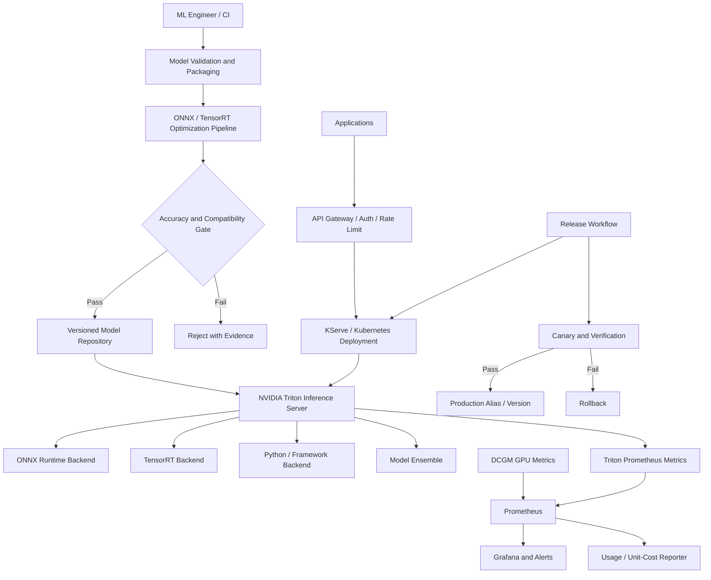

# L2-CS04 — NVIDIA Optimized Inference Platform

## Executive summary

A fictional enterprise has multiple TensorFlow, PyTorch and ONNX models deployed through separate Python services. GPU utilization is inconsistent, every team implements batching differently, latency varies under load, model versions are difficult to manage, and the organization cannot explain whether TensorRT optimization or GPU sharing is producing business value.

This case study creates a standardized inference platform based on NVIDIA Triton Inference Server, TensorRT optimization patterns, KServe-compatible deployment, GPU telemetry, controlled promotion, load testing and SRE/FinOps evidence.

> **Portfolio status:** detailed architecture and implementation blueprint created. CPU/container-safe configuration and client tests will be separated from GPU/TensorRT runtime evidence. No latency, throughput or cost-improvement percentage is claimed without captured execution evidence.

## Synthetic customer scenario

**Customer:** Vector Commerce Intelligence, a fictional global retailer

**Model portfolio:**

- image classification;
- demand-prediction model;
- product-text classification;
- optional embedding or language-model service;
- multiple versions and framework formats.

**Current symptoms:**

- one custom API per model;
- low batching efficiency;
- GPU memory fragmentation;
- inconsistent health and metrics endpoints;
- model version changes require application rebuilds;
- no canary or controlled rollback;
- teams cannot compare CPU, native-framework and optimized runtimes;
- production incidents lack model-level telemetry.

## Business objectives

1. Standardize multi-framework model serving.
2. Improve measurable utilization through safe batching and concurrency.
3. Establish a repeatable TensorRT optimization and validation workflow.
4. Decouple model lifecycle from API-service code where appropriate.
5. Provide versioned model repositories and controlled rollout.
6. Define latency, availability and error SLOs.
7. Attribute inference cost by model and workload.
8. Preserve a local/CPU-safe validation path.

## Scope

### Included

- Triton model-repository structure;
- ONNX and framework-backend examples;
- TensorRT conversion/optimization blueprint;
- dynamic batching and instance groups;
- model ensembles;
- KServe-compatible InferenceService design;
- autoscaling and protected GPU pool concepts;
- Python HTTP/gRPC client and load generator;
- Prometheus/DCGM telemetry;
- canary, rollback and model-version controls;
- CUDA/driver/runtime compatibility checks;
- optional NeMo-oriented model-service integration boundary;
- security, SRE, FinOps and CI/CD.

### Excluded initially

- proprietary production models;
- claims of real GPU performance without GPU execution;
- unapproved cloud GPU deployment;
- redistribution of vendor assets outside their licenses;
- real retail/customer data.

## Personas

| Persona | Need |
|---|---|
| ML engineer | Standard packaging and predictable deployment |
| Data scientist | Validate optimized model accuracy before release |
| Platform engineer | Operate shared serving infrastructure and versions |
| SRE | Health, capacity, latency and incident visibility |
| Security engineer | Controlled images, endpoints, model artifacts and access |
| FinOps lead | Cost per model/request and utilization evidence |
| Product owner | Stable service with documented release and rollback |

## Functional requirements

| ID | Requirement | Priority |
|---|---|---|
| FR-01 | Support a versioned Triton model repository | Must |
| FR-02 | Serve at least one portable ONNX model configuration | Must |
| FR-03 | Provide a framework-backend or Python-backend example | Should |
| FR-04 | Define TensorRT optimization workflow and accuracy validation | Must |
| FR-05 | Configure dynamic batching | Must |
| FR-06 | Configure instance groups/concurrent execution | Must |
| FR-07 | Provide HTTP and/or gRPC client automation | Must |
| FR-08 | Capture latency, throughput, error and resource metrics | Must |
| FR-09 | Support model-version promotion and rollback | Must |
| FR-10 | Provide KServe deployment manifests | Must |
| FR-11 | Provide autoscaling design based on useful metrics | Should |
| FR-12 | Support canary traffic or staged rollout | Should |
| FR-13 | Provide ensemble example | Should |
| FR-14 | Validate CUDA, driver and runtime compatibility | Must |
| FR-15 | Document NeMo model-service extension | Could |

## Non-functional requirements

- model accuracy must not regress beyond an approved tolerance after optimization;
- inference endpoints require authentication/authorization in target state;
- model artifacts are immutable and versioned;
- deployment manifests are reproducible;
- production pool protected from research-job pre-emption;
- observability includes model version and execution backend;
- rollback does not require model retraining;
- benchmark results record hardware, software, batch and concurrency settings;
- core CI remains runnable without a GPU.

## High-level architecture



## Model repository design

Example structure:

```text
model_repository/
├── image_classifier/
│   ├── config.pbtxt
│   ├── 1/model.onnx
│   └── 2/model.plan
├── text_preprocessor/
│   ├── config.pbtxt
│   └── 1/model.py
├── classifier_ensemble/
│   ├── config.pbtxt
│   └── 1/
└── README.md
```

Rules:

- each model and version is immutable after approval;
- configuration is reviewed with the artifact;
- model name, version, backend, input/output schema and owner are recorded;
- artifact checksums are retained;
- production selection uses an explicit alias/deployment reference, not an uncontrolled “latest.”

## Dynamic batching design

Dynamic batching can increase throughput by combining compatible requests, but it can also increase queueing latency. The platform therefore treats these as measured configuration variables:

- preferred batch sizes;
- maximum queue delay;
- request timeout;
- maximum batch size;
- priority and queue policy;
- model execution time;
- client arrival pattern.

A benchmark matrix records both throughput and tail latency rather than celebrating throughput alone.

| Test | Batch | Concurrency | Queue delay | p95 latency | Throughput | Evidence label |
|---|---:|---:|---:|---:|---:|---|
| baseline | 1 | 1 | 0 | measured/local or blank | measured/local or blank | Label required |
| dynamic-batch-a | configured | configured | configured | measured only when run | measured only when run | Label required |
| TensorRT target | configured | configured | configured | requires GPU | requires GPU | Requires GPU |

## Instance-group and GPU-placement strategy

- separate production inference from best-effort research capacity;
- configure model instances according to memory footprint and concurrency behavior;
- avoid arbitrary replica multiplication that causes out-of-memory failures;
- use MIG for stronger partitioning/predictability where supported;
- use time-slicing only for appropriate low-risk development or low-duty workloads;
- apply node affinity/tolerations and topology constraints;
- reserve headroom for rollout and failure recovery.

## TensorRT optimization workflow

```text
Source framework model
  -> export to ONNX or supported representation
  -> validate source predictions
  -> build TensorRT engine for target GPU/runtime
  -> inspect unsupported operations and precision choices
  -> validate numerical accuracy against source
  -> benchmark latency/throughput/memory
  -> package engine with compatibility metadata
  -> register and promote through release gates
```

### Precision decisions

- FP32 provides the closest baseline but may not deliver the desired acceleration;
- FP16 can improve performance on supported GPUs but requires accuracy validation;
- INT8 requires calibration and more rigorous evaluation;
- optimization choice depends on model, hardware and accuracy tolerance.

No precision change is promoted based solely on speed.

## CUDA and compatibility controls

The release evidence records:

- GPU model and compute capability;
- NVIDIA driver version;
- CUDA/runtime version;
- Triton image/version;
- TensorRT version;
- model backend version;
- container digest;
- Kubernetes/GPU Operator versions;
- build and target architecture.

A compatibility preflight prevents deploying an engine built for an incompatible target.

## KServe deployment design

The target manifests include:

- `InferenceService` or supported serving resource;
- Triton runtime reference;
- model storage URI;
- resource requests and GPU limits;
- readiness/liveness behavior;
- autoscaling configuration;
- service account/workload identity;
- node selector, affinity and tolerations;
- canary traffic percentage or deployment strategy;
- NetworkPolicy and ingress controls;
- model/version labels for telemetry.

## NeMo integration boundary

AHEAD's role references the NVIDIA NeMo Framework. This project documents a safe extension without overstating experience:

- a NeMo-trained/fine-tuned model may be exported or packaged through a supported serving path;
- model conversion and serving compatibility must be validated for the chosen model/version;
- NeMo training lifecycle belongs primarily in L2-CS02/L2-CS03;
- Triton focuses on serving and optimization;
- no specific NeMo model result is claimed until an actual compatible artifact is executed.

## Client and load-test automation

The Python client will support:

- endpoint health check;
- model metadata and readiness check;
- synthetic request generation;
- HTTP/gRPC inference;
- configurable concurrency and request count;
- response-schema validation;
- latency histogram and error summary;
- result export as JSON/CSV;
- comparison between model versions/configurations.

The client never fabricates server performance values; missing execution produces a clearly marked “not run” result.

## SLO and observability model

### Candidate service SLOs

| SLO | Concept |
|---|---|
| Availability | Successful eligible requests over total eligible requests |
| Latency | p95/p99 by model and request class |
| Error rate | Transport, validation, timeout and inference failures |
| Model readiness | Approved production model loaded and ready |
| Capacity | Defined saturation threshold and safe headroom |

### Triton/service metrics

- request success/failure;
- inference count;
- execution count;
- queue time;
- compute input/infer/output duration;
- pending requests;
- model-load status;
- model version.

### GPU metrics

- GPU utilization;
- framebuffer memory;
- power and temperature;
- XID/ECC errors;
- per-process or pod attribution where available;
- allocation versus active utilization.

### Alerts

- production model unavailable;
- error-budget burn;
- tail latency above threshold;
- sustained saturation;
- GPU hardware/driver errors;
- unexpected model version;
- failed canary verification;
- memory pressure or repeated OOM.

## Security architecture

- API gateway authentication and authorization;
- rate limiting and request-size limits;
- input schema/content validation;
- tenant-aware endpoint isolation where needed;
- encrypted transport;
- immutable and integrity-checked model artifacts;
- workload identity for model storage;
- non-root/restricted runtime where supported;
- signed image and artifact target state;
- vulnerability scanning;
- no model repository write access from serving pods;
- audit of model/version promotion.

## Release and rollback

```text
model pull request
  -> artifact and configuration validation
  -> source-versus-optimized accuracy comparison
  -> image/model scan
  -> staging deployment
  -> readiness and smoke test
  -> controlled load test
  -> canary approval
  -> production promotion
  -> post-promotion verification
  -> automatic/manual rollback on failed gate
```

Rollback points the serving deployment to the prior immutable artifact and configuration. It does not rebuild an old model from source during an incident.

## FinOps model

Unit metrics:

```text
cost per 1,000 requests
cost per successful request
cost by model/version
GPU-hours allocated versus actively used
cost of idle production headroom
cost impact of batch/concurrency configuration
cost impact of failed or repeated deployments
```

A performance change is accepted only when it satisfies quality, latency, reliability and cost objectives together.

## Planned repository structure

```text
cs04-nvidia-inference-platform/
├── README.md
├── ARCHITECT-GUIDE.md
├── pyproject.toml
├── src/inference_client/
│   ├── cli.py
│   ├── client.py
│   ├── loadtest.py
│   └── report.py
├── tests/
├── models/
│   ├── source/
│   ├── onnx/
│   └── model_repository/
├── optimization/
│   ├── export_onnx.py
│   ├── build_tensorrt.md
│   └── validate_accuracy.py
├── kubernetes/
│   ├── triton/
│   ├── kserve/
│   ├── canary/
│   └── policies/
├── terraform/
├── observability/
├── evidence/
└── .github/workflows/
```

## Implementation phases

### Phase 1 — portable model and client

- train or generate a small synthetic model;
- export to ONNX;
- validate predictions;
- create Triton model-repository configuration;
- implement Python client and report schema;
- run CPU/container-safe unit tests.

### Phase 2 — serving configuration

- Triton container compose/local run option where practical;
- health and metadata checks;
- dynamic-batching configuration;
- KServe manifests;
- configuration/schema validation.

### Phase 3 — load and release evidence

- configurable load generator;
- compare versions/configurations;
- canary and rollback manifests;
- Prometheus/Grafana assets;
- evidence report with measured/simulated labels.

### Phase 4 — GPU/TensorRT validation

- target GPU compatibility preflight;
- TensorRT engine build;
- accuracy comparison;
- latency/throughput/memory benchmark;
- actual GPU telemetry;
- no result published before execution.

## Acceptance criteria

- source and exported model predictions agree within documented tolerance;
- model repository passes structure/configuration checks;
- client validates inputs and outputs;
- load report never substitutes fabricated values;
- KServe/Triton manifests validate structurally;
- canary and rollback paths are documented and testable;
- compatibility metadata is complete;
- security and artifact-integrity controls are present;
- GPU-dependent claims remain labelled until run.

## Interview demonstration

1. Explain why a standardized inference server is preferable to one custom Flask API per model.
2. Show model-repository structure and `config.pbtxt` decisions.
3. Explain dynamic batching trade-offs.
4. Run the Python client against an available local endpoint or show validated offline evidence.
5. Walk through TensorRT export, accuracy and compatibility gates.
6. Show KServe deployment, canary and rollback.
7. Review Triton/DCGM metrics and SLOs.
8. Explain cost per request and GPU-headroom decisions.

## Profile proof statement

> Designed an NVIDIA-oriented inference platform with Triton model repositories, TensorRT optimization and accuracy gates, dynamic batching, concurrent model execution, KServe deployment, Python HTTP/gRPC load tooling, Prometheus/DCGM observability, canary rollout, rollback and inference unit-cost governance. Hardware-dependent benchmark claims are published only with captured GPU evidence.

## Questions this case study prepares me to answer

- What does Triton provide beyond a custom model API?
- How do dynamic batching and instance groups affect latency and throughput?
- How do you validate TensorRT FP16 or INT8 optimization safely?
- What compatibility data must accompany a TensorRT engine?
- How does KServe integrate with Triton?
- How do you canary and roll back a model version?
- Which Triton and GPU metrics matter during an incident?
- How do you calculate cost per inference rather than cost per GPU alone?
- Where does NeMo fit relative to training, registry and serving?
