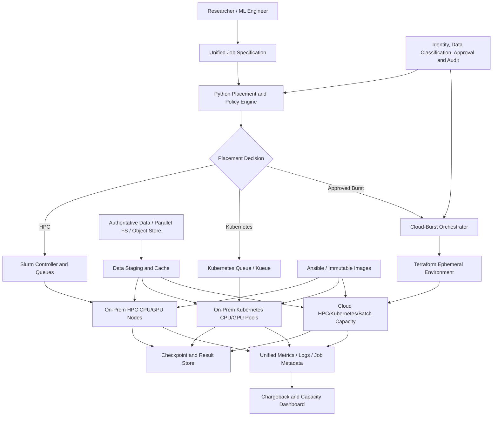

# L2-CS05 — Hybrid HPC and AI Cloud-Burst Platform

## Executive summary

A fictional regulated research organization operates an on-premises HPC environment and a separate Kubernetes platform. Researchers submit CPU, GPU and MPI workloads through different processes, cloud bursting is ad hoc, large datasets are repeatedly transferred, and capacity decisions are not connected to cost, security or workload characteristics.

This case study designs a hybrid HPC and AI platform that combines Slurm-style batch scheduling, Kubernetes-native AI workloads and controlled public-cloud burst capacity. It demonstrates workload placement, distributed-training architecture, data staging, high-speed networking considerations, Terraform/Ansible automation, observability, chargeback and operational governance.

> **Portfolio status:** detailed architecture and implementation blueprint created. Scheduler behavior and placement decisions will be demonstrated with synthetic workloads and simulation. No InfiniBand, RDMA, multi-node GPU or cloud-burst result is claimed without captured target-environment evidence.

## Synthetic customer scenario

**Customer:** National Materials Research Consortium, a fictional regulated research organization

**Current environment:**

- on-premises Slurm-managed CPU and GPU nodes;
- Kubernetes cluster used by ML and application teams;
- shared parallel file system;
- object-storage archive;
- public-cloud account available but weakly governed;
- mixed simulation, MPI, data-processing, model-training and inference workloads.

**Current symptoms:**

- researchers do not know which platform to use;
- GPU jobs wait while cloud capacity is available but not automated;
- cloud bursting copies large datasets inefficiently;
- no policy decides whether data may leave on-premises;
- cluster queues and Kubernetes quotas are not coordinated;
- cost is allocated by department estimates rather than actual use;
- environment configuration differs between on-premises and cloud;
- failed jobs leave orphaned resources and data.

## Business objectives

1. Establish an explainable workload-placement policy.
2. Preserve existing HPC investment while enabling cloud elasticity.
3. Support MPI/distributed training and Kubernetes-native AI workloads.
4. Automate environment creation and configuration.
5. Minimize unnecessary data movement.
6. Enforce security, residency and approval constraints.
7. Provide unified utilization, queue and cost reporting.
8. Define reliable burst, teardown and failure-recovery procedures.

## Scope

### Included

- Slurm/HPC and Kubernetes role separation;
- workload classification and placement policy;
- cloud-burst control plane;
- MPI/NCCL/distributed-training design;
- high-speed network, storage and data-cache considerations;
- Terraform cloud foundation and ephemeral compute modules;
- Ansible node configuration;
- container and environment portability;
- queue, quota and approval models;
- observability, chargeback and capacity planning;
- security, DR and operational runbooks;
- Python placement and cost simulator;
- synthetic workload catalog.

### Excluded initially

- real classified/restricted datasets;
- production connection to an actual research network;
- paid cloud capacity without approval;
- real InfiniBand/RDMA benchmarks;
- vendor-specific HPC licenses;
- claims of real multi-node speedup without execution evidence.

## Personas

| Persona | Need |
|---|---|
| Researcher | Simple job submission and clear platform choice |
| ML engineer | Distributed training, containers, checkpoints and artifacts |
| HPC administrator | Preserve scheduler controls and diagnose batch workloads |
| Platform engineer | Operate Kubernetes, automation and cloud overlays |
| Security/data-governance lead | Enforce residency, export and identity rules |
| FinOps/capacity lead | Compare owned capacity, queues and cloud burst cost |
| Research program owner | Prioritize strategic workloads and meet deadlines |

## Workload classes

| Class | Example | Preferred platform | Key decision factors |
|---|---|---|---|
| H1 | tightly coupled MPI simulation | HPC/Slurm | low-latency network, scheduler maturity, software licensing |
| H2 | large CPU batch sweep | HPC or cloud batch | deadline, queue, data size, cloud price |
| A1 | interactive notebook | Kubernetes | workspace controls, fractional GPU, collaboration |
| A2 | distributed deep-learning training | Kubernetes or HPC | framework, GPU topology, scheduler integration, data locality |
| A3 | model pipeline | Kubernetes | orchestration, metadata, repeatability |
| A4 | production inference | Kubernetes | SLO, autoscaling, release governance |
| B1 | urgent deadline workload | approved cloud burst | queue delay versus burst cost and data eligibility |

## Functional requirements

| ID | Requirement | Priority |
|---|---|---|
| FR-01 | Classify workloads from a declarative specification | Must |
| FR-02 | Recommend on-prem HPC, on-prem Kubernetes or cloud burst | Must |
| FR-03 | Enforce data-residency and export restrictions | Must |
| FR-04 | Consider queue wait, deadline, runtime and cost | Must |
| FR-05 | Provision approved cloud burst foundation with Terraform | Must |
| FR-06 | Configure compute nodes with Ansible | Must |
| FR-07 | Support containerized workloads across targets | Must |
| FR-08 | Provide MPI/distributed-training templates | Must |
| FR-09 | Stage and validate data before burst execution | Must |
| FR-10 | Checkpoint results and recover from interruption | Must |
| FR-11 | Tear down ephemeral resources reliably | Must |
| FR-12 | Report queue, utilization and estimated/actual cost | Must |
| FR-13 | Support approval for high-cost or sensitive jobs | Must |
| FR-14 | Provide capacity-planning scenarios | Should |
| FR-15 | Integrate with enterprise ticket/change process | Could |

## Non-functional requirements

- policy decisions explain why a target was selected;
- cloud burst must be deny-by-default for restricted data;
- infrastructure changes are reviewable and reproducible;
- resource teardown is independently executable;
- model/simulation results are durable before compute termination;
- secrets are obtained at runtime;
- target-specific assumptions are explicit;
- CI does not require an HPC or cloud environment;
- measured, simulated and estimated values are never mixed silently.

## High-level architecture



## Workload specification

```yaml
metadata:
  workload_id: materials-sim-2026-001
  owner: research-team-a
  cost_center: CC-4100
  priority: strategic
workload:
  class: distributed_training
  container: registry.example/synthetic-training@sha256:placeholder
  estimated_runtime_minutes: 180
  deadline: 2026-07-20T18:00:00Z
resources:
  nodes: 4
  gpus_per_node: 4
  cpu_per_node: 32
  memory_per_node: 256Gi
  network: high_bandwidth
  checkpoint_interval_minutes: 15
data:
  classification: internal
  input_size_gb: 500
  output_size_gb: 50
  export_allowed: true
placement:
  allowed_targets:
    - onprem-hpc
    - onprem-kubernetes
    - approved-cloud-burst
  max_estimated_cost: 2500
  prefer_owned_capacity: true
```

The public example uses synthetic values and targets.

## Placement policy

The engine evaluates hard constraints before scoring eligible targets.

### Hard constraints

- data export prohibited;
- software/license unavailable;
- required accelerator unavailable;
- target not approved for workload classification;
- budget ceiling exceeded;
- deadline impossible under estimated queue/runtime;
- required network/storage capability unavailable.

### Scoring factors

```text
placement score =
  deadline fit
  + data locality
  + expected performance fit
  + reliability fit
  + strategic priority
  - queue delay
  - data-transfer time
  - estimated marginal cost
  - operational risk
```

The output explains each accepted and rejected target.

## Slurm and Kubernetes operating model

### Slurm remains preferred for

- mature tightly coupled MPI workloads;
- traditional HPC software stacks;
- environments built around reservations, partitions and batch queues;
- workloads requiring specialized low-latency interconnect and scheduler integration.

### Kubernetes remains preferred for

- notebooks and collaborative ML workspaces;
- containerized training pipelines;
- model lifecycle integration;
- inference services and APIs;
- cloud-portable platform workflows;
- service-oriented AI applications.

### Integration principles

- a unified intake specification can translate into `sbatch`, Kubeflow/Kubernetes or cloud-batch resources;
- both environments emit common ownership and cost metadata;
- artifact and checkpoint conventions are shared;
- the platform does not pretend the schedulers are identical;
- operations teams retain target-specific diagnostic procedures.

## Distributed training and MPI design

### Communication

- MPI provides a process-launch/communication model common in HPC;
- NCCL is used for efficient NVIDIA GPU collectives in supported distributed-training stacks;
- topology, NUMA, PCIe/NVLink and network path affect performance;
- oversubscribed cloud networking can negate additional GPU capacity;
- rendezvous, timeout and failure propagation are explicit.

### Scheduling

- all workers/nodes should be available together for tightly coupled jobs;
- Slurm allocation or Kubernetes gang scheduling prevents partial waste;
- placement policy checks topology and capacity before submission;
- checkpoint frequency reflects interruption risk and runtime.

### Validation

- CPU/MPI or multi-process local tests prove orchestration logic;
- GPU/NCCL and RDMA claims require target execution;
- benchmark reports record topology and software versions.

## Data architecture

### Data zones

1. authoritative source data;
2. approved export/staging area;
3. local high-performance cache or scratch;
4. checkpoint store;
5. final curated result/artifact store;
6. archive and retention tier.

### Burst data flow

```text
classify and approve data
  -> estimate transfer time/cost
  -> generate manifest and checksums
  -> stage encrypted data
  -> validate completeness
  -> execute workload
  -> checkpoint and publish results
  -> verify result integrity
  -> delete ephemeral copies
  -> destroy compute/network resources
  -> retain audit evidence
```

Large data movement can dominate the business value of cloud bursting, so the placement decision includes data-transfer duration and cost.

## Infrastructure automation

### Terraform

- network and private endpoints;
- identity roles and policies;
- encrypted object/checkpoint storage;
- compute cluster or managed Kubernetes/batch capacity;
- logging and monitoring integration;
- budget/tag controls;
- ephemeral-resource lifecycle;
- remote state and environment separation.

### Ansible

- OS baseline and hardening;
- NVIDIA driver/CUDA preparation where appropriate;
- container runtime;
- Slurm or worker-agent configuration;
- MPI/NCCL dependencies;
- monitoring agents;
- mount and storage client configuration;
- validation checks.

### Image strategy

- immutable base images for common workloads;
- versioned container images for application dependencies;
- separate hardware-dependent layers where needed;
- SBOM and vulnerability evidence;
- no interactive drift on production nodes.

## Security architecture

- federated identity and short-lived workload credentials;
- data-classification and export policy before cloud placement;
- private connectivity and restricted egress;
- encryption in transit and at rest;
- tenant/project separation;
- approved images and registries;
- secrets manager integration;
- administrative actions audited;
- cloud burst requires policy and budget approval;
- ephemeral environment destroyed after evidence and results are secured;
- logs avoid sensitive data content.

## SRE and operations model

### Monitored signals

- queue depth and wait time;
- job start, run and completion duration;
- pending reason;
- node/GPU utilization;
- network and storage throughput;
- data-staging duration;
- checkpoint success/failure;
- pre-emption/interruption;
- cloud-resource age and teardown status;
- cost by workload and department.

### Operational runbooks

- job pending too long;
- MPI/NCCL initialization failure;
- node or GPU hardware error;
- storage bottleneck;
- incomplete data stage;
- checkpoint failure;
- cloud quota exhaustion;
- budget threshold breach;
- orphaned cloud resources;
- failed teardown;
- result-integrity failure.

### Recovery

- durable periodic checkpoints;
- restart on eligible target;
- independent data and infrastructure teardown procedures;
- versioned job specification;
- final output verification before scratch deletion;
- control-plane configuration backup.

## FinOps and capacity model

### Owned-capacity view

Owned infrastructure is not free; the model includes:

- depreciation/lease allocation;
- support and maintenance;
- energy and cooling;
- facilities;
- administrator effort;
- utilization and stranded capacity.

### Cloud-burst view

- compute/GPU runtime;
- storage and operations;
- data transfer;
- private connectivity;
- log/metric ingestion;
- idle setup time;
- failed/repeated jobs;
- reserved/spot/on-demand pricing assumptions.

### Decision metrics

```text
cost per successful workload
cost per GPU-hour / node-hour
deadline value versus burst premium
queue-delay cost
data-transfer cost and duration
owned-capacity utilization
cloud resources older than intended TTL
```

## Capacity-planning scenarios

The simulator will support questions such as:

- What if monthly demand grows 30%?
- What if two strategic projects overlap?
- At what queue delay is cloud burst justified?
- How does checkpointing change spot/pre-emption risk?
- Should additional GPU nodes be purchased or rented?
- Which workload classes create the most idle allocation?
- How much data-transfer time invalidates a burst option?

## Planned repository structure

```text
cs05-hybrid-hpc-ai-platform/
├── README.md
├── ARCHITECT-GUIDE.md
├── pyproject.toml
├── src/placement_engine/
│   ├── cli.py
│   ├── schema.py
│   ├── policy.py
│   ├── scoring.py
│   └── reporting.py
├── tests/
├── data/synthetic-workloads/
├── slurm/
├── kubernetes/
├── mpi/
├── terraform/
│   ├── persistent/
│   └── ephemeral/
├── ansible/
├── observability/
├── evidence/
└── .github/workflows/
```

## Implementation phases

### Phase 1 — placement simulator

- workload schema;
- target-capability catalog;
- hard-constraint evaluation;
- weighted scoring;
- explainable recommendation;
- cost and deadline scenarios;
- unit tests and evidence JSON.

### Phase 2 — scheduler artifacts

- Slurm job examples;
- Kubernetes/Kubeflow job examples;
- MPI local/container test;
- common metadata and checkpoint convention;
- queue and priority mapping.

### Phase 3 — infrastructure automation

- Terraform persistent/ephemeral split;
- Ansible node roles;
- validation-only CI;
- teardown and orphan detection;
- security and cost policies.

### Phase 4 — target-environment validation

- approved small cloud burst or lab environment;
- data-stage timing;
- workload execution and checkpoint;
- results return and teardown;
- captured actual cost;
- any HPC/GPU benchmark labelled with exact environment.

## Acceptance criteria

- every placement recommendation lists reasons;
- prohibited data never receives a cloud target;
- budget and deadline constraints are enforced;
- synthetic workload catalog covers HPC, training, pipeline and burst cases;
- Terraform and Ansible pass available validation;
- teardown path exists independently of successful workload completion;
- evidence separates measured, simulated and estimated values;
- no real accounts, credentials or restricted data are committed.

## Interview demonstration

1. Submit a synthetic workload specification.
2. Show hard constraints eliminating ineligible targets.
3. Review the scored recommendation and cost/deadline trade-off.
4. Show equivalent Slurm and Kubernetes workload representations.
5. Explain MPI/NCCL, topology and data locality.
6. Walk through Terraform persistent/ephemeral design and Ansible configuration.
7. Show teardown, checkpoint and orphan-resource controls.
8. Close with capacity planning and chargeback.

## Profile proof statement

> Designed a hybrid HPC and AI cloud-burst platform combining Slurm-style batch scheduling, Kubernetes AI workloads, MPI/NCCL distributed-training patterns, data-staging controls, Terraform/Ansible automation, explainable workload placement, observability, teardown safety and chargeback. Public evidence uses synthetic workloads and does not claim unexecuted RDMA, multi-GPU or cloud performance.

## Questions this case study prepares me to answer

- When should an AI workload run on Slurm versus Kubernetes?
- What makes cloud bursting valuable or uneconomic?
- How do data locality and network topology affect distributed training?
- How do MPI and NCCL fit together?
- How do you prevent restricted data from leaving on-premises?
- How do you design ephemeral infrastructure that is reliably destroyed?
- How do you compare owned capacity with cloud marginal cost?
- How do you checkpoint and recover long-running workloads?
- What evidence is required before claiming multi-node or RDMA performance?
