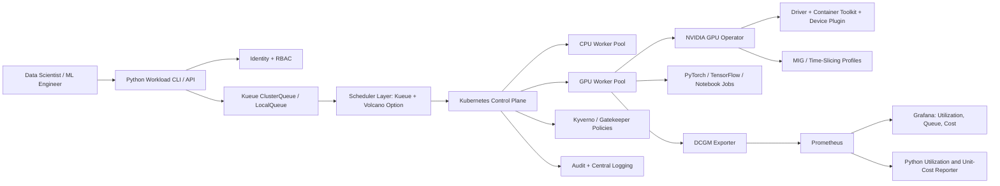

# CS01 — Multi-Tenant Kubernetes GPU Platform

## Executive scenario

A global enterprise AI laboratory has accumulated separate GPU servers, ad-hoc notebooks and manually scheduled model-training jobs. Premium GPU capacity is frequently reserved but idle, small experiments block large distributed jobs, teams cannot see fair-share entitlement, and platform administrators have no defensible unit-cost or utilization report.

The objective is to create a secure, self-service Kubernetes GPU platform that improves utilization while protecting teams from noisy neighbors and preventing unapproved cost growth.

This is a **synthetic reference implementation**. It demonstrates architecture and implementation patterns without claiming access to a paid Run:ai environment or a real multi-GPU production cluster.

## Business outcomes

- Raise allocatable GPU utilization through shared queues, backfill, fractional-GPU options and idle-capacity borrowing.
- Reduce experiment wait time without allowing one team to monopolize capacity.
- Provide transparent project quotas, priority classes, pre-emption policy and chargeback/showback.
- Give data scientists a simple Python/CLI submission path instead of raw cluster-administration access.
- Make GPU drivers, device plugins, observability and policy controls repeatable through platform automation.
- Establish evidence for capacity planning, procurement and cloud-burst decisions.

## Requirements and acceptance criteria

### Functional requirements

1. Support at least three synthetic tenants: `research`, `product-ai` and `risk-models`.
2. Provide namespace-level isolation, service accounts and least-privilege RBAC.
3. Define nominal quota, borrowing limit and maximum GPU count by tenant.
4. Support batch queues, workload priority, pre-emption and gang-scheduling semantics.
5. Demonstrate whole-GPU, MIG and time-slicing configuration options with explicit trade-offs.
6. Provide a workload submission API/CLI that accepts image, command, GPU count, queue, priority and runtime limit.
7. Collect GPU allocation, utilization, memory, temperature, power and job metadata where hardware is available.
8. Produce utilization and estimated unit-cost reports using synthetic metrics when GPU hardware is unavailable.
9. Reject privileged containers, host-path mounts and unapproved registries through policy.
10. Provide auditable deployment, change and workload-submission evidence.

### Non-functional requirements

- Platform API availability target: 99.9% for a production implementation.
- Scheduler-control recovery objective: RTO 30 minutes; platform configuration RPO 15 minutes.
- Workload-submission p95 target: under 2 seconds excluding queue wait.
- No plaintext secrets in source control or manifests.
- All infrastructure and cluster policies must be reproducible.
- Every demonstration must run in a safe offline/configuration-only mode without cloud credentials.

### Acceptance evidence

- Kubernetes/YAML validation succeeds.
- Python unit tests validate request schema, queue selection, quota decisions and cost calculations.
- Synthetic scheduling scenarios show admitted, queued, borrowed and pre-empted workloads.
- Architecture decisions document why the selected open-source components approximate Run:ai concepts.
- A demo report clearly distinguishes simulation from real GPU execution.

## Target architecture



## Run:ai-aligned capability mapping

The job requirement names Run:ai. A paid Run:ai installation is not assumed. This project demonstrates the underlying platform concepts with open components and labels the substitution honestly.

| Enterprise capability | Demonstration implementation |
|---|---|
| Projects and departments | Namespaces, ResourceQuota and hierarchical queue design |
| Guaranteed quota | Kueue nominal quota |
| Over-quota borrowing | Kueue cohort borrowing limits |
| Workload queues | Kueue LocalQueue / ClusterQueue |
| Priority and pre-emption | Kubernetes PriorityClass plus queue policy |
| Gang scheduling | Kueue/Volcano workload semantics |
| GPU sharing | NVIDIA time-slicing profiles; MIG where hardware supports it |
| Utilization visibility | DCGM Exporter, Prometheus and synthetic fallback dataset |
| Self-service jobs | Typed Python CLI/API |
| Policy and audit | RBAC, admission policy, audit/log evidence |

## Scheduling model

### Tenant entitlements

| Tenant | Nominal GPUs | Borrowing ceiling | Priority profile | Example workload |
|---|---:|---:|---|---|
| research | 2 | 4 | normal / low-cost pre-emptible | experimentation and fine-tuning |
| product-ai | 4 | 6 | high for release validation | revenue model training |
| risk-models | 2 | 3 | high and protected windows | regulated batch scoring |

### Admission decision

The workload admission engine evaluates:

1. request validity;
2. namespace and service-account entitlement;
3. queue mapping;
4. requested GPU flavor and count;
5. nominal quota availability;
6. cohort borrowing allowance;
7. priority and pre-emption eligibility;
8. gang-size feasibility;
9. node labels, taints and topology;
10. runtime/cost guardrail.

A local simulator will generate deterministic evidence for these outcomes: `admitted`, `queued`, `borrowed`, `rejected` and `preempt_candidate`.

## GPU partitioning decisions

### Whole GPU

Use for large training, predictable performance and isolation. It minimizes interference but can waste capacity for small experiments.

### MIG

Use on supported NVIDIA GPUs when stronger hardware partitioning and predictable memory/compute slices are needed. Profiles must be standardized because reconfiguration can disrupt workloads and not all models fit every slice.

### Time-slicing

Use for lightweight development and inference experiments that tolerate contention. It raises concurrency but does not provide hard memory isolation and therefore requires clear workload classification.

### Decision rule

- regulated or latency-sensitive workload → whole GPU or validated MIG profile;
- small notebook/experimentation workload → time-sliced profile;
- large distributed training → whole GPUs with gang scheduling;
- uncertain workload → benchmark before promotion.

## Security model

- OIDC-integrated identity in a production deployment.
- Namespace-scoped service accounts and least-privilege roles.
- NetworkPolicy default deny with explicit DNS, artifact-store and telemetry egress.
- Pod Security `restricted` baseline.
- Signed images from approved registries.
- Secrets obtained from an external secret manager; no static credentials in Git.
- Admission policy blocks privileged mode, host networking, hostPath and unbounded resources.
- Audit trail records platform changes and workload metadata without recording sensitive training data.
- Tenant data and artifact stores use separate prefixes/buckets/keys where isolation is required.

## SRE and observability

### Service-level indicators

- API request success rate and latency.
- scheduler admission latency.
- queue wait time by tenant and priority.
- job start success rate.
- GPU allocation versus active utilization.
- GPU memory utilization and OOM failures.
- pre-emption count and recovery success.
- failed driver/device-plugin health checks.

### Alert examples

- allocated GPU utilization below 20% for 30 minutes;
- queue wait exceeds tenant SLO;
- GPU XID or temperature event;
- device-plugin unavailable on a GPU node;
- high pre-emption rate for protected workloads;
- tenant exceeds monthly cost threshold.

## FinOps model

The reporting layer calculates:

```text
estimated_job_cost = allocated_gpu_hours × gpu_hour_rate
                   + cpu_vcpu_hours × vcpu_hour_rate
                   + memory_gb_hours × memory_hour_rate
                   + storage_and_egress_estimate
```

Primary optimization measures:

- allocation utilization ratio;
- useful GPU-hours versus reserved GPU-hours;
- average queue wait by GPU flavor;
- cost per successful training run;
- cost per model candidate promoted;
- idle and stranded capacity;
- fragmentation caused by incompatible MIG profiles;
- savings from borrowing/backfill and scheduled shutdown.

## Implementation structure

```text
cs01-multi-tenant-gpu-platform/
├── README.md
├── docs/
│   ├── requirements-and-rfp.md
│   ├── proposal-and-value-case.md
│   ├── hld-lld-and-adrs.md
│   ├── security-threat-model.md
│   ├── sre-finops-operating-model.md
│   └── demo-and-interview-guide.md
├── kubernetes/
│   ├── namespaces-rbac.yaml
│   ├── priority-classes.yaml
│   ├── kueue-queues.yaml
│   ├── gpu-workload-example.yaml
│   └── policies/
├── terraform/
├── ansible/
├── src/gpu_platform/
│   ├── cli.py
│   ├── models.py
│   ├── admission.py
│   └── reporting.py
├── tests/
├── synthetic-data/
└── .github/workflows/validate.yml
```

## Demonstration sequence

1. Show tenant quota and queue configuration.
2. Submit a two-GPU `product-ai` workload with high priority.
3. Submit research workloads that consume nominal quota and then borrow from the cohort.
4. Submit an oversized request and show deterministic rejection reasoning.
5. Demonstrate a gang-scheduled distributed job definition.
6. Show a time-sliced development workload and explain the isolation limitation.
7. Generate queue, utilization and estimated-cost evidence.
8. Show policy violations being rejected.
9. Explain how the design maps to a commercial Run:ai implementation.

## Interview proof statement

> Built a synthetic multi-tenant Kubernetes GPU platform reference implementation covering fair-share queues, nominal quota and borrowing, priority and pre-emption, gang scheduling, whole-GPU/MIG/time-slicing choices, Python self-service submission, policy controls, GPU observability and unit-cost reporting. Open-source scheduler components are explicitly identified as a Run:ai-equivalent demonstration rather than claimed commercial-product experience.

## Profile-ready short line

**Multi-Tenant GPU Platform:** designed Kubernetes GPU scheduling, quota/borrowing, priority, NVIDIA GPU Operator patterns, Python workload automation, DCGM observability and AI FinOps evidence for secure enterprise AI teams.

## Honest implementation status

| Component | Status |
|---|---|
| Requirements and architecture | Implemented in repository documentation |
| Kubernetes policy and queue manifests | In progress |
| Python admission/utilization simulator | In progress |
| Automated unit tests | In progress |
| Terraform/Ansible cloud environment | Planned |
| Real NVIDIA GPU execution | Not yet performed |
| Commercial Run:ai execution | Not claimed |