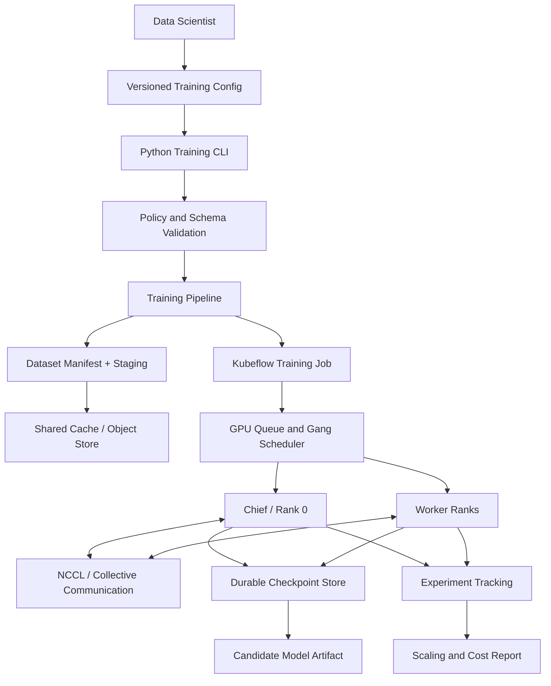

# CS02 — Distributed PyTorch and TensorFlow Training Factory

## Executive scenario

A product organization has many data-science teams, but every team builds training environments differently. Experiments run on laptops, unmanaged virtual machines and expensive GPU hosts. Dependency drift makes results difficult to reproduce; failed jobs lose hours of work; multi-node scaling is poorly understood; and teams cannot tell whether adding GPUs improves delivery speed or only increases cost.

The target is a reusable training factory that turns a declared experiment specification into a governed single-node or distributed training job with repeatable environments, dataset staging, experiment tracking, checkpoints, failure recovery and scaling evidence.

This is a synthetic reference implementation. CPU-safe examples and configuration validation are permitted, but CPU execution will never be represented as a real GPU or NCCL benchmark.

## Business outcomes

- Reduce environment setup and job-submission effort through reusable templates.
- Make experiments reproducible through pinned images, source revisions, data references and parameter capture.
- Enable PyTorch and TensorFlow teams without creating two unrelated platforms.
- Recover failed/pre-empted jobs from durable checkpoints.
- Measure throughput, scaling efficiency, queue delay and estimated cost before expanding GPU capacity.
- Provide a governed path from experiment to candidate model artifact.

## Scope

### Included

- PyTorch single-process and Distributed Data Parallel patterns.
- TensorFlow single-worker and `MultiWorkerMirroredStrategy` patterns.
- Kubernetes job specifications and Kubeflow Trainer/Training Operator-style resources.
- Distributed-process launch, rank/world-size handling and environment contracts.
- Dataset manifest, staging and cache patterns.
- Checkpoint creation, retention, restore and resume-after-failure.
- MLflow-compatible experiment metadata and artifact references.
- Hyperparameter-sweep scaffold.
- Synthetic benchmark harness and scaling-efficiency report.
- Security, observability, FinOps and operational handover.

### Excluded from initial evidence

- Claims of production training on proprietary customer data.
- Claims of real multi-node GPU throughput without hardware evidence.
- Training foundation models from scratch.
- Unbounded cloud autoscaling or cost-incurring deployment.

## Detailed requirements

1. A user must describe a training run through a versioned YAML or Python configuration.
2. The system must support framework choice: `pytorch` or `tensorflow`.
3. The same configuration contract must support local test, single-node Kubernetes and distributed Kubernetes modes.
4. Every run must capture source revision, container image, data version, parameters, seed, requested resources and owner.
5. Checkpoints must be written to durable object/shared storage and restored after simulated failure.
6. The platform must reject unsupported GPU count, missing resource limits, mutable image tags and unauthorised datasets.
7. A distributed job must request all workers as a coordinated unit when gang scheduling is required.
8. Metrics must include samples/second, step time, epoch time, loss, checkpoint duration, restart count and allocated resource-hours.
9. The benchmark report must calculate speedup and scaling efficiency.
10. CI must validate Python, tests, YAML and pipeline/job specifications without requiring a GPU.

## Target architecture



## Framework implementations

### PyTorch path

The PyTorch example will demonstrate:

- deterministic seed configuration;
- `torch.distributed` initialization;
- local rank/device selection;
- `DistributedDataParallel` wrapping;
- `DistributedSampler` and epoch synchronization;
- rank-zero logging and checkpoint writes;
- resume from latest compatible checkpoint;
- graceful termination handling for pre-emption;
- metrics for batch throughput and communication overhead.

Example launch contract:

```text
torchrun --nnodes=$NNODES \
  --nproc-per-node=$GPUS_PER_NODE \
  --rdzv-backend=c10d \
  --rdzv-endpoint=$RENDEZVOUS_ENDPOINT \
  -m training.pytorch_train --config configs/run.yaml
```

### TensorFlow path

The TensorFlow example will demonstrate:

- `TF_CONFIG` generation;
- `MultiWorkerMirroredStrategy`;
- sharded dataset input;
- consistent model and optimizer construction inside strategy scope;
- chief-worker checkpointing;
- callback-based metric capture;
- restart from durable checkpoint;
- deterministic synthetic dataset for CPU-safe CI.

## Distributed training design decisions

### Data parallelism

Primary pattern for the portfolio because it is understandable, widely applicable and directly demonstrates multi-worker coordination. Each worker holds a model replica and processes a shard of the batch.

### Model/tensor parallelism

Documented as a future path for models that do not fit on one device. It is not claimed as implemented unless code and hardware evidence are later added.

### Gang scheduling

Distributed jobs should be admitted only when all required workers can start. Partial scheduling wastes GPUs and can leave workers waiting for rendezvous.

### Topology awareness

For a real cluster, the scheduler should prefer workers within the same high-bandwidth domain before spreading across slower links. Node labels can represent GPU model, network fabric, rack/zone and local NVMe capability.

### Mixed precision

A controlled AMP path may improve throughput and memory efficiency. It requires numeric validation and will be presented as an optional benchmark dimension, not an automatic optimization.

## Checkpoint and recovery strategy

Checkpoint metadata records:

- run ID and source revision;
- framework and library versions;
- model/optimizer state;
- epoch, global step and random states;
- dataset version and preprocessing revision;
- world size and compatibility constraints;
- checksum and creation time.

Recovery workflow:

1. receive termination/failure signal;
2. complete or abandon unsafe in-flight checkpoint;
3. identify newest valid checkpoint;
4. validate checksum and compatibility;
5. reconstruct cluster membership;
6. restore model, optimizer, scheduler and step state;
7. resume metrics under the same logical run;
8. record lost work and recovery time.

Target evidence includes a deliberate failure injection after a configured number of steps and a successful resumed run using a small synthetic dataset.

## Dataset and storage model

- Source data remains immutable and versioned.
- A manifest identifies object paths, checksums, schema and split rules.
- Workers stage only required shards.
- Shared cache is keyed by dataset version and preprocessing revision.
- Checkpoints and final artifacts use separate lifecycle policies.
- Training code receives short-lived credentials through workload identity in a production design.
- Sensitive data is never embedded in images, notebooks or logs.

## Benchmark model

### Core measures

```text
speedup(N) = throughput(N workers) / throughput(1 worker)
scaling_efficiency(N) = speedup(N) / N
estimated_cost_per_epoch = allocated_resource_hours × rate
wasted_cost = failed_or_idle_resource_hours × rate
```

### Benchmark matrix

| Test | Workers | Batch strategy | Failure injection | Evidence |
|---|---:|---|---|---|
| local smoke | 1 CPU | small fixed batch | no | correctness and CI |
| single-worker baseline | 1 | fixed global batch | no | reference throughput |
| two-worker simulation/config | 2 | split batch | optional | launch and aggregation |
| checkpoint recovery | 1 or 2 | fixed | yes | resume evidence |
| mixed precision | hardware-dependent | controlled | no | future GPU benchmark |
| scale-out | hardware-dependent | fixed global/per-device | no | future real-GPU evidence |

## MLOps integration

Each run records:

- parameters and environment;
- metrics and resource metadata;
- code and data references;
- checkpoint/artifact URIs;
- test and evaluation summary;
- promotion recommendation;
- security and license metadata where applicable.

A successful training job produces a **candidate**, not an automatically production-approved model. Promotion requires evaluation and governance gates in CS03.

## Security and supply chain

- Pinned container digests for release workflows.
- Software bill of materials and vulnerability scan in CI.
- Non-root execution, read-only root filesystem where feasible and explicit resource limits.
- Workload identity rather than static object-store keys.
- Namespace isolation and default-deny network policy.
- Restricted egress to approved artifact, telemetry and package endpoints.
- Dataset authorization validated before job creation.
- Training logs redact sample content and secrets.

## SRE model

### SLIs

- job-submission success rate;
- time from admission to all-worker ready;
- successful training completion rate;
- checkpoint success rate and duration;
- recovery success rate and recovery time;
- lost-work interval after failure;
- worker desynchronization or collective timeout count;
- throughput and scaling efficiency;
- experiment metadata completeness.

### Failure scenarios

- worker process crash;
- node loss;
- object-store timeout;
- corrupt checkpoint;
- rendezvous failure;
- out-of-memory condition;
- slow worker/straggler;
- pre-emption;
- incompatible library/container version.

Each scenario has detection, containment, recovery and evidence expectations.

## FinOps model

- cost per completed run;
- cost per epoch or one million samples;
- cost per accepted candidate;
- failed-run cost;
- checkpoint-storage cost;
- data-staging/egress cost;
- queue delay versus capacity cost;
- spot/pre-emptible savings net of recovery overhead.

The placement policy should use cheaper interruptible capacity only for checkpoint-capable jobs whose recovery economics justify it.

## Planned repository structure

```text
cs02-distributed-training-factory/
├── README.md
├── configs/
│   ├── pytorch-single.yaml
│   ├── pytorch-ddp.yaml
│   └── tensorflow-multiworker.yaml
├── src/training_factory/
│   ├── cli.py
│   ├── config.py
│   ├── pytorch_train.py
│   ├── tensorflow_train.py
│   ├── checkpointing.py
│   └── metrics.py
├── kubernetes/
│   ├── pytorchjob.yaml
│   ├── tfjob.yaml
│   └── network-policy.yaml
├── pipelines/
├── tests/
├── docs/
├── synthetic-data/
└── .github/workflows/validate.yml
```

## Demonstration sequence

1. Validate a versioned run configuration.
2. Run the CPU-safe PyTorch smoke test.
3. Show generated single-node and distributed job specifications.
4. Explain rank, world size, rendezvous and collective communication.
5. Trigger a controlled failure and resume from checkpoint.
6. Display experiment metadata and scaling/cost report.
7. Compare fixed-global-batch and fixed-per-device-batch interpretations.
8. Explain what must change for a real multi-GPU benchmark.

## Interview proof statement

> Built a synthetic distributed-training factory that standardizes PyTorch DDP and TensorFlow multi-worker jobs, Kubeflow-style training resources, dataset staging, durable checkpoints, failure recovery, experiment metadata and scaling/cost analysis. CPU-safe tests prove the control path, while real GPU/NCCL performance is explicitly reserved for hardware-backed validation.

## Profile-ready short line

**Distributed Training Factory:** implemented repeatable PyTorch/TensorFlow training patterns with Kubernetes/Kubeflow job generation, checkpoints, recovery, experiment tracking and scaling-efficiency economics.

## Honest implementation status

| Component | Status |
|---|---|
| Requirements and architecture | Implemented in repository documentation |
| PyTorch CPU-safe training example | Planned next |
| TensorFlow CPU-safe training example | Planned next |
| Kubernetes/Kubeflow job specs | Planned next |
| Checkpoint recovery test | Planned next |
| MLflow-compatible metadata | Planned |
| Real multi-GPU/NCCL benchmark | Not yet performed |