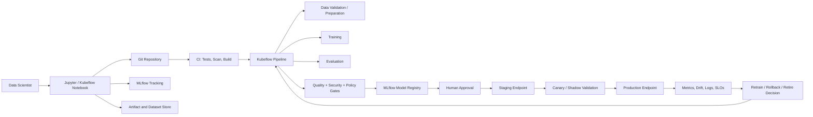

# CS03 — Jupyter-to-Production MLOps Platform

## Executive scenario

An enterprise has hundreds of notebooks and many promising models, but very few models reach a controlled production environment. Notebook kernels differ by user, experiment metadata is incomplete, data lineage is unclear, models are emailed or copied between environments, and there is no consistent approval, rollback or monitoring process.

The goal is to build a governed path from Jupyter experimentation to repeatable pipelines, registered model candidates, controlled deployment and production monitoring—without removing the flexibility that data scientists need.

This is a synthetic reference implementation using synthetic datasets and local/offline-safe validation paths.

## Business outcomes

- Shorten the time from approved experiment to deployable model artifact.
- Improve reproducibility through versioned environments, data references, pipeline code and metadata.
- Create one auditable model lifecycle instead of team-specific release practices.
- Prevent untested, insecure or poorly documented models from entering production.
- Give operations teams clear ownership, SLOs, rollback and incident runbooks.
- Link infrastructure consumption and inference behavior to model/business value.

## Lifecycle

```text
Jupyter exploration
      ↓
Reproducible experiment package
      ↓
Kubeflow pipeline execution
      ↓
Evaluation + security + policy gates
      ↓
MLflow candidate registration
      ↓
Human approval
      ↓
Staging deployment and canary
      ↓
Production monitoring
      ↓
Promote, rollback, retrain or retire
```

## Requirements

### Workspace requirements

1. Provide isolated Jupyter workspaces per user or team.
2. Select environment from approved, versioned images.
3. Enforce CPU, memory, GPU, storage and idle-time limits.
4. Use workload identity for artifact/data access.
5. Mount only approved datasets and persistent workspace volumes.
6. Capture owner, project, cost center, image version and source repository.
7. Stop or suspend idle workspaces according to policy.

### Experiment requirements

1. Every promoted experiment must have a source revision, data version, parameters, seed and environment.
2. Metrics and artifacts must be stored outside the notebook filesystem.
3. Notebooks must be converted into testable modules or pipeline components before promotion.
4. Training and evaluation must be reproducible from a declarative pipeline.
5. Model signature and input/output schema must be recorded.
6. Security, quality, bias/fairness where relevant, performance and license checks must be visible.

### Deployment requirements

1. Model stages must include at least `candidate`, `approved`, `staging`, `production`, `rejected` and `retired` through tags/aliases or an equivalent controlled state model.
2. Deployment must use immutable model and image references.
3. Staging tests must cover functional behavior, latency, resource use and failure handling.
4. Production promotion requires an explicit approval record.
5. Canary or shadow traffic must be supported where appropriate.
6. Rollback must be rehearsed and measurable.
7. Monitoring must include data quality, prediction distribution, drift, latency, errors, saturation and business outcome where available.

## Target architecture



## Jupyter workspace design

### Environment contract

Approved workspace images define:

- Python version;
- framework and CUDA compatibility where applicable;
- common data-science packages;
- MLflow and pipeline SDK versions;
- vulnerability and license scan status;
- image digest and release date;
- compatible GPU classes;
- supported notebook extensions.

Users may add project dependencies through a locked project environment, but cannot silently mutate the shared base image.

### Resource controls

- default and maximum CPU/memory;
- optional GPU profiles;
- workspace quota by namespace/team;
- idle culling;
- maximum session age where required;
- persistent-volume size and lifecycle;
- outbound network allow-list;
- cost labels and owner metadata.

## Notebook-to-pipeline conversion

A notebook can explore, explain and visualize, but production logic must become importable and testable code.

The conversion process is:

1. identify data acquisition, validation, transformation, training and evaluation cells;
2. move reusable logic into Python modules;
3. add typed function interfaces and unit tests;
4. create pipeline components with explicit inputs/outputs;
5. pin container/environment dependencies;
6. compile a versioned pipeline specification;
7. execute against synthetic or approved data;
8. record run metadata and artifact lineage;
9. retain the notebook as narrative evidence, not the only executable implementation.

## Pipeline component model

```text
validate_data
   → prepare_features
      → train_model
         → evaluate_model
            → security_and_policy_gate
               → register_candidate
                  → deploy_staging
                     → validate_canary
```

Every component declares:

- input and output artifacts;
- resource request;
- container image digest;
- parameters;
- cache behavior;
- retries/timeouts;
- owner and version;
- observability events;
- failure and cleanup behavior.

## MLflow tracking and registry model

### Experiment metadata

- source commit and branch;
- pipeline version and run ID;
- dataset manifest/version;
- environment image digest;
- framework/library versions;
- parameters and seed;
- evaluation metrics;
- training resource summary;
- model signature and example input;
- artifact checksum;
- responsible owner and business use case.

### Model governance tags

- `risk_tier`;
- `data_classification`;
- `intended_use`;
- `prohibited_use`;
- `owner`;
- `validation_status`;
- `security_scan_status`;
- `approval_ticket`;
- `monitoring_profile`;
- `retirement_date`.

A registry entry is a technical record, not sufficient approval by itself.

## Promotion gates

| Gate | Evidence | Blocking condition |
|---|---|---|
| Unit/integration tests | CI report | test failure |
| Data contract | schema, null/range checks | incompatible or low-quality data |
| Model quality | metric threshold and comparison | below approved baseline |
| Robustness | edge/adversarial cases where applicable | unsafe failure pattern |
| Bias/fairness | approved use-case metrics | policy breach |
| Security | dependency/image/model scan | critical unresolved issue |
| Performance | latency, throughput, memory | SLO/capacity breach |
| Explainability | required artifacts | missing for regulated use case |
| Human approval | owner/risk sign-off | absent approval |
| Rollback readiness | previous version and runbook | rollback unavailable |

## CI/CD model

### Pull-request validation

- lint and static typing;
- unit and component tests;
- notebook output/secret hygiene;
- dependency and image scanning;
- pipeline compilation;
- YAML/schema validation;
- model-card completeness;
- synthetic smoke test.

### Release flow

1. merge approved code;
2. build and sign immutable image;
3. generate SBOM and provenance;
4. execute pipeline in controlled environment;
5. register candidate artifact;
6. collect approval;
7. deploy staging;
8. execute functional and load tests;
9. deploy canary/shadow;
10. evaluate SLO and model metrics;
11. promote or rollback;
12. preserve evidence.

## Monitoring and model operations

### Platform signals

- endpoint availability, latency, error rate and saturation;
- pod/container restarts and resource throttling;
- model-load time and failed loads;
- queue depth and autoscaling activity;
- artifact-store and registry availability.

### Model signals

- input schema violations;
- missing/invalid features;
- feature and prediction distribution change;
- confidence/calibration movement;
- delayed ground-truth performance;
- fairness measures where relevant;
- outlier and fallback rate;
- business outcome signal.

### Decision actions

- continue;
- alert and investigate;
- increase sampling/observability;
- rollback to previous version;
- route to fallback model;
- trigger retraining pipeline;
- suspend model;
- retire model.

## Security and governance

- SSO/OIDC and team-based access.
- Workload identity for object store, registry and pipeline access.
- Separate development, staging and production permissions.
- No production deployment privilege from a notebook user account.
- Secrets supplied by an external manager.
- Approved registries and signed images.
- Network segmentation and restricted egress.
- Sensitive notebook outputs removed before commit.
- Dataset and model access audited.
- Model cards and use restrictions preserved with the registry record.
- Human approval for high-risk promotion and emergency override.

## SRE and DR

### SLO examples

- notebook control-plane availability: 99.9%;
- pipeline submission success: 99.5%;
- experiment metadata completeness: 99%;
- production endpoint availability: use-case-specific, e.g. 99.9%;
- p95 latency and error budget by endpoint tier;
- rollback initiation under 10 minutes;
- registry metadata RPO 15 minutes and RTO 2 hours for reference design.

### Recovery priorities

1. identity and authorization;
2. artifact and metadata stores;
3. pipeline control plane;
4. production serving;
5. notebook workspaces.

Notebook local state is never the only copy of valuable experiment output.

## FinOps model

- workspace cost per active user-hour;
- idle workspace cost;
- pipeline cost per successful candidate;
- training cost per experiment and approved model;
- artifact retention cost;
- endpoint cost per 1,000 predictions;
- canary/shadow overhead;
- failed pipeline cost;
- savings from caching, idle culling, right-sizing and scheduled shutdown.

## Planned repository structure

```text
cs03-jupyter-mlops-platform/
├── README.md
├── notebooks/
│   └── 01-synthetic-experiment.ipynb
├── src/mlops_platform/
│   ├── data_validation.py
│   ├── training.py
│   ├── evaluation.py
│   ├── registration.py
│   └── monitoring.py
├── pipelines/
│   ├── components/
│   └── compile_pipeline.py
├── mlflow/
├── kubernetes/
├── terraform/
├── tests/
├── model-card/
├── docs/
└── .github/workflows/validate.yml
```

## Demonstration sequence

1. Open a synthetic notebook and show the approved environment contract.
2. Track an experiment with parameters, metrics and artifact lineage.
3. Show reusable code extracted from notebook cells.
4. Compile the pipeline and execute a CPU-safe synthetic run.
5. Fail one promotion gate and explain the blocking evidence.
6. Register an approved candidate with governance tags.
7. Show staging/canary deployment specification.
8. Simulate drift or SLO breach and execute rollback/retrain decision.
9. Present model card, audit trail and cost report.

## Interview proof statement

> Designed a governed Jupyter-to-production MLOps platform using versioned notebook environments, MLflow tracking and registry, Kubeflow-style pipeline components, promotion gates, immutable deployment artifacts, canary/rollback and model/platform monitoring. The evidence package demonstrates both data-scientist usability and enterprise controls.

## Profile-ready short line

**Jupyter-to-Production MLOps:** built the reference lifecycle for reproducible notebooks, MLflow lineage/registry, Kubeflow pipelines, approval gates, canary deployment, monitoring and rollback.

## Honest implementation status

| Component | Status |
|---|---|
| Requirements and architecture | Implemented in repository documentation |
| Notebook and reusable Python module | Planned next |
| MLflow local tracking example | Planned next |
| Pipeline components/compiler | Planned next |
| Promotion policy tests | Planned |
| Staging/canary manifests | Planned |
| Live production endpoint | Not yet deployed |