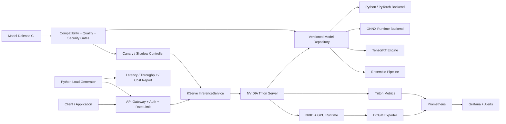

# CS04 — NVIDIA-Optimized Inference Platform

## Executive scenario

An enterprise operates multiple computer-vision, NLP and tabular models, each deployed through a different application stack. GPU endpoints are expensive, latency is inconsistent, models are loaded inefficiently, release teams lack a standard rollback mechanism, and no one can compare the business benefit of optimization against engineering effort or GPU cost.

The goal is to create a governed inference platform using NVIDIA Triton as the multi-framework serving layer, with a TensorRT optimization path, Kubernetes/KServe integration, autoscaling, canary rollout, GPU telemetry and repeatable latency/throughput/cost evidence.

This is a synthetic reference implementation. Configuration, client code and CPU-safe validation may run without NVIDIA hardware. TensorRT speedups and real GPU throughput will be labelled **unvalidated** until hardware-backed evidence is produced.

## Business outcomes

- Standardize deployment for models from multiple frameworks.
- Reduce latency and GPU cost through measured—not assumed—optimization.
- Increase utilization through dynamic batching and controlled concurrency.
- Separate model artifact lifecycle from application release lifecycle.
- Provide production SLOs, observability, canary rollout and rollback.
- Give architects an evidence-based decision framework for CPU, GPU, optimized GPU and managed endpoint choices.

## Scope

### Included

- Triton model repository structure and model configuration.
- Python, ONNX and TensorRT-compatible deployment paths.
- Dynamic batching and instance-group/concurrency design.
- Model ensembles and preprocessing/postprocessing patterns.
- KServe/Kubernetes deployment and autoscaling reference manifests.
- Python load generator and benchmark reporter.
- DCGM/Prometheus/Grafana telemetry design.
- Canary, shadow and rollback strategies.
- Security, model governance, SRE and FinOps.
- NeMo-compatible service path as an architecture integration point.

### Excluded initially

- Unsupported claims of NVIDIA AI Enterprise licensing or paid-product operation.
- Real TensorRT optimization results without compatible GPU execution.
- Production handling of confidential model weights or customer requests.
- Unlimited autoscaling or live cloud deployment without cost approval.

## Requirements

### Functional requirements

1. Support versioned models through a standard repository contract.
2. Serve at least two synthetic model types to demonstrate multi-framework operation.
3. Expose health, readiness, inference and metrics endpoints.
4. Validate input/output schema before a version is promoted.
5. Support configurable dynamic batching with maximum delay and preferred batch sizes.
6. Support multiple model instances where resources allow.
7. Demonstrate an ensemble or preprocessing/model/postprocessing pipeline.
8. Provide a Python benchmark client with configurable concurrency, duration and payload size.
9. Calculate p50/p95/p99 latency, requests/second, error rate and estimated cost per 1,000 inferences.
10. Support staging, canary and rollback specifications.
11. Track model version, runtime configuration, image digest and benchmark record.
12. Refuse release when compatibility, quality, security or SLO gates fail.

### Non-functional requirements

- Production endpoint availability target: 99.9% for standard tier; higher only when business value justifies it.
- No model artifact is mutable after promotion.
- p95 latency and throughput targets are model-specific and captured as policy.
- Rollback must not require rebuilding the previous model artifact.
- Telemetry must not expose sensitive request content.
- GPU/runtime compatibility must be validated before rollout.

## Target architecture



## Model repository governance

Illustrative structure:

```text
model-repository/
├── image_classifier/
│   ├── config.pbtxt
│   ├── 1/model.onnx
│   └── 2/model.plan
├── text_preprocessor/
│   ├── config.pbtxt
│   └── 1/model.py
├── text_model/
│   ├── config.pbtxt
│   └── 1/model.onnx
└── text_ensemble/
    ├── config.pbtxt
    └── 1/
```

Every released version records:

- source model checksum;
- converted artifact checksum;
- framework/runtime version;
- required CUDA compute capability;
- precision mode;
- maximum batch and input shape policy;
- validation dataset version;
- benchmark evidence;
- security/license status;
- owner and approval record;
- rollback predecessor.

## TensorRT optimization workflow

```text
Validated source model
      ↓
Export to ONNX or supported interchange
      ↓
ONNX graph and operator compatibility checks
      ↓
Build TensorRT engine for target GPU and precision
      ↓
Accuracy/numerical parity validation
      ↓
Latency, throughput, memory and power benchmark
      ↓
Compare against baseline
      ↓
Approve target-specific engine or retain baseline
```

### Optimization decision dimensions

- target GPU architecture and compute capability;
- static versus dynamic input shapes;
- FP32, TF32, FP16 or INT8 precision;
- calibration dataset quality for INT8;
- unsupported operators and fallback behavior;
- engine portability constraints;
- cold-start and model-load time;
- latency versus throughput objective;
- accuracy or numerical tolerance;
- engineering/maintenance cost.

No optimization is accepted only because the engine builds. It must satisfy accuracy, reliability and economics gates.

## Dynamic batching design

Dynamic batching can increase throughput by combining requests, but it may add queue delay. The platform tests:

- preferred batch sizes;
- maximum queue delay;
- client concurrency;
- input shape similarity;
- instance count;
- GPU memory headroom;
- latency SLO.

Decision example:

```text
interactive low-latency endpoint:
  max_queue_delay_microseconds: low
  preferred_batch_size: small

asynchronous high-throughput endpoint:
  max_queue_delay_microseconds: higher
  preferred_batch_size: larger
```

The benchmark report must show both latency distribution and throughput. Average latency alone is insufficient.

## Model instance and concurrency strategy

- One instance may underutilize the GPU if kernels or request patterns are small.
- Too many instances can exhaust memory and reduce predictability.
- Multiple model instances are tested against dynamic batching, not enabled blindly.
- Instance groups may target specific GPU types or CPU fallback.
- Multi-model colocation requires workload compatibility and failure-isolation analysis.
- Large models may require tensor/pipeline parallel serving; this is documented separately and not claimed implemented without evidence.

## Ensemble design

An ensemble can combine preprocessing, inference and postprocessing while reducing extra network hops. The reference pattern must define:

- tensor names and shapes;
- preprocessing version;
- failure behavior;
- timeout budget by step;
- trace correlation;
- scaling relationship between steps;
- whether CPU preprocessing can bottleneck the GPU.

For NeMo-based models, the platform documents how exported artifacts or a compatible NeMo/Triton deployment path would enter the same registry, validation and serving controls.

## Kubernetes and KServe model

### Deployment controls

- dedicated inference namespace;
- workload identity and model-store read access;
- GPU node selector/toleration and runtime class;
- explicit CPU, memory and GPU requests/limits;
- readiness/liveness/startup probes;
- PodDisruptionBudget and topology spread;
- NetworkPolicy;
- autoscaling policy;
- immutable container image and model version;
- model cache lifecycle;
- canary traffic percentage.

### Autoscaling signals

Possible signals include:

- request concurrency;
- queue time;
- p95 latency;
- requests/second;
- GPU utilization;
- GPU memory;
- model-specific capacity estimate.

GPU utilization alone may be misleading; scaling must consider SLO, queue and model behavior.

## Benchmark methodology

### Baselines

1. framework-native or Python-backend baseline;
2. ONNX Runtime baseline where applicable;
3. Triton without dynamic batching;
4. Triton with tuned dynamic batching;
5. TensorRT engine where hardware permits;
6. canary under production-like traffic profile.

### Metrics

- p50/p95/p99 and maximum latency;
- requests per second;
- error and timeout rate;
- GPU utilization and memory;
- power/energy where available;
- CPU and memory utilization;
- cold-start and model-load time;
- cost per 1,000 successful inferences;
- successful requests per GPU-hour.

### Load shapes

- steady low concurrency;
- steady high concurrency;
- ramp-up;
- burst;
- mixed payload/input sizes;
- malformed/oversized input;
- dependency or model-store interruption;
- canary comparison.

Synthetic results must be visually labelled as simulated. Real performance results must record hardware, driver, CUDA, model, input and configuration versions.

## Compatibility matrix

A release records and validates:

| Layer | Examples |
|---|---|
| GPU | model, memory, compute capability |
| Driver | NVIDIA driver version |
| CUDA | runtime/toolkit compatibility |
| Container | Triton image tag and digest |
| Backend | Python, PyTorch, ONNX, TensorRT versions |
| Model | framework/export format and opset |
| Kubernetes | runtime, device plugin and GPU Operator versions |
| Engine | TensorRT build target and precision |

The CI path performs static/configuration checks without pretending that static validation proves runtime compatibility.

## Security and model protection

- AuthN/AuthZ and rate limiting at gateway.
- NetworkPolicy limits direct access to serving pods.
- Model repositories are private, versioned and encrypted.
- Workload identity replaces embedded object-store credentials.
- Images are signed and scanned.
- Model artifacts have checksums and provenance.
- Request/response logging is metadata-first and redacts payloads.
- Input size, type and rate constraints protect against abuse.
- Tenant separation is applied when models/data require it.
- Administrative model load/unload operations are restricted and audited.

## SRE and incident model

### SLIs

- availability and successful-request rate;
- p50/p95/p99 latency;
- timeout and overload rate;
- queue duration;
- model load success and duration;
- GPU memory and utilization;
- OOM and GPU XID events;
- autoscaling reaction time;
- canary error/latency delta;
- rollback completion time.

### Failure scenarios

- corrupt model artifact;
- unsupported TensorRT engine/GPU;
- model-store outage;
- GPU node loss;
- memory leak/OOM;
- traffic spike;
- slow preprocessing;
- bad canary version;
- metrics pipeline outage;
- expired credentials.

Every failure has detection, user impact, immediate containment, rollback and preventive-action guidance.

## FinOps model

```text
cost_per_1000 = total_endpoint_cost / successful_requests × 1000
successful_requests_per_gpu_hour = successful_requests / allocated_gpu_hours
```

Optimization levers:

- right GPU class;
- dynamic batching;
- instance count;
- autoscaling minimum/maximum;
- scale-to-zero for non-critical asynchronous endpoints;
- model quantization/precision after validation;
- multi-model consolidation where safe;
- scheduled capacity;
- managed versus self-hosted comparison;
- CPU fallback for suitable models;
- artifact caching and reduced cold starts.

## Planned repository structure

```text
cs04-nvidia-inference-platform/
├── README.md
├── model-repository/
├── src/
│   ├── benchmark_client.py
│   ├── report.py
│   ├── compatibility.py
│   └── release_gate.py
├── conversion/
│   ├── export_onnx.py
│   └── build_tensorrt.md
├── kubernetes/
│   ├── triton-deployment.yaml
│   ├── kserve-inferenceservice.yaml
│   ├── hpa.yaml
│   └── network-policy.yaml
├── dashboards/
├── tests/
├── synthetic-data/
├── docs/
└── .github/workflows/validate.yml
```

## Demonstration sequence

1. Inspect model-repository layout and version metadata.
2. Validate model configuration and compatibility matrix.
3. Start a CPU-safe/local path or show deployment manifests.
4. Run benchmark client against a mock/reference endpoint.
5. Compare no-batching versus batching configuration using clearly simulated evidence if no GPU is available.
6. Show TensorRT build and numerical-parity gates.
7. Demonstrate KServe canary specification and rollback.
8. Review Triton/DCGM metrics and SLO alerts.
9. Present cost-per-1,000 and capacity recommendation.

## Interview proof statement

> Designed an NVIDIA-oriented inference platform using Triton model repositories, TensorRT conversion and validation gates, dynamic batching, controlled concurrency, KServe autoscaling, canary rollback, DCGM/Triton telemetry and benchmark-driven cost decisions. Static and simulated evidence is explicitly separated from real GPU results.

## Profile-ready short line

**NVIDIA Inference Platform:** designed Triton/TensorRT model serving, dynamic batching, KServe autoscaling, GPU observability, canary rollback and latency/throughput/FinOps evidence.

## Honest implementation status

| Component | Status |
|---|---|
| Requirements and architecture | Implemented in repository documentation |
| Triton repository/config examples | Planned next |
| Python benchmark client | Planned next |
| KServe/Kubernetes manifests | Planned next |
| Compatibility and release gates | Planned |
| TensorRT engine build | Not yet performed |
| Real NVIDIA GPU benchmark | Not yet performed |
| NeMo runtime integration | Architecture path only |