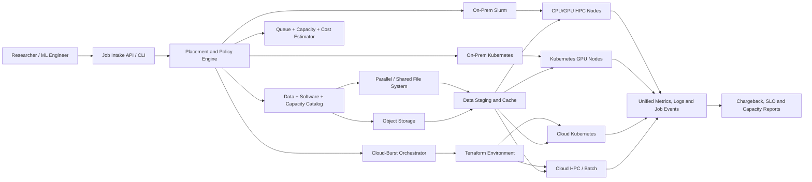

# CS05 — Hybrid HPC and AI Cloud-Burst Platform

## Executive scenario

A regulated research organization owns an on-premises HPC estate with Slurm, high-performance storage and a limited GPU fleet. Demand is bursty: some projects wait days for capacity while other partitions are idle; cloud teams are separately building Kubernetes environments; data movement is slow and poorly governed; and finance cannot determine when cloud bursting is economical.

The target is a hybrid platform that preserves the strengths of the existing HPC environment while adding governed Kubernetes and public-cloud elasticity. Workloads are placed according to data sensitivity, accelerator need, queue urgency, software compatibility, network/storage requirements and cost.

This is a synthetic architecture and implementation blueprint. It does not claim operation of a real InfiniBand fabric, production Slurm cluster or cloud GPU fleet unless later validated with explicit evidence.

## Business outcomes

- Reduce queue backlog for suitable workloads through controlled cloud bursting.
- Avoid unnecessary data movement by placing workloads near approved datasets.
- Provide one policy model for Slurm, Kubernetes batch and cloud capacity.
- Standardize environments through containers, Terraform and Ansible.
- Improve utilization, chargeback and capacity-planning evidence.
- Protect regulated data through classification-aware placement and transfer controls.
- Support distributed AI training, simulation and batch analytics without forcing every workload onto one scheduler.

## Scope

### Included

- On-premises Slurm/HPC reference architecture.
- Kubernetes batch/GPU environment.
- Workload classification and placement engine.
- Cloud-burst control plane and environment lifecycle.
- Terraform and Ansible automation patterns.
- Object/shared/parallel storage and data-staging design.
- Network topology including RDMA/InfiniBand considerations.
- Container and software-environment strategy.
- Identity, security, audit and data-sovereignty controls.
- Observability, queue/capacity SLOs and incident runbooks.
- Chargeback/showback, TCO and burst economics.
- Synthetic placement and cost simulation.

### Excluded initially

- Direct operation of a real regulated dataset.
- Claims of actual RDMA/NCCL performance without compatible hardware.
- Automatic public-cloud provisioning with real credentials.
- Replacement of all Slurm workloads with Kubernetes.
- Assumption that every workload is container-ready.

## Requirements

### Workload intake

Every workload must declare:

- owner, project and cost center;
- workload type: simulation, batch analytics, training, fine-tuning, inference benchmark or notebook;
- data classification and approved locations;
- CPU, memory, GPU model/count and local scratch requirement;
- expected runtime and deadline/priority;
- distributed-process and network requirements;
- container/software environment;
- input/output data size;
- checkpoint capability;
- pre-emption tolerance;
- budget ceiling;
- retention and audit requirements.

### Placement outcomes

The policy engine returns one of:

- `onprem-slurm`;
- `onprem-kubernetes`;
- `cloud-kubernetes`;
- `cloud-hpc`;
- `manual-review`;
- `rejected`.

Every decision includes reasons, constraints, estimated queue/start time, estimated cost and required approval.

### Platform requirements

1. Preserve Slurm for tightly coupled HPC and established scientific workloads.
2. Use Kubernetes for container-native AI/ML, notebooks, pipelines and elastic services.
3. Support a cloud-burst environment that can be created, validated, used and destroyed through controlled workflows.
4. Prevent cloud bursting when data classification or transfer constraints prohibit it.
5. Provide dataset staging with checksums, manifests, encryption and lifecycle control.
6. Support checkpoints for interruptible workloads.
7. Track job state across submission, placement, staging, execution, result return and teardown.
8. Produce queue, utilization, transfer and cost evidence.
9. Provide emergency stop and budget guardrails.
10. Keep secrets and account identifiers outside source control.

## Target architecture



## Scheduler coexistence model

### Slurm remains appropriate for

- mature MPI workflows;
- tightly coupled jobs requiring predictable topology;
- established scientific software modules;
- workloads dependent on parallel filesystems and specialized interconnects;
- on-premises data that cannot move;
- long-running batch jobs with mature Slurm operational controls.

### Kubernetes remains appropriate for

- container-native model training and inference;
- Jupyter and collaborative workspaces;
- Kubeflow/MLflow pipelines;
- microservices and APIs surrounding AI workloads;
- self-service namespaces and policy controls;
- elastic cloud-native jobs;
- mixed pipeline stages beyond only compute.

The architecture does not force a single scheduler. It creates an intake, policy, identity, data and evidence layer across both.

## Placement policy

### Hard constraints

A hard constraint cannot be traded for cost or speed:

- prohibited data region or cloud transfer;
- unsupported accelerator/software combination;
- mandatory interconnect unavailable;
- budget ceiling exceeded;
- missing approval for regulated/high-risk workload;
- untrusted image or dependency;
- insufficient checkpoint/recovery capability for interruptible placement.

### Scored dimensions

After hard constraints pass, candidate environments are scored by:

```text
placement_score =
    urgency_weight × start_time_score
  + cost_weight × normalized_cost_score
  + locality_weight × data_locality_score
  + performance_weight × topology_fit_score
  + sustainability_weight × energy/carbon_score
  + reliability_weight × recovery_fit_score
```

Weights are policy-controlled and explainable. The engine preserves all component scores so reviewers can challenge the decision.

### Example rules

- restricted dataset + on-prem-only policy → on-prem Slurm/Kubernetes;
- tightly coupled MPI + InfiniBand requirement → compatible HPC partition;
- container-native training + cloud-approved data + urgent deadline → cloud Kubernetes candidate;
- checkpointable batch + low urgency → spot/pre-emptible candidate;
- data transfer cost larger than compute savings → keep near data;
- unknown software license portability → manual review.

## Cloud-burst lifecycle

```text
Capacity trigger or approved workload
        ↓
Budget and policy authorization
        ↓
Terraform plan and security validation
        ↓
Create network, identity, compute and storage controls
        ↓
Ansible/bootstrap runtime and scheduler integration
        ↓
Validate GPU/driver/container/storage/network health
        ↓
Stage approved data and workload image
        ↓
Execute, checkpoint and observe
        ↓
Return results and evidence
        ↓
Destroy ephemeral resources
        ↓
Reconcile cost, logs and residual-data checks
```

The environment must fail closed if policy, budget, identity, data or runtime validation does not pass.

## Infrastructure automation

### Terraform layers

- organization/account/subscription/project bootstrap reference;
- network and private connectivity;
- identity/workload identity;
- encryption keys and secret integration;
- object/storage resources;
- Kubernetes or HPC compute control plane;
- GPU node groups or batch queues;
- observability and audit destinations;
- budget and policy controls;
- ephemeral workload environment.

### Ansible layers

- base operating-system hardening;
- NVIDIA driver/container runtime prerequisites where applicable;
- Slurm client/worker configuration;
- monitoring agents/exporters;
- filesystem and mount configuration;
- software module/container tooling;
- time synchronization and system limits;
- validation and evidence collection.

Live apply remains approval-gated. Offline CI validates syntax, formatting, schemas and safe defaults.

## Data-staging design

### Data manifest

Every transfer records:

- dataset ID/version;
- source and destination;
- classification and owner;
- file/object list and size;
- checksums;
- encryption requirement;
- transfer method;
- expected and actual duration;
- retention/teardown rule;
- validation result;
- approval reference.

### Transfer patterns

- parallel filesystem to local NVMe scratch;
- object storage to node-local cache;
- on-prem object gateway to cloud object store;
- read-only reference dataset with versioned manifest;
- result-only return path;
- delta/incremental transfer for repeated jobs;
- pre-staging for scheduled windows.

### Controls

- encryption in transit and at rest;
- private connectivity or approved transfer service;
- checksum verification before execution;
- no compute start until required data is valid;
- lifecycle deletion after evidence retention period;
- egress-cost estimation before approval;
- provenance and lineage retained after data teardown.

## Storage strategy

| Workload need | Preferred pattern | Key concern |
|---|---|---|
| tightly coupled HPC | parallel filesystem | metadata/throughput scaling |
| repeated training dataset | object store + local/shared cache | cache invalidation/versioning |
| checkpoints | durable object/shared storage | frequency, recovery and cost |
| temporary shuffle/scratch | local NVMe | node loss and cleanup |
| notebooks | persistent user/team volume | quota and lifecycle |
| model artifacts | versioned object registry | integrity and access control |

Benchmark plans separate sequential throughput, random I/O, metadata operations and many-small-file behavior.

## High-speed network and distributed training

The design documents—but does not fabricate—these performance considerations:

- InfiniBand or RoCE availability;
- GPUDirect RDMA support;
- NCCL topology and interface selection;
- east-west bandwidth and oversubscription;
- placement within rack/zone/fabric domain;
- MTU and congestion control;
- collective timeout and retry behavior;
- network telemetry;
- cross-zone/cloud transfer latency and cost.

Distributed training is placed in cloud only when the target topology is compatible and the value of faster start/completion exceeds transfer and capacity cost.

## Container and software environment

- OCI containers for portable workloads where licensing and performance permit.
- Apptainer/Singularity compatibility path for traditional HPC environments.
- Environment/module records for non-containerized legacy applications.
- Image allow-list, signing, SBOM and vulnerability scan.
- Base-image compatibility matrix for GPU driver/CUDA/framework.
- Software license location and cloud-portability check.
- Immutable release artifacts with owner and support window.

## Identity and security

- Federated enterprise identity.
- Group/project mapping across portal, Slurm accounts and Kubernetes namespaces.
- Short-lived workload credentials.
- Separation of platform administrator, scheduler operator, data custodian and researcher duties.
- Private network paths and egress restrictions.
- Encryption and customer-managed keys where required.
- Data-classification-aware placement and transfer policy.
- Restricted administrative access through approved bastion/PAM path.
- Central audit trail for submit, approve, stage, execute, cancel and teardown events.
- No secrets or real account identifiers in the portfolio.

## SRE and observability

### SLIs

- intake and placement success rate;
- placement-decision latency;
- queue wait by environment and priority;
- time to provision burst environment;
- burst-environment validation success;
- data-stage throughput and failure rate;
- job success, checkpoint and recovery rates;
- teardown success and residual-resource count;
- GPU/CPU utilization;
- scheduler availability;
- cost reconciliation completeness.

### Operational alerts

- queue-age threshold exceeded;
- cloud budget threshold approached;
- failed or partial teardown;
- data checksum mismatch;
- transfer stalled;
- GPU/driver health event;
- Slurm controller or Kubernetes control-plane degradation;
- checkpoint age exceeds policy;
- unauthorized placement attempt;
- cost anomaly by project.

## DR and continuity

- Slurm and platform configuration backed up and versioned.
- Infrastructure code and bootstrap automation support rebuild.
- Job metadata and placement records replicated according to RPO.
- Durable checkpoints survive worker loss.
- Object/model metadata has cross-region or secondary-site protection where justified.
- Cloud burst can act as emergency capacity only for workloads whose data and dependencies permit it.
- DR exercises verify identity, scheduler, storage, staging, job resume and evidence recovery—not only infrastructure creation.

## FinOps and chargeback

### Cost components

```text
estimated_total_cost =
    compute_and_gpu_hours
  + storage_capacity_and_operations
  + data_transfer_and_egress
  + licensed_software
  + interconnect/connectivity allocation
  + orchestration_and_observability
  + recovery_overhead
```

### Decision metrics

- cost per completed job;
- cost per simulation/training unit;
- queue-delay value impact;
- on-prem marginal cost versus cloud variable cost;
- data transfer cost as percentage of total;
- failed/restarted job cost;
- spot/pre-emptible savings net of lost work;
- utilized versus allocated accelerator-hours;
- burst-environment idle time;
- cost avoided by scheduled teardown;
- forecast capacity shortfall.

Cloud is not automatically cheaper. The placement engine considers deadline value, queue delay, utilization, data movement and operational effort.

## Synthetic placement simulator

The planned Python engine consumes:

```yaml
workload:
  id: train-risk-042
  data_classification: confidential
  allowed_locations: [onprem, approved-cloud-region]
  cpu: 32
  memory_gb: 256
  gpu:
    count: 4
    minimum_memory_gb: 40
  network: high_bandwidth
  checkpointable: true
  expected_hours: 8
  deadline_hours: 12
  max_cost_usd: 1200
  priority: high
```

It combines environment inventory, queue forecast, rate card and policy to produce an explainable decision report. Tests cover hard-policy rejection, on-prem preference, urgent cloud burst, transfer-cost reversal and manual review.

## Planned repository structure

```text
cs05-hybrid-hpc-ai-platform/
├── README.md
├── src/placement_engine/
│   ├── models.py
│   ├── policy.py
│   ├── scoring.py
│   ├── cost.py
│   └── cli.py
├── configs/
│   ├── environments.yaml
│   ├── policies.yaml
│   └── rate-card.yaml
├── terraform/
│   ├── modules/
│   └── environments/sandbox/
├── ansible/
│   ├── roles/
│   └── playbooks/
├── slurm/
├── kubernetes/
├── synthetic-data/
├── tests/
├── docs/
└── .github/workflows/validate.yml
```

## Demonstration sequence

1. Submit five synthetic workloads with different data, topology, deadline and budget profiles.
2. Show hard-policy rejection for prohibited data movement.
3. Place a tightly coupled MPI workload on on-prem HPC.
4. Place a container-native urgent training job on cloud Kubernetes after approval.
5. Show data-stage manifest and checksum controls.
6. Review Terraform plan-only and Ansible validation path.
7. Simulate checkpoint/retry on interruptible capacity.
8. Demonstrate teardown reconciliation and residual-resource alert.
9. Compare on-prem queue delay with cloud cost and business deadline value.
10. Present capacity-plan recommendation.

## Interview proof statement

> Designed a hybrid HPC/AI platform that integrates Slurm, Kubernetes and controlled cloud bursting through an explainable workload-placement engine, data-classification and staging controls, Terraform/Ansible automation, accelerator/network/storage topology, checkpoint recovery, unified observability and chargeback economics.

## Profile-ready short line

**Hybrid HPC/AI Cloud Burst:** designed Slurm/Kubernetes workload placement, cloud-burst automation, governed data staging, high-speed GPU topology, checkpoint recovery and capacity/FinOps decision evidence.

## Honest implementation status

| Component | Status |
|---|---|
| Requirements and architecture | Implemented in repository documentation |
| Placement-engine Python scaffold | Planned next |
| Policy and cost test scenarios | Planned next |
| Terraform plan-only modules | Planned |
| Ansible validation roles | Planned |
| Slurm/Kubernetes reference configs | Planned |
| Real HPC/GPU/RDMA benchmark | Not yet performed |
| Live cloud burst | Not deployed |