# CS01 — Healthcare Clinical Document Intelligence

**Portfolio category:** Enterprise GenAI / Document Intelligence / Healthcare  
**Primary role evidence:** Principal AI Platform Architect · Enterprise Solution Architect · Healthcare AI Architect  
**Scenario type:** Fictional enterprise case study using synthetic clinical documents only  
**Evidence status:** Architecture implemented in public recruiter edition; offline processing simulated; cloud deployment design-only until sandbox approval

## 1. Executive summary

A multi-hospital healthcare group receives referral notes, discharge summaries, diagnostic reports, laboratory results and scanned correspondence through multiple channels. Clinicians and revenue-cycle teams spend significant time locating facts, reconciling inconsistent formats and preparing concise review packets. The organization wants document intelligence and generative AI, but it cannot permit uncontrolled clinical recommendations, patient-data leakage or untraceable model output.

This case study designs a secure, human-reviewed clinical document intelligence platform that:

- ingests synthetic referral, discharge and laboratory documents;
- classifies document type and extracts structured fields;
- produces evidence-linked summaries rather than unsupported medical conclusions;
- routes low-confidence or high-risk output to a clinical reviewer;
- records source, model, prompt, retrieval, confidence, reviewer and final-decision evidence;
- supports a safe offline demonstration and a controlled AWS implementation path;
- separates durable data/artifact resources from ephemeral demo compute so cost returns close to zero after a session.

The design demonstrates how an architect converts a healthcare business problem into a governed AI delivery lifecycle covering requirements, proposal, target architecture, data boundaries, security, responsible-AI controls, operational readiness, Infrastructure as Code, CI/CD, testing and handover.

## 2. Business context

### 2.1 Synthetic customer

`NorthStar Health Group` is a fictional network of eight hospitals and twenty outpatient clinics. It handles approximately 2.5 million document pages each month across clinical intake, care transitions, diagnostics and billing operations.

### 2.2 Business pain

- Clinical staff read long documents to find a small number of relevant facts.
- Important fields are expressed differently across facilities and vendors.
- Manual summaries are inconsistent and difficult to audit.
- Scanned documents require OCR before downstream use.
- Existing search relies on file names and broad keywords.
- A model-generated summary without source evidence is unacceptable.
- Privacy, residency, retention and least-privilege requirements limit SaaS experimentation.
- The organization needs a pilot that proves value without creating production risk.

### 2.3 Intended outcomes

| Outcome | Target for pilot | Evidence method |
|---|---:|---|
| Reduce document-review preparation time | 40–60% | Timed baseline versus assisted review |
| Required-field extraction precision | >= 95% for pilot fields | Synthetic labelled test set |
| Unsupported material clinical claims | 0 accepted outputs | Citation and reviewer tests |
| High-risk output reviewed by a human | 100% | Workflow audit events |
| Traceability from summary to source | 100% of material facts | Evidence-link validation |
| Active demo-cloud cost after teardown | Near zero | Cost and resource inventory check |

Targets are hypotheses for the synthetic pilot, not claims about a real healthcare deployment.

## 3. Stakeholders and responsibilities

| Stakeholder | Accountability |
|---|---|
| Chief Medical Information Officer | Clinical-safety sponsor and acceptance authority |
| Chief Information Security Officer | Security, privacy and risk acceptance |
| Clinical operations lead | Workflow owner and value measurement |
| Data protection / compliance | Data processing, retention and audit requirements |
| Enterprise architect | Target architecture, standards and cross-domain decisions |
| AI platform team | Model, retrieval, evaluation and deployment platform |
| Application engineering | Intake, reviewer workflow and integration |
| SRE / operations | SLOs, monitoring, incident handling and recovery |
| FinOps | Budget, cost allocation and consumption controls |
| Clinical reviewers | Human verification and final approval |

## 4. Synthetic RFP requirements

### 4.1 Functional requirements

1. Accept PDF, text and image-based synthetic documents.
2. Detect file type, validate size and malware-scan before processing.
3. Apply OCR where required and retain page/section coordinates.
4. Classify referral, discharge, lab and diagnostic document types.
5. Extract configured fields into a versioned canonical schema.
6. Produce a concise summary with source-page references.
7. Mark uncertain, missing or conflicting facts explicitly.
8. Prevent the model from issuing autonomous diagnosis or treatment advice.
9. Route records to human review based on risk and confidence policy.
10. Capture reviewer changes, reason codes and final disposition.
11. Expose APIs for status, extracted data, review queue and audit retrieval.
12. Support replay against a fixed synthetic evaluation set.

### 4.2 Non-functional requirements

- Pilot availability target: 99.5% during agreed business hours.
- P95 processing latency: under 120 seconds for a 20-page digital PDF; OCR documents measured separately.
- Encryption in transit and at rest.
- Private service connectivity for regulated data paths.
- Least-privilege workload identities and no long-lived credentials in code.
- Logical tenant and environment separation.
- Immutable or protected audit trail for material workflow events.
- Configurable retention and legal-hold support.
- Repeatable deployment and teardown through IaC.
- Observable cost per document and per successful reviewed summary.

### 4.3 Compliance and responsible-AI requirements

- Use synthetic data in the public portfolio.
- Treat generated output as decision support, never an autonomous clinical decision.
- Require source evidence for material facts.
- Redact or block configured identifiers from logs and model telemetry.
- Maintain model, prompt, retrieval-index and policy versions.
- Record human approval for outputs entering a downstream clinical workflow.
- Support investigation of prompt injection, data leakage and retrieval contamination.
- Provide an exit path if a chosen model or managed service becomes unacceptable.

## 5. Discovery questions

Before final design, the architect would validate:

- Which document types and fields create the highest operational burden?
- What constitutes a material clinical fact versus administrative metadata?
- Which systems are sources of truth: EHR, document management, laboratory or referral portal?
- Is data allowed to leave a private cloud boundary or region?
- Which model providers are approved, and what contractual data-use controls exist?
- What review thresholds are clinically acceptable?
- Which outputs may be written back, and which remain advisory?
- How will user identity and patient context be propagated?
- What retention and deletion rules apply to source documents, embeddings and outputs?
- Which failure is worse: omission, false extraction, delayed processing or unavailable service?
- How will model changes be approved and rolled back?
- What is the business baseline and who signs off measured value?

## 6. Proposed solution

### 6.1 Delivery scope

The pilot implements one bounded workflow: convert synthetic discharge and referral documents into structured, evidence-linked review packets. It excludes autonomous clinical decisions, broad EHR write-back, real patient data and unsupervised production operation.

### 6.2 High-level architecture

```mermaid
flowchart LR
    A[Secure Upload / API] --> B[Quarantine Bucket]
    B --> C[Malware & File Validation]
    C --> D[OCR / Text Extraction]
    D --> E[Document Classifier]
    E --> F[Canonical Field Extraction]
    F --> G[Chunking + Metadata]
    G --> H[Vector / Search Index]
    H --> I[Retrieval + Re-ranking]
    I --> J[Guarded LLM Summary]
    J --> K[Evidence & Confidence Validator]
    K -->|Low risk/high confidence| L[Reviewer Queue]
    K -->|High risk/conflict| M[Escalated Clinical Review]
    L --> N[Approved Structured Output]
    M --> N
    N --> O[Audit Store / Export API]
    P[IAM, KMS, Network, Policy] -.controls.-> B
    P -.controls.-> J
    Q[Logs, Metrics, Traces, Cost] -.observes.-> C
    Q -.observes.-> J
    Q -.observes.-> N
```



### 6.3 AWS reference mapping

A controlled AWS implementation could use:

- Amazon S3 for quarantine, curated documents, artifacts and evidence;
- EventBridge and Step Functions for workflow orchestration;
- Lambda or container tasks for validation, parsing and canonicalization;
- Textract for OCR where approved;
- Bedrock or SageMaker endpoints for model access;
- OpenSearch Serverless or Aurora PostgreSQL/pgvector for retrieval;
- API Gateway and Lambda/ECS for application APIs;
- Cognito or enterprise federation for reviewer access;
- KMS, Secrets Manager, CloudTrail, Config, GuardDuty and Security Hub for security controls;
- CloudWatch and OpenTelemetry-compatible instrumentation for operations;
- Terraform for persistent and ephemeral stacks.

This mapping is design-only until an approved sandbox is connected.

## 7. Data and retrieval design

### 7.1 Canonical record

```json
{
  "document_id": "synthetic-discharge-001",
  "document_type": "discharge_summary",
  "patient_reference": "SYN-0001",
  "facility": "NorthStar Central",
  "admission_date": "2026-01-10",
  "discharge_date": "2026-01-14",
  "diagnoses": [
    {"text": "synthetic diagnosis", "source_page": 2, "confidence": 0.98}
  ],
  "medications": [],
  "follow_up": [],
  "conflicts": [],
  "review_status": "pending",
  "schema_version": "1.0"
}
```

### 7.2 Retrieval rules

- Chunk by clinical section and page rather than arbitrary token windows where possible.
- Attach document, page, section, facility, document-type and schema metadata.
- Filter retrieval by authorized patient/context boundary before similarity search.
- Re-rank candidate passages and enforce a minimum evidence threshold.
- Reject generation when required evidence is absent.
- Include only cited passages in the model context.
- Version the index and preserve the evaluation corpus used for a release decision.

### 7.3 Prompt-injection controls

- Treat document text as untrusted data, not system instructions.
- Separate system policy, user request and retrieved evidence.
- Detect common instruction-injection patterns.
- Allowlist tools and block model-initiated external actions.
- Validate output against a strict schema.
- Require evidence references for material fields.
- Route suspicious records to review and preserve forensic context.

## 8. Security architecture

### 8.1 Identity and access

- Workforce identity federated through the enterprise identity provider.
- Reviewer and administrator roles separated.
- Workloads use short-lived identities.
- Data access constrained by environment, tenant and workflow purpose.
- Break-glass administration is logged and time-bound.

### 8.2 Network and encryption

- Private subnets/endpoints for regulated service paths.
- No public object storage.
- TLS for service-to-service communication.
- Customer-managed encryption keys with key separation by environment/data class.
- Egress allowlisting for approved model endpoints.

### 8.3 Audit events

At minimum, record upload, validation, OCR, classification, extraction, retrieval query, retrieved evidence IDs, model/prompt version, policy decision, reviewer view, reviewer edit, approval/rejection, export and deletion.

### 8.4 Threat model

| Threat | Control |
|---|---|
| Malicious uploaded file | Quarantine, type validation, malware scan, size limits |
| Prompt injection in source text | Untrusted-content isolation, detection, schema validation, no tools |
| Cross-patient retrieval | Authorization filter before vector search and evidence validation |
| Sensitive data in logs | Redaction, structured telemetry and access controls |
| Model hallucination | Evidence-only context, citation validator and human approval |
| Unauthorized model use | Gateway policy, approved model list and workload identity |
| Index poisoning | Controlled ingestion, provenance and signed release dataset |
| Privileged misuse | Separation of duties, immutable audit and alerting |

## 9. Reliability and operations

### 9.1 SLOs

| Service indicator | Pilot objective |
|---|---:|
| Accepted-document processing success | 99% |
| Reviewer application availability | 99.5% business hours |
| Audit-event completeness | 100% for material events |
| Approved summary evidence coverage | 100% material facts |
| P95 digital-PDF processing time | < 120 seconds |

### 9.2 Failure handling

- Idempotent processing keyed by document and workflow version.
- Dead-letter queue for non-transient failures.
- Bounded retries with jitter for transient dependencies.
- Manual replay with traceable reason.
- Degraded mode that permits source-document review if AI processing is unavailable.
- Model/provider failover only after policy and evaluation approval; no silent routing changes.

### 9.3 Recovery

- Durable source/evidence data replicated according to policy.
- Infrastructure recreated through Terraform.
- Index rebuild tested from curated documents and metadata.
- RPO target determined by source-system replay capability.
- RTO target for pilot: four hours; production target requires business impact analysis.

## 10. Observability and evaluation

### 10.1 Operational telemetry

- documents accepted/rejected by type and reason;
- stage latency and failure rate;
- queue depth and oldest-item age;
- OCR confidence and extraction completeness;
- retrieval hit count and evidence coverage;
- model latency, token usage and refusal rate;
- reviewer turnaround and edit rate;
- cost per processed and approved document.

### 10.2 AI-quality metrics

- field-level precision, recall and F1;
- citation correctness;
- evidence coverage;
- contradiction/conflict detection;
- unsupported-claim rate;
- reviewer correction rate;
- performance segmented by document type and scan quality.

A release is blocked if safety-critical fields regress or if unsupported claims exceed the agreed threshold.

## 11. FinOps and commercial model

### 11.1 Cost drivers

- pages processed by OCR;
- embedding volume and re-index frequency;
- vector/search storage and queries;
- model input/output tokens;
- workflow invocations and container duration;
- evidence retention;
- reviewer effort.

### 11.2 Unit economics

Track:

```text
cost_per_accepted_document
cost_per_reviewed_document
cost_per_approved_summary
cost_per_1,000_pages
reviewer_minutes_saved_per_document
```

The design uses persistent and ephemeral stacks. Persistent storage, keys and approved artifacts remain; demo compute, endpoints and temporary workflows are destroyed after a session.

## 12. Delivery plan

| Phase | Duration | Deliverables |
|---|---:|---|
| Discovery and safety framing | 1 week | Workflow, risk, data and baseline definition |
| Architecture and controls | 1 week | HLD, threat model, ADRs, evaluation plan |
| Offline implementation | 1–2 weeks | Parser, canonical schema, synthetic corpus, tests |
| Controlled cloud pilot | 2 weeks | IaC, workflow, model/retrieval, reviewer API |
| Evaluation and decision | 1 week | Quality, cost, security, operations and value report |
| Handover / scale plan | 1 week | Runbooks, backlog, production roadmap and ownership |

## 13. Architecture decisions

### ADR-001 — Human approval is mandatory

**Decision:** Every generated review packet requires human approval during the pilot.  
**Reason:** Clinical impact and model uncertainty make autonomous acceptance inappropriate.  
**Trade-off:** Lower straight-through processing, higher safety and better labelled feedback.

### ADR-002 — Evidence-linked generation

**Decision:** Material claims must reference source page/section IDs.  
**Reason:** Reviewers need traceability and the platform needs an objective validation rule.  
**Trade-off:** More retrieval and validation complexity.

### ADR-003 — Persistent/ephemeral infrastructure split

**Decision:** Durable evidence and artifacts are separated from demo-time compute.  
**Reason:** Fast teardown, lower cost and reduced attack surface.  
**Trade-off:** More Terraform state and deployment orchestration.

### ADR-004 — Provider abstraction through an AI gateway

**Decision:** Application code calls an internal model interface rather than a model-specific endpoint directly.  
**Reason:** Central policy, audit, cost and provider portability.  
**Trade-off:** Gateway becomes a critical platform dependency.

## 14. Validation and acceptance

### Automated validation

- schema validation for extracted records;
- deterministic parser tests against synthetic documents;
- evidence-page reference validation;
- prompt-injection test cases;
- authorization-filter unit tests;
- reviewer-state transition tests;
- Terraform format/validate;
- secret scanning and dependency scanning;
- link and documentation checks.

### Acceptance gates

1. No real patient data is present.
2. All material summary facts have valid source references.
3. High-risk records cannot bypass review.
4. Cross-context retrieval tests fail closed.
5. Audit events cover every material workflow transition.
6. Teardown removes ephemeral resources.
7. Quality and cost results are reproducible from the committed synthetic set.

## 15. Repository implementation map

```text
README.md                         # end-to-end architecture and case narrative
src/demo_pipeline.py              # offline synthetic pipeline
terraform/main.tf                 # safe reference IaC scaffold
tests/test_demo_pipeline.py       # deterministic validation
sample-data/                      # synthetic documents only
evidence/                         # generated evaluation outputs
```

## 16. Demo walkthrough

1. Explain the business workflow and safety boundary.
2. Show one synthetic referral and one discharge document.
3. Run the offline pipeline.
4. Review canonical extracted fields and source references.
5. Trigger a conflict/low-confidence example and show escalation.
6. Display audit events and evaluation summary.
7. Walk through the cloud architecture and threat model.
8. Explain persistent versus ephemeral stacks and cost controls.
9. Close with scale-up conditions and production risks.

## 17. Implementation status

| Capability | Status |
|---|---|
| Business/RFP/proposal/architecture package | Implemented in public documentation |
| Synthetic sample-data model | Implemented / simulated |
| Offline parser and evidence generation | Implemented scaffold; validation to be run in CI |
| Human-review workflow | Simulated in public code |
| AWS managed-service deployment | Design-only |
| Terraform cloud scaffold | Implemented, no live apply |
| Real EHR integration | Out of scope |
| Real clinical validation | Out of scope |

## 18. Interview story

**Situation:** A healthcare organization wants GenAI summaries but faces privacy, safety and traceability concerns.  
**Task:** Create a pilot architecture that proves measurable workflow value without allowing unsupported clinical decisions.  
**Action:** Bound the use case; separated source evidence from model reasoning; designed private data paths, human approval, schema validation, audit, evaluation and persistent/ephemeral IaC; established release gates covering quality, security, reliability and unit cost.  
**Result:** A decision-ready pilot blueprint that can demonstrate value with synthetic data and move to a controlled sandbox without redesigning governance from scratch.

## 19. Resume / profile proof line

Designed a secure, human-reviewed healthcare document-intelligence and RAG platform case study covering synthetic document ingestion, OCR, evidence-linked extraction, prompt-injection controls, clinical review, auditability, evaluation, FinOps, Terraform and controlled AWS deployment patterns.

## 20. Honest-use statement

This is portfolio proof of architecture and engineering approach. It must be described as a synthetic case study, not a completed customer implementation. Any interview discussion should distinguish public implementation evidence from design-only cloud components.