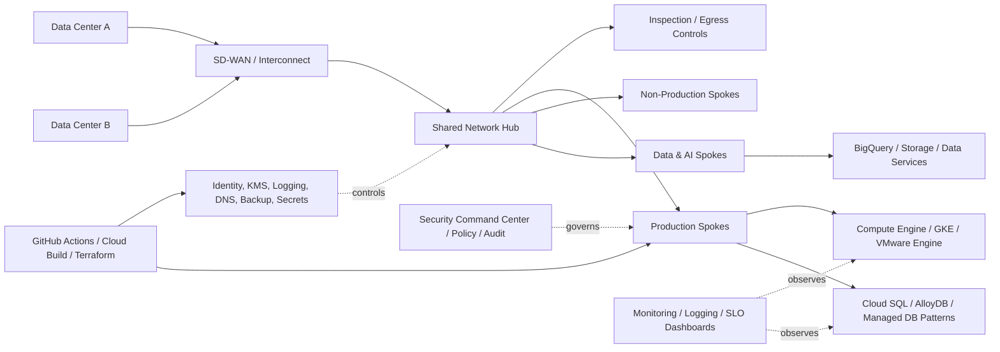

# CS02 — GCP Data-Center Exit & Enterprise Migration Factory

**Portfolio category:** Enterprise Cloud Transformation / GCP / Migration Factory  
**Primary role evidence:** Principal Cloud Architect · Enterprise Architect · Cloud Transformation Director  
**Scenario type:** Fictional Fortune 500 data-center-exit program using synthetic workload inventory  
**Evidence status:** Detailed architecture and migration-planning implementation; offline wave planner simulated; GCP provisioning design-only until sandbox approval

## 1. Executive summary

A regulated global enterprise must exit two leased data centers before renewal while improving resilience, security, delivery velocity and cost transparency. The current estate contains VMware, Linux, Windows, Oracle, SQL Server, middleware, file services and tightly coupled business applications. Previous cloud initiatives migrated individual workloads but did not establish a governed operating model or a repeatable factory.

This case study defines a GCP data-center-exit and migration factory capable of assessing thousands of workloads, recommending 6R dispositions, creating migration waves, establishing a secure GCP foundation, controlling cutover risk and producing traceable evidence for business and technical governance.

The solution demonstrates:

- enterprise discovery and application dependency mapping;
- target-state GCP organization, folder, project and landing-zone architecture;
- identity, network, security, logging, KMS, backup and DR standards;
- portfolio scoring, 6R recommendation and wave planning;
- migration factory governance and stage gates;
- repeatable Terraform deployment for persistent and ephemeral resources;
- CI validation, operational readiness and cutover controls;
- FinOps, licensing and decommission-value tracking;
- executive communication and a multi-year transformation roadmap.

## 2. Synthetic business scenario

`Orion Global Manufacturing` is a fictional regulated manufacturer operating in 24 countries. Two primary data centers host 2,400 server workloads and 310 applications. Lease renewal is due in 18 months. The organization wants to exit both facilities, reduce technical debt and create an AI-ready cloud foundation without causing production disruption.

### 2.1 Current estate

| Domain | Synthetic quantity | Key concern |
|---|---:|---|
| Virtual machines | 2,050 | VMware licensing, aging hardware, low utilization |
| Physical / appliance workloads | 350 | Specialized dependencies and support constraints |
| Business applications | 310 | Mixed criticality and undocumented dependencies |
| Databases | 520 | Oracle/SQL Server licensing and latency sensitivity |
| Data volume | 9.5 PB | Transfer duration, retention and egress planning |
| Network sites | 110 | WAN redesign and hybrid connectivity |
| Regulatory zones | 6 | Residency, segregation and evidence requirements |
| Operations teams | 14 | Fragmented tooling and ownership |

All values are synthetic and exist only to demonstrate architecture and transformation planning.

### 2.2 Business drivers

- avoid data-center lease renewal and hardware refresh;
- improve time to provision environments;
- reduce operational fragility and support risk;
- establish consistent security and audit controls;
- modernize selected applications and databases;
- create reusable cloud onboarding and platform patterns;
- provide transparent migration cost, cloud run-rate and decommission savings;
- prepare the foundation for analytics and AI workloads.

## 3. Program outcomes

| Outcome | Target hypothesis | Measurement |
|---|---:|---|
| Data-center exit | <= 18 months | Lease and asset closure evidence |
| Workloads dispositioned | 100% | Approved portfolio record |
| Automated landing-zone controls | >= 90% | Policy/IaC coverage |
| Migration success without Severity-1 rollback | >= 98% | Cutover records |
| Post-migration critical incidents | < 2% of waves | 30-day hypercare data |
| Decommissioned source assets | >= 95% eligible | CMDB and finance reconciliation |
| Provisioning lead-time reduction | >= 70% | Before/after request cycle |
| Cloud-unit-cost reporting | 100% migrated apps | FinOps allocation report |

These are design targets for the synthetic program, not claimed real outcomes.

## 4. Stakeholders and governance

| Forum / role | Purpose |
|---|---|
| Executive steering committee | Scope, investment, risk and business decisions |
| Enterprise architecture board | Standards, exceptions and target-state alignment |
| Cloud Center of Excellence | Landing zone, platform products and guardrails |
| Migration control tower | Portfolio, waves, dependencies, readiness and reporting |
| Application owners | Business testing, downtime and acceptance |
| Security and risk | Controls, evidence, exceptions and sign-off |
| Network / identity teams | Connectivity, DNS, IAM and federation |
| Database and middleware teams | Migration method and technical assurance |
| Service management / SRE | Monitoring, runbooks, support and hypercare |
| FinOps / procurement | Cost model, commitments, licenses and vendor controls |

## 5. Synthetic RFP scope

### 5.1 In scope

1. Discovery and inventory normalization.
2. Application dependency mapping and business criticality.
3. 6R disposition and target service recommendation.
4. GCP organization and landing-zone design.
5. Network connectivity, DNS, IPAM and segmentation.
6. Identity federation, privileged access and workload identity.
7. Security, encryption, logging and compliance controls.
8. Migration tooling, factory process and runbooks.
9. Compute, database, storage and middleware migration patterns.
10. Backup, DR, resilience and operational readiness.
11. CI/CD, Terraform and configuration automation.
12. FinOps, license optimization and source decommission.
13. Wave execution governance and hypercare.
14. Knowledge transfer and target operating model.

### 5.2 Explicit exclusions

- application functional redesign unless separately approved;
- unsupported proprietary appliances without vendor approval;
- business-process transformation unrelated to the exit;
- production migration using the public portfolio environment;
- real customer data, account identifiers or credentials.

## 6. Discovery and assessment model

### 6.1 Required data

- server and VM inventory;
- application-to-infrastructure mapping;
- network flows and latency requirements;
- database engines, size, growth and HA topology;
- OS and software versions;
- backup, RPO/RTO and retention policies;
- vulnerability and end-of-support status;
- business criticality and maintenance windows;
- licensing and vendor restrictions;
- utilization and seasonality;
- owner, cost center and regulatory classification.

### 6.2 Data-quality gates

A workload cannot enter a committed wave until:

- business and technical owners are identified;
- critical dependencies are mapped or formally accepted as risk;
- target disposition and rollback path are approved;
- data-transfer and downtime estimates are validated;
- security, backup and monitoring controls are assigned;
- testing and acceptance owners are named;
- cost-center and decommission records are linked.

### 6.3 6R decision model

| Strategy | Typical trigger | GCP target example |
|---|---|---|
| Rehost | Tight deadline, low change appetite | Compute Engine / VMware Engine |
| Replatform | Moderate change, managed service benefit | Cloud SQL, GKE, managed file service |
| Refactor | High business value, technical debt | GKE, Cloud Run, event-driven services |
| Repurchase | Commodity capability | SaaS / approved marketplace product |
| Retire | Duplicate or unused | Decommission after retention evidence |
| Retain | Regulatory, technical or economic constraint | Temporary hybrid operation |

The offline planner produces a recommendation, but the architecture board approves the final disposition.

## 7. Target GCP foundation

### 7.1 Organization hierarchy

```text
Organization
├── bootstrap
├── common
│   ├── identity
│   ├── networking
│   ├── security
│   ├── logging
│   └── automation
├── production
│   ├── regulated
│   ├── standard
│   └── data-ai
├── non-production
│   ├── development
│   ├── test
│   └── sandbox
└── decommission-transition
```

Folder and project boundaries align with environment, regulatory domain, ownership and blast-radius requirements rather than individual teams creating ad hoc projects.

### 7.2 High-level architecture



### 7.3 Network design

- Dedicated or Partner Interconnect with resilient paths.
- Cloud Router and dynamic routing with controlled route domains.
- Shared VPC for governed connectivity where organizational model supports it.
- Hierarchical firewall policies and distributed application controls.
- Central DNS strategy with hybrid resolution.
- Private Google Access / Private Service Connect for managed services.
- Egress inspection, allowlisting and data-loss controls.
- IPAM preventing overlap and reserving expansion space.
- Explicit latency, bandwidth and failover tests before migration waves.

### 7.4 Identity and access

- Workforce federation with corporate identity.
- Group-based access and separation of duties.
- Privileged access management and time-bound elevation.
- Service accounts avoided for human use.
- Workload Identity Federation for CI/CD.
- Organization policies restricting risky configurations.
- Access Context Manager/VPC Service Controls where data perimeter needs justify them.

## 8. Security and compliance architecture

### 8.1 Baseline controls

- encryption at rest and in transit;
- customer-managed keys for regulated workloads where required;
- central logging and immutable retention;
- Security Command Center and vulnerability findings;
- approved images and hardened templates;
- secrets in Secret Manager;
- policy-as-code in CI;
- patch, EDR and configuration baselines;
- backup isolation and recovery testing;
- asset inventory and configuration drift detection.

### 8.2 Policy examples

- prohibit public IPs except approved edge projects;
- prohibit public storage access;
- restrict regions and services by regulatory zone;
- require shielded VM and approved images;
- require labels for owner, application, environment, data class and cost center;
- restrict service-account key creation;
- require central logging sinks;
- block direct production changes outside approved pipelines.

### 8.3 Exception process

Every exception contains owner, reason, compensating control, risk rating, expiry date and review forum. Exceptions are not permanent architecture by default.

## 9. Migration factory operating model

### 9.1 Factory workstreams

1. Portfolio and discovery.
2. Cloud foundation and shared services.
3. Network and identity.
4. Security and compliance.
5. Application migration.
6. Database and data migration.
7. Testing and business acceptance.
8. Operations and service transition.
9. FinOps and commercial management.
10. Decommission and benefit realization.

### 9.2 Stage gates

```text
Candidate
 -> assessed
 -> disposition approved
 -> wave assigned
 -> build ready
 -> migration rehearsal passed
 -> business go/no-go
 -> production cutover
 -> hypercare exit
 -> source decommission
 -> benefit confirmed
```

A dashboard reports movement and blockage between gates rather than only counting migrated servers.

### 9.3 Wave design

Waves are grouped by application dependency, business calendar, data gravity, shared middleware, network readiness and team capacity. The planner flags workloads that appear easy individually but are risky because their dependencies span waves.

### 9.4 Cutover control

- frozen source and target baselines;
- approved runbook and timed rehearsal;
- data synchronization and consistency checks;
- technical and business validation;
- incident bridge and decision authority;
- explicit rollback threshold and latest safe rollback time;
- communications and customer-impact plan;
- post-cutover monitoring and hypercare entry.

## 10. Workload migration patterns

### Compute

- Compute Engine rehost with rightsizing and committed-use analysis.
- Migrate to Virtual Machines / image-based replication.
- VMware Engine as a transitional landing pattern when change risk is too high.
- Containerization to GKE for suitable services.
- Cloud Run for stateless event/API workloads.

### Databases

- Backup/restore, replication or database-migration service based on RPO/RTO.
- Cloud SQL / AlloyDB where engine and feature compatibility permit.
- Oracle/SQL Server licensing and support assessed before target selection.
- Data-validation and reconciliation are mandatory acceptance activities.

### Storage and file services

- Transfer Appliance/Storage Transfer Service for bulk data.
- Online transfer or replication for active datasets.
- Lifecycle, retention, immutability and access patterns defined before movement.

### Applications

- Keep interfaces stable for rehost waves.
- Introduce API or event facades where they reduce coupling.
- Modernize only when value and timeline justify it; avoid turning a lease deadline into an uncontrolled refactor program.

## 11. Reliability, backup and disaster recovery

### Criticality tiers

| Tier | Availability direction | RTO | RPO | Pattern |
|---|---:|---:|---:|---|
| Tier 0 | >= 99.99% | <= 15 min | near zero | multi-zone/region, tested failover |
| Tier 1 | >= 99.9% | <= 2 hr | <= 15 min | regional HA plus secondary recovery |
| Tier 2 | >= 99.5% | <= 8 hr | <= 4 hr | zonal resilience plus restore |
| Tier 3 | business hours | <= 24 hr | <= 24 hr | backup and rebuild |

Actual service objectives require business approval. The migration factory refuses to inherit unclear RTO/RPO values silently.

### DR controls

- infrastructure recreated through versioned Terraform;
- backup policies and restore tests mapped to workload tier;
- DNS, certificates, secrets and external dependencies included in DR;
- failover decision authority documented;
- annual or more frequent exercises based on criticality;
- evidence captures achieved RTO/RPO, not merely runbook completion.

## 12. Observability and service transition

Every migrated workload must have:

- infrastructure and application metrics;
- logs with owner and retention;
- health checks and synthetic monitoring;
- alert routing and escalation;
- service dashboard and SLO where appropriate;
- backup and recovery status;
- on-call/runbook ownership;
- capacity and cost view;
- known-error and rollback documentation.

Hypercare exit requires stable telemetry, resolved critical defects, accepted support documentation and ownership transfer.

## 13. FinOps and business case

### 13.1 Cost model

The model separates:

- one-time discovery and migration cost;
- cloud foundation and shared-service cost;
- workload run-rate;
- network and data-transfer cost;
- software licenses and support;
- parallel-run cost;
- source decommission avoidance/savings;
- modernization benefit and operational productivity.

### 13.2 Unit metrics

```text
migration_cost_per_workload
migration_cost_per_application
monthly_cloud_cost_per_application
cost_per_transaction_or_user
rightsizing_savings
commitment_coverage_and_utilization
source_asset_decommission_value
parallel_run_burn_rate
```

### 13.3 Guardrails

- budgets and anomaly alerts before workload onboarding;
- mandatory allocation labels;
- rightsizing after representative utilization is available;
- commitment purchases only after demand confidence;
- non-production schedules and ephemeral environments;
- license optimization validated with procurement/legal.

## 14. Delivery roadmap

| Stage | Indicative duration | Result |
|---|---:|---|
| Mobilize and discover | 4–6 weeks | Inventory, governance, business case |
| Build foundation | 6–10 weeks | Landing zone, network, identity, security, operations |
| Pilot waves | 6–8 weeks | Proven patterns, timings and acceptance model |
| Factory scale | 9–12 months | Repeated waves and modernization tracks |
| Exit and optimize | 2–3 months | Decommission, commitments, benefits and handover |

Workstreams overlap; foundation quality and pilot evidence control scale velocity.

## 15. Risk register

| Risk | Impact | Treatment |
|---|---|---|
| Incomplete dependency data | Outage / rollback | Flow capture, owner workshops, rehearsal and risk acceptance |
| Lease deadline drives unsafe waves | Production impact | Tiering, executive trade-offs, retain/bridge options |
| Network capacity insufficient | Performance failure | Baseline, simulation, bandwidth reservation and cutover test |
| Database incompatibility | Delay / data risk | Early assessment, PoC and rollback method |
| Security controls added late | Rework | Landing-zone controls and stage-gate evidence |
| Parallel-run cost escalates | Budget overrun | Wave cadence, decommission owner and burn-rate dashboard |
| Skills bottleneck | Throughput reduction | Factory pods, runbooks, training and partner capacity |
| Unclear ownership after migration | Operational incidents | Service-transition gate and RACI |

## 16. Architecture decisions

### ADR-001 — Landing zone before production waves

**Decision:** No production migration before minimum viable foundation controls pass.  
**Rationale:** Moving quickly into an ungoverned cloud creates a second remediation program.  
**Trade-off:** Upfront lead time versus lower migration and audit risk.

### ADR-002 — Transitional VMware Engine is permitted but time-bound

**Decision:** Use VMware Engine selectively where it protects the exit date, with a modernization/decommission date.  
**Rationale:** Not every workload can safely transform before lease expiry.  
**Trade-off:** Faster exit but higher run-rate and retained technical debt.

### ADR-003 — Wave planning follows applications, not server batches

**Decision:** Group around business services and dependencies.  
**Rationale:** Server-only waves hide cross-system failure modes.  
**Trade-off:** More discovery effort and better business continuity.

### ADR-004 — Offline decision engine advises; governance approves

**Decision:** The planner recommends target and wave but cannot approve migration.  
**Rationale:** Portfolio data is incomplete and exceptions require human judgment.  
**Trade-off:** Lower automation, stronger accountability.

## 17. Implementation and CI model

```text
README.md
migration_factory/planner.py        # synthetic 6R / wave recommendation engine
data/inventory/workloads.csv        # synthetic workload portfolio
terraform/persistent/main.tf        # landing foundation scaffold
terraform/ephemeral/main.tf         # demo-time factory resources
scripts/validate.sh                 # offline-safe validation
tests/test_planner.py               # deterministic planner tests
evidence/wave-plan.json             # generated output
```

CI should run Python tests, validate required documents, scan secrets, run Terraform fmt/validate without backend and publish generated evidence as an artifact.

## 18. Acceptance criteria

1. Every workload has an approved owner, criticality and 6R decision.
2. Production projects inherit required policy, logging and security controls.
3. Connectivity and failover tests meet approved requirements.
4. Each wave has a rehearsal, go/no-go authority and rollback plan.
5. Monitoring, backup, runbooks and support ownership exist before hypercare exit.
6. Source assets are decommissioned or have an approved retention exception.
7. Cloud cost is allocated and reported per application/cost center.
8. The synthetic planner produces reproducible wave and risk outputs.

## 19. Demo walkthrough

1. Show the synthetic estate and deadline.
2. Explain the organization, landing zone and hybrid network.
3. Run the offline planner against workload inventory.
4. Inspect recommended 6R strategy, wave and risk flags.
5. Walk through a high-risk database application and architecture-board decision.
6. Show Terraform persistent/ephemeral split and CI controls.
7. Demonstrate cutover stage gates, rollback and hypercare evidence.
8. Close with FinOps and source-decommission value.

## 20. Implementation status

| Capability | Status |
|---|---|
| Detailed RFP, proposal and target architecture | Implemented in public documentation |
| Synthetic workload inventory | Implemented / simulated |
| 6R and wave planner | Implemented scaffold; CI validation planned |
| GCP landing-zone Terraform | Implemented reference scaffold; no live apply |
| Migration dashboard | Simulated output/design |
| Hybrid network and security deployment | Design-only |
| Real workload migration | Out of scope |
| Production decommission evidence | Out of scope |

## 21. Interview story

**Situation:** A regulated enterprise must exit two data centers in 18 months with thousands of heterogeneous workloads.  
**Task:** Build an executable migration architecture and operating model that protects production and proves economic value.  
**Action:** Established a governed GCP foundation, normalized the portfolio, used an explainable 6R/wave model, organized factory workstreams, set stage gates, integrated security/operations/FinOps and designed repeatable Terraform/CI evidence.  
**Result:** A decision-ready transformation blueprint that balances lease urgency, modernization value, risk, operating readiness and source decommission.

## 22. Resume / profile proof line

Created a Fortune 500-scale GCP data-center-exit and migration-factory case study covering 2,400 synthetic workloads, 6R assessment, dependency-led wave planning, landing-zone architecture, hybrid networking, IAM/security, DR, Terraform, CI validation, FinOps and decommission governance.

## 23. Honest-use statement

This case study is a fictional portfolio demonstration. Discuss it as proof of architecture and migration-factory thinking, not as a claimed customer program. Real production delivery claims should come only from verifiable career experience.