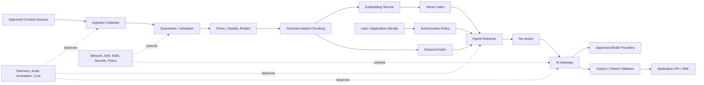

# CS03 — Secure Enterprise RAG & Knowledge Platform

**Portfolio category:** Enterprise GenAI / RAG / AI Platform Engineering  
**Primary role evidence:** Principal AI Platform Architect · Enterprise AI Architect · Head of AI Infrastructure  
**Scenario type:** Fictional regulated-enterprise knowledge platform using synthetic documents  
**Evidence status:** Detailed architecture and offline retrieval/evaluation scaffold; managed-cloud deployment design-only until sandbox approval

## 1. Executive summary

A regulated enterprise wants a common Retrieval-Augmented Generation platform for policy search, engineering knowledge, service operations and controlled employee assistance. Business units have already produced disconnected proofs of concept using different models, vector stores, prompts and security assumptions. None is ready for production because identity, document authorization, prompt injection, evaluation, audit, cost, reliability and operational ownership are inconsistent.

This case study defines a secure enterprise RAG platform that provides reusable ingestion, indexing, retrieval, model access, policy enforcement, evaluation and observability capabilities while allowing business applications to retain domain-specific user experience and approval workflows.

The architecture demonstrates:

- identity-aware retrieval and document-level authorization;
- ingestion provenance, classification, malware checks and quality gates;
- chunking, metadata, embeddings, hybrid search and re-ranking;
- a central AI gateway for approved models, policy, audit and cost controls;
- prompt-injection and data-exfiltration defenses;
- evaluation pipelines covering retrieval, grounding, safety and usefulness;
- tenant/environment isolation and controlled release management;
- LLMOps telemetry, SRE practices and cost-per-answer governance;
- provider portability across AWS, Azure and GCP patterns;
- IaC, CI/CD, offline demonstration and transparent evidence status.

## 2. Synthetic customer and problem

`Apex Industrial Group` is a fictional multinational with 70,000 employees. Its knowledge estate includes engineering standards, operating procedures, policies, service manuals, incident reports and product documentation across SharePoint, file repositories, object storage and service-management platforms.

### 2.1 Current-state problems

- Employees cannot reliably find the authoritative version of a document.
- Search results ignore business context and document permissions.
- Multiple GenAI pilots copy documents into uncontrolled indexes.
- Answers often lack citations or mix superseded documents.
- Prompt injection in uploaded content is not addressed.
- Model/provider usage is invisible to security and FinOps teams.
- No common evaluation baseline exists.
- Each team builds ingestion, retrieval, logging and guardrails again.
- Operational ownership after pilot completion is unclear.

### 2.2 Business outcomes

| Outcome | Pilot target | Evidence |
|---|---:|---|
| Reduce time to locate authoritative guidance | 50% | Timed user study |
| Grounded-answer citation coverage | 100% material claims | Automated evidence validator |
| Permission-violation rate | 0 | Authorization test suite |
| Unsupported-answer rate | < 2% on approved corpus | Evaluation set |
| P95 response latency | < 8 seconds for standard query | Trace metrics |
| Cost per successful answer | Within approved threshold | Gateway/FinOps telemetry |
| Reusable platform adoption | >= 3 pilot applications | Onboarding records |

Targets are synthetic decision criteria, not real customer outcomes.

## 3. Scope and boundaries

### In scope

- approved document-source connectors;
- ingestion, classification, parsing and metadata normalization;
- versioned chunking and embedding pipelines;
- hybrid retrieval, authorization filtering and re-ranking;
- model gateway, prompts, guardrails and output validation;
- citation and grounding verification;
- evaluation, monitoring, cost and audit;
- tenant/application onboarding model;
- APIs and a minimal demonstration client;
- Terraform and CI/CD reference implementation.

### Out of scope

- autonomous write actions into business systems;
- unrestricted internet search;
- training a foundation model from scratch;
- real confidential documents in the public repository;
- claims of production deployment without evidence;
- replacing authoritative source systems.

## 4. Stakeholders

| Role | Responsibility |
|---|---|
| Business product owner | Use case, adoption and value |
| Enterprise architect | Platform boundaries and standards |
| CISO / privacy | Threat model, data boundaries and approval |
| Knowledge owners | Source authority, retention and content quality |
| AI platform team | Retrieval, gateway, evaluation and runtime |
| Application teams | Domain UX and workflow integration |
| IAM team | User/group/attribute propagation |
| SRE | Reliability, observability and incidents |
| FinOps | Unit-cost and provider economics |
| Legal / procurement | Model-provider contractual controls |

## 5. Synthetic RFP requirements

### Functional

1. Connect to approved repositories without bypassing source authorization.
2. Detect file type, malware, unsupported formats and duplicate versions.
3. Normalize metadata including owner, classification, effective date, expiry and ACL.
4. Chunk content using document structure where available.
5. Support dense and keyword retrieval with re-ranking.
6. Filter search candidates before generation based on user/application authorization.
7. Produce answers with citations and source-version metadata.
8. Refuse or qualify answers when evidence is insufficient or conflicting.
9. Provide an application-neutral API and reusable SDK.
10. Centralize model routing, quotas, policy and audit.
11. Run offline and pre-production evaluation against versioned test sets.
12. Support document deletion, expiry and index rebuild.

### Non-functional

- high availability appropriate to internal critical services;
- private connectivity where regulated data requires it;
- encryption and customer-managed keys where policy requires;
- P95 standard-query target below eight seconds;
- end-to-end traceability from request to retrieved chunks and model decision;
- defined RTO/RPO and index-rebuild capability;
- safe degradation when model or vector service is unavailable;
- cost allocation by application, business unit and model;
- repeatable environments through IaC;
- release rollback for prompts, policies, models and indexes.

## 6. High-level architecture



## 7. Platform layers

### 7.1 Content onboarding

Every source receives a documented connector contract:

- source owner and authoritative status;
- authentication method;
- incremental-change mechanism;
- ACL/attribute mapping;
- classification and retention;
- supported file types and size;
- expected volume and freshness;
- deletion and legal-hold behavior;
- data-quality metrics;
- failure and replay handling.

No connector can drop authorization metadata merely because the vector store does not natively understand the source ACL.

### 7.2 Ingestion pipeline

1. Fetch through approved identity.
2. Write to a quarantine boundary.
3. Validate type, size, malware and integrity.
4. Extract text and structure.
5. Detect language and classification.
6. Redact configured sensitive fields from telemetry; do not silently mutate authoritative content.
7. Attach provenance and ACL metadata.
8. Chunk and embed with versioned algorithms.
9. Publish to search indexes after quality gates.
10. Record manifest and index lineage.

### 7.3 Retrieval pipeline

- normalize query and context;
- derive authorized filter set;
- perform keyword and dense retrieval;
- merge and de-duplicate candidates;
- re-rank according to domain and query intent;
- remove stale, unauthorized or low-quality chunks;
- apply minimum evidence threshold;
- send only selected evidence to the model;
- validate citations against exact chunks and source versions.

### 7.4 AI gateway

The gateway owns:

- approved model catalog;
- application and user quotas;
- routing policy by data class, latency and cost;
- prompt template and system-policy versions;
- token limits and context controls;
- content and prompt-injection checks;
- response schema validation;
- audit and cost telemetry;
- provider circuit breaker and approved fallback;
- emergency model disablement.

Applications must not call foundation-model endpoints directly in production.

## 8. Identity-aware retrieval

### 8.1 Access decision

```text
allow = user_is_active
    AND application_is_approved
    AND source_document_acl_matches(user/groups/attributes)
    AND environment_policy_allows(data_class, model, region)
    AND requested_operation_is_allowed
```

Authorization is applied before the model sees candidate content. Post-generation filtering alone is insufficient because sensitive content may already have entered model context or telemetry.

### 8.2 Tenant isolation patterns

Choose based on risk and scale:

- separate index per tenant for strong isolation;
- shared index with mandatory tenant filter and policy enforcement;
- separate encryption key and project/account/subscription for regulated domains;
- separate model endpoint when contractual or residency controls differ.

The architecture decision records why the selected boundary is adequate.

## 9. Security and threat model

| Threat | Control |
|---|---|
| Prompt injection in source document | Treat retrieved text as data; injection detection; no arbitrary tools; policy hierarchy |
| Unauthorized retrieval | Pre-retrieval ACL filter; negative tests; fail closed |
| Cross-tenant data exposure | Isolation, tenant key, mandatory filter and audit |
| Sensitive data in prompt logs | Redaction/tokenization and access-controlled telemetry |
| Index poisoning | Approved connectors, provenance, signing and quarantine |
| Stale/superseded source | Effective/expiry metadata and freshness SLO |
| Model-provider retention | Approved contracts/configuration and gateway routing policy |
| Excessive agent permissions | Minimal tool allowlist, scoped identity and human approval |
| Citation fabrication | Programmatic citation-to-chunk validation |
| Denial of wallet | Quotas, budgets, rate limits and anomaly detection |
| Supply-chain compromise | Signed artifacts, dependency scanning, provenance and policy gates |

### 9.1 Data classes

- Public: broad approved model choice.
- Internal: approved enterprise endpoints with controlled retention.
- Confidential: private connectivity, stricter provider/region and logging controls.
- Restricted: dedicated boundary or no GenAI use unless risk accepted.

## 10. Model and provider strategy

The platform supports multiple approved providers but avoids uncontrolled multi-model complexity.

### Routing dimensions

- data classification and region;
- task type and quality score;
- latency requirement;
- context length;
- cost ceiling;
- provider availability;
- contractual restrictions;
- evaluation-approved versions.

### Fallback policy

A fallback is not automatically safe. It must be independently evaluated, support the same data controls and preserve answer/schema expectations. When no approved fallback exists, the service degrades to search/citation results rather than silently using an unapproved model.

## 11. Evaluation framework

### 11.1 Retrieval metrics

- recall@k;
- mean reciprocal rank;
- normalized discounted cumulative gain;
- authorization-filter correctness;
- stale-document rate;
- evidence diversity and duplication.

### 11.2 Generation metrics

- groundedness;
- citation correctness and completeness;
- answer relevance;
- unsupported-claim rate;
- refusal appropriateness;
- conflict handling;
- safety/policy compliance;
- human rating and correction rate.

### 11.3 Evaluation sets

- golden question/evidence/answer triplets;
- adversarial prompt-injection cases;
- permission-negative tests;
- conflicting and superseded documents;
- missing-evidence questions;
- long-context and high-volume cases;
- multilingual samples where required.

### Release gate

A release identifies the exact corpus snapshot, chunker, embedding model, index parameters, re-ranker, prompt, gateway policy and model version. Any change that can alter answers triggers the appropriate evaluation tier.

## 12. SRE and operational model

### SLO examples

| Indicator | Objective |
|---|---:|
| API availability | 99.9% |
| Authorized retrieval correctness | 100% test suite |
| P95 answer latency | < 8 sec standard query |
| Citation-validator success | >= 99.9% |
| Content freshness | source-specific, e.g. < 4 hr |
| Audit-event completeness | 100% material requests |

### Reliability patterns

- stateless API and gateway scaling;
- queue-based ingestion with retries and DLQ;
- idempotent indexing by source/version;
- index aliases for atomic promotion/rollback;
- model-provider circuit breaker;
- cached safe metadata/search results where permitted;
- graceful degradation to source search;
- recovery runbook for full index rebuild;
- synthetic probes using non-sensitive queries.

### Incident classes

- unauthorized retrieval or data leakage;
- model/prompt regression;
- stale or poisoned index;
- provider outage;
- runaway cost/traffic;
- ingestion backlog;
- citation/evaluation failure;
- key or identity compromise.

## 13. Observability

Correlate each request with:

- application/user pseudonymous identifier;
- policy decision;
- query classification;
- candidate/re-ranked chunk IDs;
- source/version metadata;
- model, prompt and policy version;
- token count, latency and cost;
- output-validation result;
- user feedback and downstream action.

Operational dashboards separate service health from AI quality. A low-error API can still produce poor answers.

## 14. FinOps and unit economics

### Cost components

- connector and parsing compute;
- OCR where required;
- embedding generation and re-indexing;
- vector/keyword index storage and query;
- re-ranking;
- model input/output tokens;
- gateway/API/observability;
- evaluation runs;
- human review and content stewardship.

### Unit metrics

```text
cost_per_query
cost_per_grounded_answer
cost_per_1,000_documents_indexed
cost_per_application
cost_per_business_unit
retrieval_cost_vs_generation_cost
cache_savings
model_route_savings
```

### Controls

- per-application quotas and budgets;
- model/context limits;
- rate limits and anomaly detection;
- scheduled or incremental indexing;
- archive/remove stale content;
- choose smaller models for classification/routing when quality permits;
- compare cost per successful answer, not token price alone.

## 15. Multi-cloud reference mapping

| Capability | AWS | Azure | GCP |
|---|---|---|---|
| Model platform | Bedrock / SageMaker | Azure OpenAI / AI Foundry | Vertex AI |
| Search / vector | OpenSearch / Aurora pgvector | AI Search / PostgreSQL | Vertex AI Search / AlloyDB / vector options |
| Orchestration | Step Functions / EventBridge | Functions / Logic Apps / Container Apps | Workflows / Pub/Sub / Cloud Run |
| Secrets / keys | Secrets Manager / KMS | Key Vault / Managed HSM | Secret Manager / Cloud KMS |
| Identity | IAM / Identity Center | Entra ID / Managed Identity | Cloud IAM / Workforce & Workload Identity |
| Monitoring | CloudWatch / OTEL | Azure Monitor / App Insights | Cloud Monitoring / Logging |

The final implementation should favor one primary cloud unless business requirements justify multi-cloud runtime. Portability comes from platform contracts, IaC modules and data/index rebuild capability, not pretending services are identical.

## 16. Delivery plan

| Phase | Duration | Deliverables |
|---|---:|---|
| Use-case and data discovery | 1–2 weeks | value baseline, sources, risk and scope |
| Platform architecture | 1–2 weeks | HLD, threat model, ADRs and NFRs |
| Offline retrieval prototype | 1–2 weeks | synthetic corpus, retrieval/evaluation baseline |
| Cloud pilot | 2–4 weeks | ingestion, index, gateway, API and telemetry |
| Application onboarding | 1–2 weeks each | domain prompt, evaluation and workflow |
| Production readiness | 2 weeks | SRE, security, DR, FinOps and handover |

## 17. Key architecture decisions

### ADR-001 — Platform capability, not one chatbot

**Decision:** Build reusable ingestion, retrieval, gateway and evaluation services; keep domain UX separate.  
**Reason:** Avoid duplicate controls and enable accountable domain ownership.  
**Trade-off:** Requires platform product management and onboarding discipline.

### ADR-002 — Authorization before retrieval context

**Decision:** Apply source-derived permissions before evidence reaches the model.  
**Reason:** Prevent sensitive-context exposure.  
**Trade-off:** More complex metadata and identity integration.

### ADR-003 — Hybrid retrieval with re-ranking

**Decision:** Combine lexical and dense search, then re-rank.  
**Reason:** Enterprise identifiers and exact terms often perform poorly in dense-only search.  
**Trade-off:** Additional latency and cost.

### ADR-004 — Evidence-insufficient requests refuse or return search results

**Decision:** Do not force a generative answer.  
**Reason:** Trust and safety outweigh answer-rate vanity metrics.  
**Trade-off:** Lower apparent coverage and higher content-remediation demand.

### ADR-005 — Version the full answer supply chain

**Decision:** Track corpus, chunker, embedding, index, prompt, policy and model.  
**Reason:** Reproducibility and rollback require more than model version.  
**Trade-off:** Stronger release engineering burden.

## 18. Risks

| Risk | Treatment |
|---|---|
| Poor source quality | ownership, metadata, content remediation and freshness SLO |
| ACL mismatch | source contract, identity mapping and negative tests |
| Latency growth | stage traces, bounded k, re-ranker tuning and route selection |
| Model/provider change | evaluation gate, gateway abstraction and rollback |
| Cost growth | unit metrics, quotas, routing and budget alerts |
| Platform becomes central bottleneck | product model, self-service onboarding and federated domain ownership |
| Teams bypass gateway | network/IAM controls and approved SDK |
| Overpromised accuracy | decision thresholds, human review and transparent limitations |

## 19. Repository implementation map

```text
README.md
src/rag_demo.py                 # offline deterministic retrieval and citation demo
sample-data/documents/          # synthetic enterprise documents
sample-data/evaluation.json     # golden questions/evidence
terraform/main.tf               # cloud-neutral reference scaffold/comments
policies/gateway-policy.yaml    # model and data-class controls
tests/test_rag_demo.py          # grounding/authorization tests
evidence/evaluation-report.json # generated evidence
```

## 20. Acceptance criteria

1. Unauthorized documents never enter candidate evidence.
2. Material claims have valid citations to authorized sources.
3. Missing or conflicting evidence produces a qualified response/refusal.
4. Prompt-injection samples cannot override platform policy or invoke tools.
5. Every answer records full version lineage.
6. Evaluation and unit-cost reports are reproducible.
7. Provider outage follows the approved degrade/fallback policy.
8. Index deletion and rebuild are tested.
9. IaC and configuration validation pass without secrets.

## 21. Demo walkthrough

1. Show three synthetic source documents with different ACLs and versions.
2. Query as two users and demonstrate permission-aware results.
3. Show hybrid retrieval and re-ranked evidence.
4. Produce an answer with verified citations.
5. Trigger missing/conflicting evidence and demonstrate refusal/qualification.
6. Run a prompt-injection sample.
7. Display evaluation, trace and cost records.
8. Walk through the multi-cloud mapping, SRE and release model.

## 22. Implementation status

| Capability | Status |
|---|---|
| Requirements, architecture, threat model and ADRs | Implemented in documentation |
| Synthetic corpus and evaluation model | Implemented / simulated |
| Offline identity-aware retrieval/citation demo | Implemented scaffold |
| Gateway policy model | Implemented configuration scaffold |
| Terraform reference | Implemented, no apply |
| Managed vector/model endpoints | Design-only |
| Enterprise source connectors | Design-only |
| Production data / users | Out of scope |

## 23. Interview story

**Situation:** Multiple GenAI pilots exist but cannot safely reach production because retrieval authorization, evaluation, audit and cost are inconsistent.  
**Task:** Define a reusable enterprise RAG platform rather than another chatbot.  
**Action:** Designed governed onboarding, source-derived ACLs, hybrid retrieval, an AI gateway, evidence validation, full version lineage, adversarial evaluation, SRE and unit economics; separated platform capabilities from domain applications.  
**Result:** A scalable decision-ready architecture that lets teams onboard use cases without rebuilding critical controls or exposing data through uncontrolled model calls.

## 24. Resume / profile proof line

Designed a secure enterprise RAG platform case study with source-derived authorization, hybrid retrieval and re-ranking, AI gateway, prompt-injection defenses, citation validation, adversarial evaluation, LLMOps observability, SRE, AI FinOps, IaC and multi-cloud provider mapping.

## 25. Honest-use statement

This is a synthetic portfolio implementation and architecture demonstration. It should be presented as public proof of approach and engineering judgment, not as a named client production deployment.