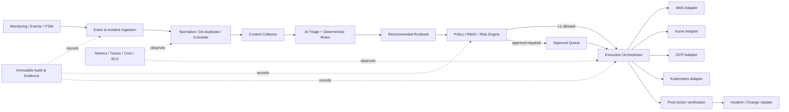

# CS04 — Multi-Cloud AIOps Operations Control Plane

**Portfolio category:** AIOps / SRE / Platform Operations / Multi-Cloud  
**Primary role evidence:** Director Platform Engineering · Principal Cloud Architect · AIOps / SRE Leader  
**Scenario type:** Fictional enterprise operations platform using synthetic incidents and sandbox-safe adapters  
**Evidence status:** Control-plane patterns and runbook engine implemented as public scaffolds; real cloud remediation requires approved identities and change controls

## 1. Executive summary

A global enterprise operates production workloads across AWS, Azure, Google Cloud and legacy data centers. Operations are fragmented across provider consoles, monitoring tools, ticket queues, scripts and tribal knowledge. L1 teams spend time collecting context, L2 teams execute repetitive remediation inconsistently, and L3 engineers are interrupted for issues that should have been enriched or safely automated. Automation exists, but it lacks consistent authorization, approval, audit and rollback controls.

This case study designs a multi-cloud AIOps operations control plane that combines telemetry, incident enrichment, governed runbooks and human approval. It does not attempt to replace cloud-native consoles or give an unrestricted AI agent administrator access. Instead, it creates a narrow, auditable execution layer for approved operational actions.

The platform demonstrates:

- common provider adapters for AWS, Azure and GCP operations;
- L1/L2/L3 activity catalogues and role-based controls;
- incident enrichment using logs, metrics, events and deployment context;
- AI-assisted triage with deterministic fallback;
- approval workflow for higher-risk remediation;
- immutable audit and execution evidence;
- runbook versioning, dry run, rollback and blast-radius controls;
- SLO/error-budget integration;
- FinOps and operations-efficiency metrics;
- dashboard, API, Kubernetes/Helm and CI validation patterns.

## 2. Synthetic customer and business problem

`GlobalLink Services` is a fictional business with approximately 1,800 cloud accounts/subscriptions/projects, 60 Kubernetes clusters and hundreds of production services. Its operations organization handles 35,000 alerts and 8,000 service tickets per month.

### Current-state problems

- Different teams use incompatible scripts and response practices.
- Alert context is gathered manually from multiple tools.
- Cloud credentials are over-privileged or stored in automation platforms.
- Tickets are escalated without complete diagnostics.
- Remediation actions lack consistent approval and evidence.
- Automation success is measured by executions, not customer impact or risk.
- Repeated incidents are not converted into preventive engineering work.
- AIOps vendors suggest autonomous action without fitting enterprise change controls.

### Target outcomes

| Outcome | Synthetic target | Evidence |
|---|---:|---|
| Reduce mean time to acknowledge | 50% | incident timeline comparison |
| Reduce diagnostic collection effort | 70% | automated enrichment record |
| Automate approved L1 actions | >= 60% eligible | execution/audit dashboard |
| Controlled L2/L3 actions with approval | 100% | approval evidence |
| Unauthorized execution | 0 | RBAC and negative tests |
| Runbook success rate | >= 95% for approved scope | execution results |
| Repeat-incident reduction | 20% | problem-management trend |
| Cost per resolved incident | measurable by service/team | FinOps/operations report |

These are targets for the fictional program, not real production outcomes.

## 3. Principles

1. **AI recommends; policy authorizes.**
2. **No unrestricted cloud administrator agent.**
3. **Every action is attributable, versioned and auditable.**
4. **Higher blast radius requires stronger approval and verification.**
5. **Automation must fail closed when identity, scope or evidence is uncertain.**
6. **Runbooks are products with owners, tests, SLOs and retirement dates.**
7. **Customer impact and reliability improvement matter more than number of automated actions.**

## 4. Scope

### In scope

- alert/event ingestion;
- incident context collection;
- provider-neutral resource inventory;
- governed L1/L2/L3 runbook catalogue;
- AI-assisted classification and recommended next steps;
- role-based execution and approvals;
- audit logs and evidence;
- Kubernetes deployment and dashboard;
- provider adapter contracts;
- safe simulation and testing;
- SRE/FinOps reporting.

### Out of scope

- arbitrary shell execution from a natural-language prompt;
- bypassing ITSM/change-management requirements;
- production credentials in the public repository;
- automatic destructive operations without approved policy;
- replacing native provider security and observability tools;
- making business-impact decisions without accountable humans.

## 5. Personas and roles

| Role | Allowed activity |
|---|---|
| Viewer | Observe status, incidents, runbooks and audit |
| Operator | Execute approved L1 actions; request L2/L3 actions |
| Admin / incident commander | Approve scoped L2/L3 execution and emergency controls |
| Runbook owner | Author, test and maintain a runbook |
| Security reviewer | Approve permissions, sensitive actions and evidence |
| SRE | Define SLOs, error budgets, response and prevention work |
| Platform owner | Operate control plane and provider integrations |
| Auditor | Read immutable evidence without execution permission |

Production roles should be federated from enterprise identity with time-bound elevation.

## 6. Runbook activity matrix

### L1 — observation and enrichment

- check instance/VM status;
- check storage health and capacity;
- validate network reachability and DNS;
- list recent control-plane events;
- collect ticket context;
- verify backup job status;
- inspect error-budget burn;
- validate certificate expiry;
- collect deployment and configuration-change history;
- attach diagnostics to the incident.

L1 actions are read-only or operationally low risk.

### L2 — controlled remediation

- restart a scoped service/instance;
- scale an approved resource group;
- isolate an unhealthy node;
- flush or roll back a stuck deployment;
- rotate a service credential through an approved workflow;
- re-run a failed backup or batch job;
- drain and replace a Kubernetes node;
- fail over a non-critical component within a tested pattern.

L2 actions require policy checks and often approval or change linkage.

### L3 — expert and high-impact workflows

- root-cause analysis across services;
- regional failover execution;
- disaster-recovery drill;
- security-forensics evidence capture;
- major cost anomaly review;
- post-incident review and preventive backlog;
- architecture decision on recurring reliability issues;
- emergency traffic-shaping or feature-disable workflow.

L3 workflows remain human-led. The control plane orchestrates evidence, checklists and approved sub-actions.

## 7. High-level architecture



## 8. Incident data model

```json
{
  "incident_id": "INC-SYN-1001",
  "service": "payments-api",
  "environment": "production",
  "severity": "SEV2",
  "provider": "aws",
  "region": "ap-south-1",
  "resources": ["synthetic-resource-1"],
  "signals": [],
  "deployments": [],
  "recent_changes": [],
  "slo_context": {"burn_rate_1h": 8.2},
  "recommended_runbook": "restart-and-verify-v2",
  "risk_level": "medium",
  "approval_status": "pending",
  "execution_status": "not_started"
}
```

The model avoids copying sensitive log payloads by default. Evidence links reference governed stores.

## 9. AI-assisted triage design

The AI component may:

- summarize incident signals;
- classify likely domain and severity;
- identify missing diagnostics;
- rank approved runbooks;
- draft a timeline;
- suggest questions for the incident commander;
- identify similar historical incidents.

It may not:

- grant itself permissions;
- invent a runbook not in the approved catalogue;
- execute arbitrary commands;
- suppress a severity without policy/human authorization;
- expose secrets or customer data;
- make an unreviewed regional failover decision.

### Deterministic fallback

If model access fails or confidence is low, rule-based enrichment still provides resource health, recent changes, topology, known alerts and runbook matches. Operations must not become dependent on a model response for basic incident handling.

## 10. Runbook contract

Each runbook includes:

```yaml
id: restart-and-verify-v2
owner: platform-sre
risk: medium
category: L2
providers: [aws, azure, gcp]
preconditions:
  - incident_linked
  - resource_scope_single
  - maintenance_or_incident_authority
permissions:
  - compute.restart
approval:
  required: true
  approver_roles: [incident_commander, admin]
steps:
  - capture_baseline
  - restart_resource
  - verify_health
  - verify_customer_signal
rollback:
  - trigger_failover_or_restore
success_criteria:
  - health_check_green
  - error_rate_below_threshold
  - no_new_critical_alert
max_duration_minutes: 15
```

Runbooks are versioned and signed/reviewed like application code.

## 11. Policy and approval engine

### Decision inputs

- authenticated user and role;
- service/environment/resource scope;
- incident severity and authority;
- runbook version and risk;
- maintenance/change record;
- error-budget status;
- business calendar;
- resource tags and ownership;
- previous executions and cooldown;
- security policy and active freeze.

### Example decision

```text
permit execution when:
  identity is valid
  AND runbook is approved
  AND resource belongs to requested service/environment
  AND requested parameters satisfy schema
  AND required incident/change link exists
  AND approval is present for medium/high risk
  AND no active security or change freeze blocks action
```

### Approval evidence

Record approver, timestamp, scope, runbook version, parameters, reason, expiry and whether execution completed within the approved window.

## 12. Provider adapters

A common interface supports:

- resource lookup;
- health/status;
- recent events;
- safe action execution;
- post-action verification;
- standardized result and evidence.

Adapters call provider SDKs/CLIs under workload identity. The control plane never stores personal access keys.

### AWS examples

EC2/ECS/EKS health, CloudWatch context, Systems Manager automation, Auto Scaling and approved failover patterns.

### Azure examples

VM/VMSS/AKS health, Azure Monitor, Resource Graph, Automation/Functions and managed-identity execution.

### GCP examples

Compute/GKE health, Cloud Monitoring/Logging, Cloud Asset Inventory, Workflows/Cloud Run and Workload Identity.

Provider-specific differences remain explicit; the common model must not hide important semantics.

## 13. Security architecture

### Identity

- enterprise SSO and MFA;
- short-lived workload identity;
- separate read, execute and approve roles;
- just-in-time privileged approval;
- environment/resource scoping;
- break-glass process with enhanced audit.

### Execution safety

- allowlisted runbook and parameters;
- no free-form command input;
- dry-run and precondition checks;
- blast-radius limit;
- concurrency and cooldown controls;
- change/incident linkage;
- post-action verification;
- timeout and compensating action;
- emergency kill switch.

### Threats and controls

| Threat | Control |
|---|---|
| Prompt causes destructive action | AI cannot authorize; approved runbook/policy only |
| Stolen operator session | MFA, short session, scoped role and approval separation |
| Malicious parameter injection | strict schema/allowlist and escaping |
| Runbook tampering | branch protection, review, signing and hash in audit |
| Cross-account/project action | resource ownership and provider-policy validation |
| Secret leakage | workload identity, secret manager and telemetry redaction |
| Audit deletion | protected/immutable evidence store |
| Automation storm | rate, concurrency, circuit breaker and cooldown |

## 14. Reliability and SRE

### Control-plane SLOs

| Indicator | Objective |
|---|---:|
| Read-only enrichment availability | 99.9% |
| Approved execution request acceptance | 99.9% |
| Audit-event durability | 100% material events |
| Incorrect resource targeting | 0 |
| P95 L1 enrichment latency | < 60 sec |
| Approval notification latency | < 30 sec |

### Failure modes

- provider API throttling/outage;
- stale resource inventory;
- lost approval notification;
- duplicate event/execution;
- partial action success;
- post-verification failure;
- model outage or poor recommendation;
- audit-store unavailability.

### Controls

- idempotency keys;
- workflow state machine;
- bounded retries and DLQ;
- provider-specific backoff;
- execution locks and cooldown;
- compensating/rollback steps;
- durable audit before/after critical transition;
- reconciliation jobs;
- degraded read-only mode;
- chaos tests against adapter and dependency failures.

## 15. Observability and KPIs

### Operational metrics

- incidents ingested and deduplicated;
- enrichment completion and latency;
- recommendation confidence;
- runbook request/approval/execution counts;
- success, partial success, rollback and failure;
- provider API errors/throttling;
- mean time to acknowledge, diagnose, restore and resolve;
- repeat incidents and problem backlog;
- error-budget burn before/after remediation.

### Automation-value metrics

- engineer minutes saved;
- tickets resolved without escalation;
- approved automation coverage;
- false or rejected recommendation rate;
- customer-impact minutes avoided;
- cost per resolved incident;
- preventive actions completed from post-incident reviews.

Do not optimize for automation percentage if it increases risk or hides recurring design defects.

## 16. FinOps

### Platform costs

- event ingestion and retention;
- telemetry queries;
- model tokens/requests;
- control-plane compute and database;
- audit evidence;
- provider API execution;
- dashboard and notifications.

### Unit metrics

```text
cost_per_incident_enriched
cost_per_runbook_execution
cost_per_incident_resolved
model_cost_per_triage
engineer_minutes_saved
incident_impact_cost_avoided
```

Budget controls include model quotas, telemetry retention tiers, query limits and visibility by service/team.

## 17. Delivery roadmap

| Phase | Duration | Result |
|---|---:|---|
| Discovery and control model | 2 weeks | personas, incidents, runbooks, policy and baseline |
| L1 enrichment pilot | 2–3 weeks | read-only context collection and dashboard |
| L2 governed remediation | 3–4 weeks | approvals, adapters, execution and verification |
| L3 workflow support | 2–3 weeks | RCA, DR, forensics and PIR orchestration |
| Scale and platform product | ongoing | onboarding, reliability and value optimization |

Start with a small set of frequent, well-understood incidents. Do not begin with high-impact autonomous actions.

## 18. Architecture decisions

### ADR-001 — Runbook-first, not prompt-to-shell

**Decision:** AI can select from approved runbooks but cannot generate arbitrary execution commands.  
**Reason:** Predictability, audit and blast-radius control.  
**Trade-off:** Slower coverage expansion but materially safer operations.

### ADR-002 — Approval for L2/L3 by default

**Decision:** Medium/high-risk operations require explicit approval unless a separate policy exception is proven.  
**Reason:** Align with enterprise change and incident authority.  
**Trade-off:** Additional response time.

### ADR-003 — Deterministic fallback

**Decision:** Context collection and basic routing work without the model.  
**Reason:** Reliability and avoidance of AI dependency.  
**Trade-off:** Duplicate rule and model logic.

### ADR-004 — Post-action customer-signal verification

**Decision:** Resource API success is insufficient; verify service health and customer signal.  
**Reason:** A restarted VM may not mean the service recovered.  
**Trade-off:** More integration and runbook complexity.

## 19. Repository implementation map

```text
README.md
src/control_plane.py          # role, policy, approvals and execution simulation
src/providers/                # AWS/Azure/GCP adapter contracts
runbooks/catalog.yaml         # approved L1/L2/L3 activities
helm/aiops-control-plane/     # Kubernetes package scaffold
terraform/main.tf             # optional foundation scaffold
tests/                        # RBAC, approval, idempotency and safety tests
evidence/                     # synthetic incident and audit outputs
```

## 20. Acceptance criteria

1. Viewer cannot execute actions.
2. Operator L2/L3 requests create an approval record.
3. Parameters outside runbook schema are rejected.
4. Execution cannot cross the approved resource scope.
5. Duplicate requests do not execute twice.
6. Every state transition creates audit evidence.
7. Failed verification triggers escalation/rollback guidance.
8. Model outage preserves deterministic enrichment.
9. No credentials or production identifiers exist in the repository.
10. CI validates code, runbook schema, Helm and IaC format.

## 21. Demo walkthrough

1. Ingest a synthetic high-error-rate incident.
2. Show automatic context: resource, deployment, SLO and recent events.
3. Display AI/rule recommendation and confidence.
4. Execute an L1 read-only check as operator.
5. Request an L2 restart; show pending approval.
6. Approve as incident commander and execute.
7. Demonstrate post-action service verification and audit.
8. Trigger duplicate/unauthorized requests and show rejection.
9. Review MTTR, automation-value and cost metrics.
10. Explain the path to provider sandbox identities and live testing.

## 22. Implementation status

| Capability | Status |
|---|---|
| Business requirements, architecture and operating model | Implemented in documentation |
| RBAC, approval and audit patterns | Implemented scaffold |
| L1/L2/L3 runbook catalogue | Implemented |
| AI triage | Simulated with deterministic fallback design |
| Provider adapters | Implemented interfaces / sandbox-safe stubs |
| Kubernetes/Helm package | Implemented scaffold |
| Real cloud action execution | Planned live validation; not enabled publicly |
| Production ITSM/monitoring integrations | Design-only |

## 23. Interview story

**Situation:** Multi-cloud operations suffer from alert noise, inconsistent scripts and unsafe pressure for autonomous AI remediation.  
**Task:** Improve MTTR and operator productivity without bypassing enterprise controls.  
**Action:** Designed a runbook-first control plane with provider adapters, deterministic enrichment, AI recommendations, RBAC, L2/L3 approval, immutable audit, post-action verification, SLO and FinOps metrics.  
**Result:** A scalable operating model that automates repeatable work while keeping authorization and high-impact decisions accountable.

## 24. Resume / profile proof line

Built a multi-cloud AIOps control-plane case study with AWS/Azure/GCP adapters, L1/L2/L3 runbooks, deterministic and AI-assisted triage, RBAC, approval workflow, immutable audit, post-action verification, Kubernetes packaging, SRE metrics and incident unit economics.

## 25. Honest-use statement

This is synthetic proof of architecture and implementation approach. Real production remediation remains disabled without approved cloud identities, scopes, change authority and cost/security approval.