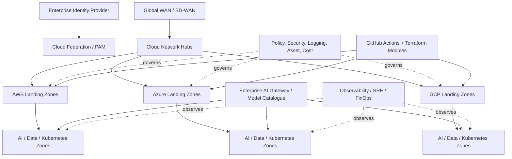

# CS05 — AI-Ready Multi-Cloud Landing Zone

**Portfolio category:** Enterprise Cloud Foundation / Governance / AI Infrastructure  
**Primary role evidence:** Enterprise Cloud Architect · Cloud CoE Leader · Principal AI Platform Architect  
**Scenario type:** Fictional multinational landing-zone transformation across AWS, Azure and GCP  
**Evidence status:** Architecture, policy model and Terraform-module interfaces implemented as public reference patterns; live cloud provisioning requires approved sandboxes

## 1. Executive summary

A multinational enterprise uses AWS, Azure and Google Cloud through disconnected accounts, subscriptions and projects. Each business unit created its own networking, identity, logging and cost practices. The organization now wants to scale AI and data workloads, but its existing foundations cannot consistently enforce private connectivity, workload identity, GPU controls, data boundaries, model-provider policy, observability or unit-cost reporting.

This case study defines an AI-ready multi-cloud landing-zone architecture that establishes consistent enterprise control objectives while preserving provider-native implementation. It treats the landing zone as a platform product, not a one-time setup exercise.

The solution demonstrates:

- cloud organization, account/subscription/project hierarchy;
- identity federation, privileged access and workload identity;
- hub/spoke and cloud-native network patterns with private service access;
- policy-as-code, guardrails, logging, key management and security tooling;
- shared services, DNS, egress, secrets, images and artifact governance;
- Kubernetes and AI-workload onboarding zones;
- GPU quota, model endpoint and data-perimeter controls;
- reusable Terraform modules and GitHub Actions validation;
- platform-service catalogue, golden paths and exception management;
- FinOps allocation, budgets and AI unit economics;
- SRE, DR and operating-model requirements across clouds.

## 2. Synthetic customer and current state

`Helios Consumer & Industrial Group` is a fictional enterprise with 45 business units and operations in 32 countries.

### Cloud estate

| Provider | Synthetic estate | Current problem |
|---|---:|---|
| AWS | 620 accounts | inconsistent SCPs, networking and tagging |
| Azure | 480 subscriptions | management-group and policy drift |
| GCP | 310 projects | ad hoc folders, service accounts and logging |
| Kubernetes | 85 clusters | inconsistent ingress, secrets, upgrades and monitoring |
| AI initiatives | 140 PoCs | unmanaged model access, data and cost |

### Business drivers

- accelerate secure onboarding of cloud and AI workloads;
- reduce duplicated platform engineering;
- meet residency and compliance obligations;
- create transparent account/project ownership and cost;
- restrict public exposure and long-lived credentials;
- provide standard Kubernetes, data and AI foundations;
- improve recovery, observability and support readiness;
- enable central governance without blocking product teams.

## 3. Objectives and measurable targets

| Objective | Synthetic target | Evidence |
|---|---:|---|
| New environment provisioning | < 4 hours after approval | pipeline timestamps |
| Mandatory guardrail coverage | >= 95% automated | policy report |
| Public-storage violations | 0 unresolved critical | security findings |
| Long-lived CI credentials | 0 | identity scan |
| Cost allocation | >= 98% spend | tag/label coverage |
| Standard AI workload onboarding | < 5 business days | service-catalogue data |
| Central log coverage | 100% in-scope accounts/projects | sink/diagnostic evidence |
| Recovery test coverage | tier-based target | exercise reports |

Targets are design objectives for the fictional program.

## 4. Design principles

1. One enterprise control objective may have provider-specific implementations.
2. Organization hierarchy is a security and accountability boundary.
3. Human identities and workload identities are separate.
4. Public network access is an exception, not a default.
5. Logs, asset inventory, security findings and cost data are centralized.
6. Platform teams provide paved roads; product teams own applications.
7. AI services inherit the same identity, network, data, observability and cost disciplines as other critical platforms.
8. Exceptions are time-bound, owned and measured.
9. Every foundation change is versioned, reviewed and deployed through automation.

## 5. Landing-zone service catalogue

### Core foundation services

- organizational hierarchy and account vending;
- identity federation and privileged access;
- network hubs, connectivity and DNS;
- security monitoring and policy;
- central logs and audit;
- key, secret and certificate management;
- approved images and artifact repositories;
- backup, recovery and resilience standards;
- observability and incident integration;
- budgets, labels, showback and anomaly detection.

### AI-ready foundation services

- approved model-provider connectivity;
- AI gateway and model catalogue;
- GPU quota and accelerator policy;
- Kubernetes namespaces/node pools for AI workloads;
- private object/data-store access;
- vector/search service patterns;
- prompt/model/evaluation telemetry;
- AI data classification and residency controls;
- cost-per-token/query/inference allocation;
- model and dataset artifact governance.

## 6. Enterprise hierarchy

### AWS

```text
Organization
├── Security
│   ├── Log Archive
│   └── Security Tooling
├── Infrastructure
│   ├── Network
│   ├── Identity Integration
│   └── Shared Services
├── Workloads
│   ├── Production
│   ├── Non-Production
│   └── Data-AI
├── Sandbox
└── Suspended / Quarantine
```

### Azure

```text
Tenant Root
├── Platform
│   ├── Identity
│   ├── Connectivity
│   └── Management
├── Landing Zones
│   ├── Corp
│   ├── Online
│   ├── Data-AI
│   └── Regulated
├── Sandbox
└── Decommissioned
```

### GCP

```text
Organization
├── bootstrap
├── common
│   ├── networking
│   ├── security
│   ├── logging
│   └── automation
├── production
│   ├── standard
│   ├── regulated
│   └── data-ai
├── non-production
└── sandbox
```

Hierarchy aligns with policy, billing, ownership, regulatory boundary and blast radius.

## 7. High-level multi-cloud architecture



## 8. Identity architecture

### Workforce identity

- federation with enterprise IdP;
- MFA and conditional access;
- group/role-based assignments;
- just-in-time privileged elevation;
- separate production administration roles;
- session duration and device/risk policy;
- centralized joiner/mover/leaver process;
- break-glass identities monitored and tested.

### Workload identity

- AWS IAM roles and OIDC federation;
- Azure managed identities / workload identity;
- GCP service accounts with Workload Identity Federation;
- Kubernetes service-account federation;
- no embedded cloud credentials in code or CI secrets;
- scoped trust policies and audience/subject validation;
- identity per workload/environment where risk requires.

### AI workload identity

Model access is granted to the application workload, not individual developer API keys. The identity defines allowed model, region, data class, quota and logging policy.

## 9. Network architecture

### Enterprise connectivity

- resilient Direct Connect, ExpressRoute and Cloud Interconnect where justified;
- cloud hubs connected through enterprise WAN rather than accidental full mesh;
- controlled route propagation and segmentation;
- central/shared DNS with hybrid resolution;
- IPAM and non-overlapping address plan;
- ingress through approved edge patterns;
- egress inspection, NAT and domain allowlisting;
- private endpoints for managed services;
- separate network zones for regulated and AI/data workloads.

### AI-specific network controls

- private model endpoints where supported;
- deny direct public model API use from production networks;
- egress policy based on approved provider and region;
- private vector/data access;
- separate training/experimentation and production paths;
- large-data/GPU transfer patterns reviewed for cost and security;
- network telemetry retained for incident investigation.

## 10. Policy and guardrails

### Common enterprise controls

| Control objective | AWS | Azure | GCP |
|---|---|---|---|
| Restrict regions | SCP / condition policy | Azure Policy | Org Policy |
| Prevent public storage | SCP/config/rules | Azure Policy | Org Policy / SCC |
| Central logging | org trail/log archive | diagnostic settings | aggregated sinks |
| Restrict keys | IAM/SCP | RBAC/Policy | Org Policy/IAM |
| Require encryption | Config/SCP | Policy | Org Policy / scanners |
| Asset inventory | Config/Resource Explorer | Resource Graph | Cloud Asset Inventory |
| Security posture | Security Hub/GuardDuty | Defender for Cloud | Security Command Center |
| Budget/anomaly | Budgets/Cost Anomaly | Cost Management | Budgets/Billing export |

### AI controls

- approved model catalogue;
- region and data-class restrictions;
- prohibit developer-managed production API keys;
- enforce gateway usage for production applications;
- require prompt/model/evaluation version metadata;
- require token/cost telemetry;
- restrict GPU instance families and quotas;
- require encryption and private data paths;
- block training on restricted data without approval;
- require owner and expiry for AI experiments.

### Exception lifecycle

```text
request -> architecture/security review -> compensating control
-> approval with expiry -> monitoring -> renewal or removal
```

Dashboards show aged exceptions and control debt.

## 11. Logging, security and audit

Centralize:

- control-plane and data-access logs;
- organization/account/subscription/project changes;
- identity and privileged activity;
- network flow and firewall logs where policy requires;
- security findings and vulnerability posture;
- Kubernetes audit and runtime events;
- model/gateway usage metadata;
- key/secret access;
- policy exceptions;
- cost and resource inventory.

Sensitive prompts and payloads are not indiscriminately logged. Telemetry uses classification-aware redaction and controlled evidence storage.

## 12. Kubernetes and platform onboarding

### Cluster patterns

- shared or dedicated cluster based on regulatory and blast-radius needs;
- private control plane/API access;
- workload identity;
- standard ingress/egress and service mesh only where justified;
- policy enforcement and admission control;
- signed images and controlled registries;
- secrets from managed stores;
- central logging/metrics/traces;
- upgrade and node-image lifecycle;
- backup and recovery requirements.

### AI node pools

- separate CPU and GPU pools;
- approved GPU types and regions;
- taints/tolerations and workload quotas;
- NVIDIA operator/driver lifecycle where applicable;
- MIG/time-slicing policy when supported;
- autoscaling boundaries;
- utilization and idle-cost telemetry;
- restricted privileged containers;
- model/data cache strategy.

## 13. Terraform module architecture

```text
ds-terraform-modules/
├── aws/
│   ├── organization-account
│   ├── network-spoke
│   ├── logging-baseline
│   └── ai-workload-zone
├── azure/
│   ├── subscription-vending
│   ├── vnet-spoke
│   ├── diagnostic-baseline
│   └── ai-workload-zone
├── gcp/
│   ├── project-factory
│   ├── network-spoke
│   ├── logging-baseline
│   └── ai-workload-zone
└── policy-tests/
```

### Module contract

Each module declares:

- required organizational context;
- inputs and safe defaults;
- resources and outputs;
- policy/security assumptions;
- owner and version;
- compatibility and upgrade notes;
- tests and examples;
- cost considerations;
- destructive-change behavior.

### Pipeline stages

1. lint/format;
2. static security and secret scan;
3. validate provider/module syntax;
4. policy tests;
5. plan against approved environment;
6. architecture/security approval based on risk;
7. apply with workload identity;
8. post-deployment evidence and inventory;
9. drift monitoring.

## 14. Account/subscription/project vending

A service request captures:

- business and technical owner;
- application/service name;
- environment and criticality;
- regulatory/data class;
- region and network zone;
- cost center and budget;
- required services and quotas;
- recovery tier;
- lifecycle/expiry for sandbox;
- support and on-call ownership.

Automation then creates the cloud boundary, baseline policy, networking, logging, budget, identity groups and repository/bootstrap configuration.

## 15. Reliability and resilience

The landing zone itself has service objectives for:

- account/project vending;
- identity federation;
- DNS and connectivity;
- logging delivery;
- key/secret services;
- policy evaluation;
- CI/CD automation;
- shared Kubernetes/platform services;
- AI gateway and model connectivity.

Critical shared services avoid a single centralized dependency where provider-native distributed patterns are safer. DR includes infrastructure code, state, DNS, certificates, secrets and operational access.

## 16. Observability and operational model

### Foundation dashboards

- account/project inventory and owner coverage;
- policy compliance and exceptions;
- public exposure and critical findings;
- identity/key anomalies;
- network and DNS health;
- logging freshness;
- backup/recovery status;
- Terraform drift and failed deployments;
- Kubernetes version and vulnerability posture;
- AI gateway/model usage;
- GPU utilization and idle cost;
- unallocated spend and budget anomalies.

### Support tiers

- cloud foundation/platform team owns shared services;
- product teams own application reliability;
- security owns enterprise control objectives and risk decisions;
- FinOps owns cost governance model with engineering partners;
- provider incidents and third-party dependencies have escalation paths;
- platform SLOs and error budgets govern change velocity.

## 17. FinOps and AI unit economics

### Mandatory allocation

- application/service;
- business unit/cost center;
- environment;
- owner;
- product/team;
- data/AI workload classification;
- expiry date for experiments;
- shared-service allocation method.

### AI metrics

```text
cost_per_model_request
cost_per_1m_tokens
cost_per_grounded_answer
cost_per_gpu_hour
cost_per_successful_inference
GPU_utilization_and_idle_ratio
vector_index_cost_per_application
```

### Controls

- budgets and anomaly detection at boundary creation;
- non-production schedules;
- approved instance/GPU catalogue;
- commitment governance after usage maturity;
- model routing based on quality and cost;
- ephemeral experiments with automatic expiry;
- shared-service showback;
- unit-cost review in architecture and product forums.

## 18. Delivery roadmap

| Phase | Duration | Deliverables |
|---|---:|---|
| Strategy and control objectives | 3–4 weeks | principles, hierarchy, policies and operating model |
| Minimum viable foundation | 6–10 weeks | identity, network, logging, security and vending |
| Workload onboarding pilots | 4–6 weeks | cloud and Kubernetes golden paths |
| AI-ready extension | 4–8 weeks | gateway, model, GPU, data and cost controls |
| Migration/remediation | ongoing | onboard existing estate and close policy debt |
| Platform product maturity | ongoing | SLOs, adoption, self-service and lifecycle |

## 19. Architecture decisions

### ADR-001 — Common control objectives, provider-native implementation

**Decision:** Standardize outcomes, not identical service names.  
**Reason:** Cloud services differ and lowest-common-denominator architecture reduces value.  
**Trade-off:** Requires multi-cloud skill and separate modules.

### ADR-002 — Landing zone as a product

**Decision:** Maintain roadmap, service catalogue, SLOs, adoption and feedback.  
**Reason:** Foundations evolve with workloads, services and threats.  
**Trade-off:** Permanent product ownership rather than one-off project closure.

### ADR-003 — Gateway-required production model access

**Decision:** Production applications access approved models through a governed gateway/contract.  
**Reason:** Policy, audit, cost and emergency control.  
**Trade-off:** Additional platform dependency and latency.

### ADR-004 — No long-lived CI cloud keys

**Decision:** Use OIDC/workload federation.  
**Reason:** Reduce credential leakage and rotation burden.  
**Trade-off:** More initial identity configuration.

### ADR-005 — AI experiment expiry by default

**Decision:** Sandbox AI resources require owner, budget and expiry.  
**Reason:** Prevent cost/security sprawl.  
**Trade-off:** Teams must renew justified experiments.

## 20. Risks

| Risk | Treatment |
|---|---|
| Central governance slows teams | paved roads, self-service and measured lead time |
| Provider divergence creates complexity | capability map, module ownership and training |
| Policy breaks legitimate workloads | progressive rollout, test environments and exceptions |
| Existing estate cannot comply immediately | remediation waves and time-bound controls |
| AI gateway becomes bottleneck | HA, scale, SLOs, provider fallback and SDK |
| GPU quota/capacity unavailable | capacity planning and multi-region/provider options |
| Shared-cost disputes | transparent allocation method and FinOps forum |
| IaC drift/manual changes | permissions, pipelines, detection and remediation |

## 21. Repository implementation map

```text
README.md
terraform/aws/                 # account and AI-zone reference modules
terraform/azure/               # subscription and AI-zone reference modules
terraform/gcp/                 # project and AI-zone reference modules
policies/control-objectives.yaml
catalog/workload-vending-schema.yaml
tests/policy/                  # compliance-as-code examples
evidence/                      # synthetic compliance and cost reports
```

## 22. Acceptance criteria

1. New boundaries inherit required policy, logging, identity and budget controls.
2. CI/CD uses workload federation with no static production key.
3. Public storage and unapproved public endpoints fail policy tests.
4. AI workloads use approved model/data paths and allocation metadata.
5. Central logs and security findings arrive within freshness target.
6. Resource ownership and cost allocation meet thresholds.
7. Exception records include owner, risk and expiry.
8. Terraform modules validate and destructive changes are surfaced.
9. Platform SLOs, support and recovery procedures are documented.

## 23. Demo walkthrough

1. Present the inconsistent current estate and AI pressure.
2. Show cloud hierarchies and common control objectives.
3. Submit a synthetic AI-workload vending request.
4. Walk through Terraform/policy validation and generated boundary.
5. Demonstrate workload identity and gateway-required model access.
6. Show policy failure for public storage or missing cost owner.
7. Review foundation, AI and GPU cost dashboards.
8. Explain exception handling, SLOs and platform product roadmap.

## 24. Implementation status

| Capability | Status |
|---|---|
| Enterprise architecture and control catalogue | Implemented in documentation |
| Cloud hierarchy and module interfaces | Implemented reference design |
| Terraform provider modules | Scaffolded; no live apply |
| Policy-as-code examples | Implemented scaffold |
| Workload vending schema | Implemented |
| AI gateway/GPU runtime | Design-only in this case study |
| Live AWS/Azure/GCP sandboxes | Planned validation with approval |
| Existing-enterprise remediation | Out of scope |

## 25. Interview story

**Situation:** Multi-cloud growth and AI experimentation created inconsistent identity, network, security, cost and operating controls.  
**Task:** Build a foundation that accelerates teams without forcing a weak lowest-common-denominator architecture.  
**Action:** Standardized enterprise control objectives, designed provider-native hierarchies and modules, automated vending, introduced workload identity, AI gateway/GPU controls, policy tests, platform SLOs and FinOps.  
**Result:** A scalable landing-zone product blueprint that supports cloud migration and production AI while preserving ownership, evidence and cost transparency.

## 26. Resume / profile proof line

Designed an AI-ready multi-cloud landing-zone case study across AWS, Azure and GCP covering organization hierarchy, identity federation, private networking, policy-as-code, logging/security, workload vending, Kubernetes/GPU zones, AI gateway controls, Terraform, SRE and cloud/AI FinOps.

## 27. Honest-use statement

This is a synthetic architecture and public reference implementation. It should be positioned as proof of multi-cloud foundation and AI-platform design, not as a claim that the public code has provisioned a customer environment.