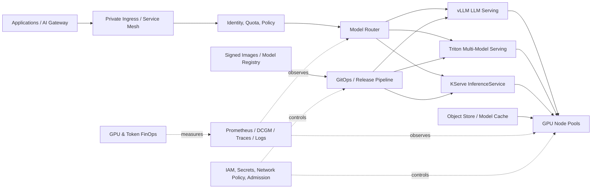

# CS06 — GPU-on-Kubernetes Enterprise Inference Platform

**Portfolio category:** AI Infrastructure / Kubernetes / LLM Serving / Platform Engineering  
**Primary role evidence:** Head of AI Infrastructure · Principal AI Platform Architect · Director Platform Engineering  
**Scenario type:** Fictional enterprise inference platform using synthetic load profiles and non-proprietary models  
**Evidence status:** Kubernetes, scheduling, service and validation patterns implemented as public scaffolds; live GPU deployment requires approved cluster capacity and budget

## 1. Executive summary

An enterprise has moved beyond hosted-model experimentation and now needs a governed platform for self-hosted and optimized model inference. Teams are independently provisioning GPU virtual machines, selecting incompatible serving frameworks and over-allocating capacity. GPU utilization is low, model release processes are inconsistent, latency is unpredictable and security teams cannot clearly trace which model, dataset, image and policy produced an endpoint.

This case study designs a GPU-on-Kubernetes inference platform supporting approved open and enterprise models through standardized deployment, scheduling, autoscaling, observability, security and FinOps controls.

The architecture demonstrates:

- Kubernetes cluster and GPU node-pool design across EKS, AKS or GKE;
- NVIDIA GPU Operator, device plugin and driver lifecycle;
- whole-GPU, MIG and time-slicing allocation patterns;
- vLLM, NVIDIA Triton and KServe-style serving contracts;
- continuous batching, quantization and model-cache strategies;
- workload identity, signed images, secrets and network policy;
- canary model release, evaluation and rollback;
- latency, throughput, token, queue and GPU telemetry;
- autoscaling and capacity planning based on SLO and economics;
- chargeback by model, team and successful inference;
- Terraform, Helm and GitHub Actions validation;
- safe local/synthetic demonstrations when GPU hardware is unavailable.

## 2. Synthetic customer and current state

`Nova Financial Services` is a fictional regulated enterprise running customer-service summarization, document processing, coding assistance and internal search. Hosted models are useful for some workloads, but data-control, latency and economics motivate self-hosted inference for selected models.

### Current problems

- Teams reserve dedicated GPUs with average utilization below 25%.
- Different CUDA, driver and framework versions create operational instability.
- Model images and weights lack provenance and promotion controls.
- Endpoints have inconsistent authentication, quotas and audit.
- Scaling decisions follow CPU metrics rather than queue/token demand.
- No standard path exists for canary, rollback or evaluation.
- Cost is reported per cluster, not per model or product.
- GPU capacity shortages are discovered only during launch.

### Target outcomes

| Outcome | Synthetic target | Evidence |
|---|---:|---|
| Average productive GPU utilization | >= 60% approved workloads | DCGM/serving metrics |
| P95 first-token latency | workload-specific, e.g. < 2 sec | load test |
| P95 inter-token latency | model-specific threshold | serving trace |
| Deployment through approved pipeline | 100% production models | release evidence |
| Model/image provenance | 100% production endpoints | signed artifact metadata |
| Cost allocation | 100% endpoint/GPU spend | chargeback report |
| Failed model rollback | < 10 min | release exercise |
| Unauthorized model deployment | 0 | policy tests |

Targets are synthetic engineering objectives.

## 3. Scope and boundaries

### In scope

- GPU-capable Kubernetes foundation;
- node pools, scheduling and isolation;
- model artifact and image promotion;
- standardized inference service contract;
- vLLM/Triton/KServe patterns;
- autoscaling and capacity management;
- security, observability, SRE and FinOps;
- CI/CD, Helm and Terraform scaffolds;
- synthetic workload and CPU-safe validation.

### Out of scope

- training a foundation model from scratch;
- publishing restricted model weights;
- live use of confidential prompts/data in the public repository;
- claiming benchmark results without the corresponding hardware and test evidence;
- direct internet exposure of model endpoints;
- uncontrolled model downloads at runtime.

## 4. Workload classes

| Class | Characteristics | Platform pattern |
|---|---|---|
| Interactive LLM | low first-token latency, bursty | vLLM, continuous batching, queue-aware scaling |
| Document batch | throughput over latency | batch queue, larger batches, scheduled capacity |
| Embedding | high request volume, predictable | optimized embedding server, horizontal scale |
| Computer vision | image/video, accelerator sensitive | Triton ensemble / specialized runtime |
| Multi-model API | many smaller models | model repository, dynamic loading with controls |
| Evaluation | temporary and reproducible | ephemeral namespace/node allocation |

A workload must provide model size, context length, concurrency, latency target, data class, expected traffic and budget before platform onboarding.

## 5. High-level architecture



## 6. Cluster and node-pool design

### Cluster options

- Dedicated AI cluster for strong isolation and specialized lifecycle.
- Shared platform cluster with dedicated GPU node pools for lower overhead.
- Separate regulated cluster/account/project when data or model license requires.
- Regional or multi-zone control plane according to service criticality.

### Node pools

- CPU system pool for controllers, gateways and observability.
- GPU pool per compatible accelerator/driver family.
- Optional high-memory CPU pool for preprocessing.
- Spot/preemptible pool for interruption-tolerant evaluation or batch work.
- Taints/tolerations and node affinity to prevent accidental scheduling.
- Autoscaling with minimum warm capacity for latency-critical workloads.

### GPU lifecycle

- approved Kubernetes, OS image, driver, CUDA and operator compatibility matrix;
- GPU Operator or managed-provider equivalent;
- staged upgrade and rollback;
- DCGM exporter metrics;
- health checks and automatic cordon/drain for unhealthy devices;
- capacity and quota tracked before workload commitment.

## 7. GPU sharing strategies

### Whole GPU

Use when a model requires the full device or strict performance isolation. Simplest to reason about but can waste capacity.

### Multi-Instance GPU (MIG)

Use supported GPUs to partition hardware into isolated instances. Suitable for predictable smaller workloads. Requires profile planning and can create fragmentation.

### Time-slicing

Allows multiple workloads to share a device over time. Improves utilization for bursty/smaller workloads but offers weaker memory/performance isolation and needs workload testing.

### Decision factors

- model memory and KV-cache demand;
- latency and throughput SLO;
- tenant/security isolation;
- workload burstiness;
- GPU model and MIG support;
- operational complexity;
- cost per successful inference.

No sharing mode is selected solely to improve an aggregate utilization chart.

## 8. Inference serving patterns

### vLLM

Best suited for high-throughput LLM serving using continuous batching and efficient KV-cache management. Platform contract defines model path, tensor parallelism, context length, quantization, resource limits and health endpoints.

### NVIDIA Triton

Useful for multi-framework models, ensembles and standardized metrics. Model repository and configuration must be versioned and promoted through the pipeline.

### KServe-style abstraction

Provides Kubernetes-native inference service lifecycle, revisions, autoscaling and canary patterns. Avoid introducing it if a simpler deployment contract meets needs; platform complexity must earn its value.

### Service API contract

```json
{
  "request_id": "synthetic-123",
  "model": "approved-model-v1",
  "input": "redacted synthetic prompt",
  "parameters": {
    "max_tokens": 256,
    "temperature": 0.1
  },
  "metadata": {
    "application": "knowledge-assistant",
    "data_class": "internal"
  }
}
```

The application accesses the endpoint through an AI gateway or private authenticated service, not a public unauthenticated load balancer.

## 9. Model artifact lifecycle

```text
candidate model
 -> license/security review
 -> artifact checksum and SBOM
 -> offline quality/safety evaluation
 -> performance profile
 -> signed registry promotion
 -> non-production deployment
 -> load/canary evaluation
 -> production approval
 -> monitored release
 -> rollback or retirement
```

### Required metadata

- model name/version/source;
- license and permitted use;
- checksum/signature;
- architecture and parameter count;
- tokenizer/version;
- quantization format;
- minimum GPU memory;
- evaluation results;
- security findings;
- owner and approval;
- retirement/refresh date.

Runtime download from arbitrary public repositories is prohibited in production.

## 10. Scheduling and resource contract

A deployment declares:

- GPU type and count;
- sharing profile;
- CPU, memory and ephemeral storage;
- model-cache requirement;
- maximum context and batch/concurrency;
- latency/throughput objective;
- minimum/maximum replicas;
- priority and preemption policy;
- topology requirement;
- data classification and namespace;
- owner, budget and on-call.

Admission policy rejects incomplete or unapproved specifications.

## 11. Autoscaling and capacity planning

### Scaling signals

- pending requests / queue depth;
- requests or tokens per second;
- time to first token;
- inter-token latency;
- batch occupancy;
- GPU utilization and memory;
- KV-cache utilization;
- request timeout/error rate;
- scheduled demand.

CPU utilization alone is not a sufficient signal.

### Capacity model

```text
required_replicas = peak_requests_per_second
                    / tested_requests_per_second_per_replica
                    * safety_factor
```

Then validate memory, context-length distribution, batching and failure-domain capacity.

### Cold-start strategy

- maintain minimum warm replicas for interactive endpoints;
- pre-pull images and model artifacts;
- local/cache volumes where appropriate;
- scheduled scale-up for known events;
- separate slow model-loading readiness from process liveness;
- route only after model and tokenizer are ready.

## 12. Security architecture

### Identity and access

- workload identity for application-to-endpoint access;
- namespace/team boundaries;
- separate deployer and runtime identities;
- registry/model-store access scoped read-only at runtime;
- just-in-time administrative access;
- audit of model deployment and invocation metadata.

### Supply chain

- signed container images;
- SBOM and vulnerability scans;
- approved base images;
- model artifact checksum/signature;
- admission policy for trusted registries;
- no privileged containers unless explicitly justified;
- immutable release references rather than mutable `latest` tags.

### Network and data

- private cluster/endpoints;
- default-deny network policy;
- controlled egress;
- encryption and managed keys;
- prompt/payload redaction in telemetry;
- tenant/data-class policy at the gateway;
- no model training or retention of prompts unless approved.

### Threats

| Threat | Control |
|---|---|
| Malicious model artifact | source review, scan, signature and sandbox evaluation |
| Unauthorized endpoint use | identity, quota, network policy and gateway |
| Prompt/data leakage in logs | redaction and protected trace storage |
| Container escape / privileged access | hardened nodes, admission policy and runtime controls |
| GPU memory leakage across workloads | isolation choice, node lifecycle and testing |
| Dependency compromise | pinned/signed artifacts and SBOM |
| Denial of wallet | quotas, budgets, queue/rate limits and kill switch |
| Model replacement without review | GitOps, immutable version and approval |

## 13. Reliability and SRE

### SLO dimensions

- endpoint availability;
- time to first token;
- inter-token latency;
- request success and timeout;
- queue wait;
- model correctness/safety evaluation separate from service health;
- deployment and rollback time;
- GPU capacity headroom;
- audit completeness.

### Reliability controls

- pod disruption budgets and topology spread;
- multiple replicas across failure domains;
- health-based routing;
- circuit breaker and bounded queue;
- model release canary;
- automatic rollback on latency/error/evaluation threshold;
- node health detection and replacement;
- cluster and artifact recovery runbooks;
- alternate hosted model route only if data/policy allows.

### Degraded modes

- queue batch requests;
- reject low-priority traffic with explicit response;
- route to an approved smaller model;
- return retrieval/search without generation;
- use approved managed endpoint as temporary fallback;
- preserve critical applications through priority classes.

## 14. Observability

### Platform metrics

- GPU utilization, memory, temperature, power and errors;
- node/pod allocation and fragmentation;
- replica count and pending pods;
- model load and readiness duration;
- queue depth and request concurrency;
- time to first token and inter-token latency;
- tokens/sec and requests/sec;
- context length and output distribution;
- failure/timeout/cancellation;
- cache hit/miss;
- model and application cost allocation.

### Trace dimensions

- application and request ID;
- model/revision;
- gateway route and policy;
- queue, preprocessing, inference and postprocessing spans;
- GPU/node/replica;
- token count and cost;
- evaluation or guardrail result.

Prompt content is not automatically included in general traces.

## 15. FinOps and unit economics

### Cost drivers

- reserved/on-demand/spot GPU hours;
- idle warm capacity;
- model loading and storage;
- inter-zone/region data transfer;
- CPU preprocessing and gateway;
- observability cardinality and retention;
- failed/aborted requests;
- licensing and support.

### Unit metrics

```text
cost_per_gpu_hour
cost_per_1m_input_tokens
cost_per_1m_output_tokens
cost_per_successful_request
cost_per_1,000_documents_processed
GPU_productive_utilization
GPU_idle_and_fragmentation_cost
cost_by_model_application_team
```

### Optimization levers

- quantization after quality validation;
- continuous batching;
- right-size context/output limits;
- MIG/time-slicing where appropriate;
- route simple tasks to smaller models;
- spot capacity for interruptible workloads;
- warm capacity aligned to demand;
- model-cache and image optimization;
- consolidate compatible workloads without violating isolation.

## 16. CI/CD and release

### Pipeline

1. lint and unit tests;
2. dependency, image and secret scans;
3. model metadata/license/checksum validation;
4. Helm/Kubernetes schema validation;
5. policy-as-code tests;
6. deploy to non-production;
7. smoke and load test against synthetic prompts;
8. quality/safety evaluation;
9. cost projection and capacity check;
10. approval for production;
11. canary release;
12. monitor and promote or roll back;
13. publish evidence.

### Rollback

Rollback references the previous signed image, model artifact and configuration. Model weight, tokenizer, prompt/gateway policy and serving parameters are treated as one release unit when they affect behavior.

## 17. Delivery roadmap

| Phase | Duration | Deliverables |
|---|---:|---|
| Demand and model discovery | 1–2 weeks | workload classes, SLOs, capacity and policy |
| Platform foundation | 3–5 weeks | cluster, GPU pools, registry, identity, observability |
| First endpoint | 2 weeks | serving contract, release and baseline test |
| Multi-tenant optimization | 2–4 weeks | sharing, quotas, autoscaling and chargeback |
| Production readiness | 2 weeks | SRE, security, DR, FinOps and handover |
| Scale | ongoing | additional models, regions and efficiency |

## 18. Architecture decisions

### ADR-001 — Kubernetes as shared inference substrate

**Decision:** Use Kubernetes where multiple model workloads justify shared scheduling and platform controls.  
**Reason:** Standard lifecycle, isolation, observability and portability.  
**Trade-off:** Cluster/GPU operational complexity; a single VM or managed endpoint may be better for small scope.

### ADR-002 — Gateway in front of model endpoints

**Decision:** Applications do not bind directly to raw serving pods.  
**Reason:** Identity, policy, routing, quota, audit and fallback.  
**Trade-off:** Added hop and platform dependency.

### ADR-003 — Queue/token metrics drive scaling

**Decision:** Scale on workload demand and SLO indicators rather than CPU only.  
**Reason:** GPU inference bottlenecks are not represented by CPU utilization.  
**Trade-off:** Custom metrics and tested capacity model required.

### ADR-004 — Artifact promotion, not runtime download

**Decision:** Models are reviewed, signed and promoted before deployment.  
**Reason:** Security, repeatability and license governance.  
**Trade-off:** Slower experimentation-to-production path.

### ADR-005 — Sharing mode is workload-specific

**Decision:** Whole GPU, MIG and time-slicing are selected through evidence.  
**Reason:** Utilization optimization cannot compromise isolation or latency.  
**Trade-off:** More capacity profiles and testing.

## 19. Risks

| Risk | Treatment |
|---|---|
| GPU quota/capacity unavailable | reservation, multi-zone/region/provider and demand forecast |
| Driver/CUDA incompatibility | compatibility matrix, staged upgrades and tested images |
| Model does not meet latency target | quantization, batching, tensor parallelism or managed alternative |
| Sharing causes noisy neighbor | isolation tests, quotas and dedicated profile |
| Idle warm capacity expensive | tiered SLOs, scheduling and smaller fallback model |
| Model licensing violation | legal review, metadata gate and approved registry |
| Sensitive prompts exposed | private path, redaction, access and retention controls |
| Platform team bottleneck | service templates, onboarding contract and self-service |

## 20. Repository implementation map

```text
README.md
kubernetes/base/                   # namespace, service, deployment and policy
helm/inference-platform/           # configurable chart scaffold
terraform/main.tf                  # cluster/GPU foundation reference
src/synthetic_inference_server.py  # CPU-safe demonstration endpoint
loadtest/                          # synthetic request generator
policies/                          # admission and model metadata examples
tests/                             # config, policy and API tests
evidence/                          # synthetic load and cost report
```

## 21. Acceptance criteria

1. Production deployment references approved signed image/model versions.
2. Endpoint requires workload identity and private access.
3. GPU workload is scheduled only on approved pool/profile.
4. Requests, latency, tokens and cost are attributable to application/model.
5. Canary automatically stops/rolls back on threshold breach.
6. Node/device failure does not silently return corrupt output.
7. Quotas prevent one tenant from exhausting capacity.
8. Terraform/Helm/policy tests pass without secrets.
9. Synthetic CPU-safe demo functions when no GPU is available.
10. Benchmark claims include exact hardware/configuration/evidence or are not made.

## 22. Demo walkthrough

1. Show workload classes, SLO and capacity request.
2. Walk through cluster, node pools and GPU sharing decision.
3. Validate model metadata and signed release reference.
4. Deploy CPU-safe synthetic server through the same service contract.
5. Generate load and show queue/latency/token metrics.
6. Demonstrate quota, canary and rollback logic.
7. Review GPU utilization/fragmentation and cost model.
8. Explain the controlled path to a live GPU sandbox.

## 23. Implementation status

| Capability | Status |
|---|---|
| Architecture, security, SRE and FinOps package | Implemented in documentation |
| Kubernetes/Helm service contract | Implemented scaffold |
| Synthetic CPU-safe inference endpoint | Implemented scaffold |
| Load and cost model | Simulated |
| GPU Operator/MIG/time-slicing configuration | Reference design/scaffold |
| Live GPU benchmark | Not yet executed; no performance claim |
| Managed cluster provisioning | Terraform design-only until approval |
| Production model/data | Out of scope |

## 24. Interview story

**Situation:** Teams independently provision GPUs, creating low utilization, weak release controls and unpredictable latency/cost.  
**Task:** Build a shared enterprise inference platform that preserves security and SLOs.  
**Action:** Designed Kubernetes GPU pools, serving contracts, artifact promotion, workload identity, queue-aware scaling, release canaries, DCGM/LLMOps telemetry and per-model unit economics; defined evidence-based sharing choices.  
**Result:** A platform blueprint capable of improving accelerator utilization and deployment consistency while making performance, risk and cost explicit.

## 25. Resume / profile proof line

Designed a GPU-on-Kubernetes inference-platform case study covering EKS/AKS/GKE patterns, NVIDIA GPU lifecycle, whole-GPU/MIG/time-slicing, vLLM/Triton/KServe serving, queue-aware autoscaling, signed model releases, LLMOps observability, SRE and GPU FinOps.

## 26. Honest-use statement

This public case study contains architecture and safe scaffolds. No live GPU benchmark or production-performance result is claimed until hardware, configuration and test evidence are committed.