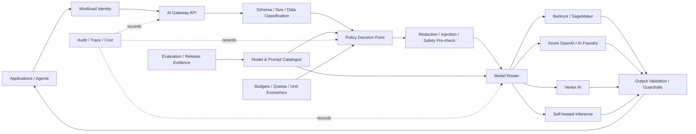

# CS07 — Enterprise AI Gateway & Multi-Model Governance

**Portfolio category:** AI Platform Governance / Responsible AI / Model Operations  
**Primary role evidence:** Principal AI Platform Architect · AI Governance Architect · Enterprise Architect  
**Scenario type:** Fictional enterprise model-access platform using synthetic prompts and policy data  
**Evidence status:** Gateway policy, routing, audit and cost patterns implemented as public scaffolds; provider calls are disabled unless an approved sandbox is configured

## 1. Executive summary

An enterprise uses multiple foundation-model providers through isolated application teams. Developers hold provider keys, model versions change without central evaluation, prompts may contain sensitive data, and no consistent way exists to enforce data-class restrictions, safety checks, quotas, audit, fallback or cost allocation. Security wants control, product teams want speed and procurement wants commercial visibility.

This case study defines an enterprise AI gateway and multi-model governance platform that sits between applications and approved model endpoints. It provides policy-driven routing, workload identity, guardrails, request/response validation, prompt/model versioning, audit, evaluation hooks, rate limits and unit-cost telemetry.

The gateway is not a generic “AI firewall” claim. Its responsibilities and limitations are explicit. It cannot guarantee model truth, replace application authorization or eliminate the need for domain-specific evaluation and human approval.

The design demonstrates:

- approved model catalogue and provider abstraction;
- identity- and data-class-aware routing;
- prompt template and system-policy version control;
- request schema, redaction and injection screening;
- output validation, grounding hooks and safety policy;
- application quotas, budget controls and denial-of-wallet protection;
- provider circuit breakers and approved fallback;
- traceable audit without indiscriminate sensitive-content logging;
- evaluation gates and emergency model disablement;
- multi-cloud mapping, IaC, API and CI/CD scaffolds.

## 2. Synthetic customer and current state

`Meridian Global Services` is a fictional 50,000-employee enterprise with more than 80 GenAI applications across customer support, engineering, finance, HR and operations.

### Current problems

- Provider API keys are stored in application secrets.
- Applications call model endpoints directly.
- No central approved model list or retirement process exists.
- Sensitive prompts may be sent to inappropriate regions/providers.
- Teams cannot explain why a request was routed to a model.
- Cost is visible by provider account but not by application/use case.
- A provider outage causes application failures or unsafe ad hoc fallback.
- Guardrails and content filters differ by team.
- Prompt/model changes reach production without evaluation evidence.
- Security has no emergency method to block a model or use case.

### Outcomes

| Outcome | Synthetic target | Evidence |
|---|---:|---|
| Production model calls through gateway | 100% | network/IAM and access logs |
| Long-lived provider keys in apps | 0 | secret and identity scan |
| Requests with complete application/data metadata | >= 99.9% | schema telemetry |
| Restricted-data routing violations | 0 | negative policy tests |
| Cost allocation | 100% model usage | FinOps report |
| Emergency model disable time | < 5 minutes | control exercise |
| Gateway availability | 99.95% target | SLO dashboard |
| Policy-decision audit completeness | 100% material requests | evidence store |

These are design targets for the fictional platform.

## 3. Platform principles

1. Applications authenticate with workload identity, not provider keys.
2. Policy decides what is allowed before routing.
3. Provider abstraction does not pretend models are behaviorally identical.
4. Fallback requires pre-approval and evaluation.
5. Logs minimize sensitive content while preserving decision evidence.
6. The gateway enforces platform policy; applications remain responsible for business authorization and workflow safety.
7. Every model, prompt and policy release is versioned and reversible.
8. Cost and risk are first-class routing dimensions.
9. A refusal or degraded response is safer than an unapproved model route.

## 4. Scope

### In scope

- workload authentication and application registration;
- model/provider catalogue;
- policy-driven route selection;
- request schema and data-class handling;
- rate limits, quotas and budgets;
- prompt/system-policy version resolution;
- request/response guardrail hooks;
- provider adapter interface;
- audit, telemetry and cost allocation;
- evaluation and release integration;
- kill switch and provider circuit breaker;
- public synthetic API demonstration.

### Out of scope

- replacing end-user identity/authorization in applications;
- guaranteeing factual correctness;
- unrestricted autonomous tool use;
- storing real prompts in the public repository;
- live model-provider access without approved credentials and budget;
- treating all models as interchangeable.

## 5. High-level architecture



## 6. Application onboarding contract

An application registers:

- owner and business purpose;
- environment and criticality;
- expected volume and latency;
- data classifications;
- allowed regions/providers/models;
- use-case category;
- safety and human-approval requirements;
- maximum context/output;
- monthly/daily budget;
- fallback/degraded behavior;
- retention and logging policy;
- on-call and incident owner;
- evaluation dataset and release criteria.

The gateway issues no generic unrestricted entitlement.

## 7. Model catalogue

```yaml
models:
  approved-chat-large-v3:
    provider: azure
    endpoint_class: enterprise-private
    regions: [centralindia]
    allowed_data_classes: [public, internal, confidential]
    use_cases: [rag, summarization]
    max_context_tokens: 128000
    evaluation_profile: grounded-enterprise-chat-v2
    cost_profile: premium
    fallback: approved-chat-medium-v2
    status: active
    owner: ai-platform
    review_date: 2026-09-30
```

### Required model metadata

- provider and exact version/deployment;
- region and endpoint type;
- contractual data-use/retention settings;
- supported data classes/use cases;
- context/output limits;
- known limitations;
- safety and quality evaluation results;
- latency and cost profile;
- fallback compatibility;
- owner, approval and review/retirement date.

## 8. Policy decision model

### Inputs

- application identity and environment;
- user/tenant context supplied by application;
- data classification;
- use-case type;
- requested model/capability;
- region/residency;
- prompt/context size;
- quota, budget and anomaly status;
- model lifecycle status;
- active incident or security restriction;
- human-approval requirement.

### Example rule

```text
allow model invocation when:
  application is active
  AND environment is approved
  AND data_class is allowed by model/provider/region
  AND use_case is approved
  AND request size is within bounds
  AND quota and budget are available
  AND model status is active
  AND no emergency policy blocks the route
```

Policy failures return explicit machine-readable reasons; applications do not silently reroute themselves.

## 9. Routing strategy

### Route dimensions

- data class and residency;
- required modality/capability;
- quality profile;
- latency SLO;
- cost ceiling;
- provider health;
- context length;
- application preference;
- evaluation-approved fallback.

### Routing modes

- fixed approved model for regulated use;
- quality tier with provider/model allowlist;
- cost-optimized route among evaluated compatible models;
- latency-optimized route;
- self-hosted route for restricted data;
- no-route/refuse when controls cannot be satisfied.

### Fallback

Fallback requires:

- identical or compatible request/response contract;
- data-class and region approval;
- evaluation evidence for the use case;
- known quality and cost effect;
- explicit observability of the route change;
- circuit-breaker and recovery behavior.

## 10. Prompt and policy lifecycle

Prompt templates, system policies and guardrail configurations are versioned artifacts.

```text
proposal
 -> peer review
 -> offline evaluation
 -> security/policy tests
 -> non-production release
 -> canary
 -> production promotion
 -> monitoring
 -> rollback/retirement
```

A release record includes model, prompt, policy, tool allowlist, schema, evaluation set and thresholds.

## 11. Request controls

### Schema

- application and request ID;
- model/capability request;
- data classification;
- user/tenant context;
- messages or structured input;
- context references rather than uncontrolled blobs where possible;
- maximum tokens and approved parameters;
- trace preference and retention class.

### Pre-processing

- size and token bounds;
- content-type validation;
- configured PII/secret detection;
- prompt-injection indicators;
- prohibited data/use-case checks;
- tool/URL allowlist;
- canonicalization and policy metadata.

Redaction is use-case and policy aware. The platform must not silently remove data that changes business meaning without telling the application.

## 12. Output controls

- response schema validation;
- content/safety checks;
- citation or grounding callback for RAG use cases;
- prohibited data detection;
- tool-call allowlist and parameter validation;
- maximum output enforcement;
- reason-coded refusal;
- application-specific human-approval flag;
- trace/model/prompt version returned in metadata.

The gateway cannot determine domain truth without application-specific evidence/evaluation.

## 13. Agent and tool governance

For agentic applications:

- tool catalogue is allowlisted;
- tool identity is scoped independently from model identity;
- tool parameters pass strict schema validation;
- high-risk actions require human approval;
- execution uses short-lived credentials;
- model cannot create permissions;
- observation and action traces are separated;
- maximum steps, duration and spend are bounded;
- compensation/rollback exists for state-changing actions;
- kill switch terminates pending runs.

## 14. Security and threat model

| Threat | Control |
|---|---|
| Application bypasses gateway | IAM/network deny direct production endpoint access |
| Provider key leakage | workload identity and centralized provider credentials |
| Prompt injection | pre-check, policy hierarchy, tool allowlist and application defenses |
| Sensitive prompt logging | metadata-first telemetry, redaction and protected trace store |
| Data routed to wrong region/provider | policy decision and negative tests |
| Model version changes unexpectedly | pinned deployment/version and catalogue release |
| Denial of wallet | quotas, rate limits, budgets, anomaly detection and kill switch |
| Unsafe fallback | pre-evaluated fallback only; otherwise degrade/refuse |
| Malicious internal app | registration, scoped identity, policy and audit |
| Gateway compromise | hardened runtime, least privilege, secrets, segmentation and SRE controls |
| Audit tampering | protected evidence store and separation of duties |

## 15. Privacy and data retention

- default logs contain metadata, hashes and policy decisions, not full sensitive prompts;
- approved debug capture is time-bound and access controlled;
- provider retention settings are verified and documented;
- user/tenant identifiers are pseudonymized where possible;
- application owns legal basis and end-user disclosure;
- deletion and investigation workflows are defined;
- cross-border processing rules are part of route policy.

## 16. Reliability and SRE

### Gateway SLOs

| Indicator | Objective |
|---|---:|
| Availability | 99.95% target |
| P95 gateway overhead | < 150 ms excluding provider |
| Policy-decision success | >= 99.99% |
| Audit-event completeness | 100% material requests |
| Incorrect route by policy | 0 |
| Kill-switch propagation | < 5 min |

### Reliability patterns

- stateless horizontally scaled gateway;
- replicated policy/catalogue cache;
- bounded provider connection pools;
- circuit breakers and health-based routing;
- backpressure and queue/rate limits;
- idempotency for tool/action requests;
- configuration rollout canary;
- degraded policy cache with fail-closed behavior for restricted routes;
- multi-zone deployment;
- recovery and configuration-rebuild runbooks.

### Degraded behaviors

- return explicit retry response;
- route to pre-approved fallback;
- use smaller approved model;
- return retrieval/search-only result;
- refuse restricted operation;
- prioritize critical applications.

## 17. Observability and audit

Capture:

- request/application/tenant identifiers;
- route and policy decision reasons;
- model/provider/deployment;
- prompt/policy/schema version;
- tokens, latency and status;
- guardrail and redaction outcomes;
- fallback/circuit-breaker state;
- cost and budget impact;
- tool requests and approvals;
- user feedback/evaluation linkage.

Dashboards distinguish gateway health, provider health, model quality, safety events and cost.

## 18. FinOps and commercial controls

### Unit metrics

```text
cost_per_request
cost_per_1m_input_tokens
cost_per_1m_output_tokens
cost_per_successful_business_result
cost_by_application_team_model_provider
fallback_cost_delta
cache_or_route_savings
budget_burn_rate
```

### Controls

- rate limits by application and environment;
- daily/monthly token/request budgets;
- model tier limits;
- context/output caps;
- anomaly alerts;
- chargeback/showback;
- routing simulation before policy change;
- negotiated commitment tracking;
- emergency stop for runaway agents/apps.

Cost optimization cannot route confidential data to an unapproved cheaper endpoint.

## 19. Evaluation and release gates

### Required test categories

- policy allow/deny matrix;
- data-class/region negative tests;
- prompt injection and secret samples;
- output-schema and guardrail tests;
- provider timeout/error/fallback;
- rate/quota/budget behavior;
- application-specific quality evaluation;
- agent tool approval and maximum-step behavior;
- performance and overhead;
- audit completeness.

### Change classes

- low risk: quota or metadata with automated tests;
- medium: prompt/policy update requiring evaluation/canary;
- high: new provider/model/data class/tool requiring security, architecture and product approval.

## 20. Multi-cloud implementation mapping

### AWS-oriented

API Gateway/ALB, ECS/EKS/Lambda, Bedrock/SageMaker, IAM roles, PrivateLink, KMS, Secrets Manager, CloudWatch and DynamoDB/Aurora.

### Azure-oriented

API Management, Container Apps/AKS/Functions, Azure OpenAI/AI Foundry, managed identity, Private Link, Key Vault, Azure Monitor and Cosmos DB/PostgreSQL.

### GCP-oriented

API Gateway/Apigee, Cloud Run/GKE, Vertex AI, Workload Identity, Private Service Connect, KMS, Secret Manager, Cloud Monitoring and Firestore/Spanner/PostgreSQL.

An enterprise may run a central logical policy model with regional/provider-specific gateway deployments to reduce latency and enforce data boundaries.

## 21. Delivery roadmap

| Phase | Duration | Deliverables |
|---|---:|---|
| Governance discovery | 2 weeks | use cases, providers, data classes and policies |
| Minimum gateway | 2–3 weeks | identity, catalogue, routing, audit and quotas |
| Guardrails/evaluation | 2–3 weeks | safety hooks, release evidence and test sets |
| Application pilots | 2–4 weeks | 3–5 onboarded use cases |
| Production readiness | 2 weeks | SRE, DR, FinOps, support and incident controls |
| Scale | ongoing | tools/agents, provider economics and self-service |

## 22. Architecture decisions

### ADR-001 — Applications cannot hold production provider keys

**Decision:** Gateway/provider adapters own credentials through workload identity.  
**Reason:** Central rotation, policy, audit and reduced leakage.  
**Trade-off:** Gateway dependency.

### ADR-002 — Policy is externalized from application code

**Decision:** Data/model/region controls live in versioned policy.  
**Reason:** Consistency and rapid risk response.  
**Trade-off:** Policy system and testing complexity.

### ADR-003 — No universal transparent fallback

**Decision:** Fallback is use-case and evaluation specific.  
**Reason:** Models differ in behavior, data terms and output.  
**Trade-off:** More catalogue/evaluation work.

### ADR-004 — Metadata-first audit

**Decision:** Preserve decision evidence without logging all prompt content by default.  
**Reason:** Privacy and security.  
**Trade-off:** Some investigations need controlled replay/debug capture.

### ADR-005 — Business-result cost beats token-price optimization

**Decision:** Evaluate cost per accepted outcome.  
**Reason:** A cheap model with poor quality can cost more through retries/review.  
**Trade-off:** Requires application outcome telemetry.

## 23. Risks

| Risk | Treatment |
|---|---|
| Gateway becomes bottleneck | HA, regional deployment, SLO and capacity tests |
| Teams bypass controls | IAM/network enforcement and approved SDK |
| Policy complexity causes outages | typed schemas, simulation, canary and rollback |
| Sensitive data captured in telemetry | classification-aware logging and access controls |
| Provider semantics leak through abstraction | explicit capability contract and application testing |
| Cost optimization degrades quality | evaluation and business-result metrics |
| Agent tools expand blast radius | scoped identity, allowlist, approval, limits and kill switch |
| Catalogue becomes stale | owner, review date and automated provider/version checks |

## 24. Repository implementation map

```text
README.md
src/gateway.py                  # policy, routing, quota and audit simulation
config/model-catalogue.yaml     # approved synthetic model catalogue
policies/routing-policy.yaml    # data/use-case/region rules
tests/                          # allow/deny, fallback, quota and audit tests
terraform/main.tf               # reference deployment scaffold
openapi.yaml                    # application-facing contract
evidence/                       # synthetic route and cost reports
```

## 25. Acceptance criteria

1. Unregistered applications cannot invoke models.
2. Restricted data cannot route to disallowed provider/region.
3. Applications contain no provider key.
4. Model/prompt/policy versions are recorded per request.
5. Quota and budget rules fail safely.
6. Fallback occurs only when approved/evaluated.
7. Kill switch blocks configured model/use case quickly.
8. Sensitive prompt content is absent from standard logs.
9. Audit and cost allocation are complete.
10. CI validates catalogue, policy, API, IaC and tests.

## 26. Demo walkthrough

1. Register two synthetic applications with different data classes/budgets.
2. Invoke the same capability and show different allowed routes.
3. Demonstrate denial for restricted data/provider mismatch.
4. Trigger quota and budget controls.
5. Simulate provider failure and approved fallback.
6. Show route decision, versions, audit and unit cost.
7. Activate model kill switch and show enforcement.
8. Explain agent/tool governance and application responsibilities.

## 27. Implementation status

| Capability | Status |
|---|---|
| Architecture, governance, threat model and ADRs | Implemented in documentation |
| Model catalogue and routing policy | Implemented scaffold |
| Gateway API/policy simulation | Implemented scaffold |
| Quota, audit and cost model | Simulated / implemented logic |
| Provider adapters | Stubbed; external calls disabled |
| Terraform deployment | Reference scaffold; no apply |
| Real production prompts/data | Out of scope |
| Live provider cost/performance | Not claimed without evidence |

## 28. Interview story

**Situation:** Dozens of applications call multiple models directly, creating data, cost, audit and fallback risk.  
**Task:** Establish central control without blocking application delivery.  
**Action:** Designed a workload-identity gateway, model catalogue, policy-driven routing, guardrail hooks, quotas, safe fallback, metadata-first audit, evaluation gates and per-application unit economics.  
**Result:** A governable multi-model platform contract that accelerates onboarding while preserving provider choice, risk controls and emergency response.

## 29. Resume / profile proof line

Designed an enterprise AI gateway and multi-model governance case study with workload identity, approved model catalogue, data-class/region routing policy, prompt and guardrail lifecycle, quotas, safe fallback, agent tool controls, audit, evaluation, SRE and AI unit economics.

## 30. Honest-use statement

This is a synthetic public architecture and implementation scaffold. Live provider calls and production claims remain disabled until an approved environment, data policy, credentials and budget are available.