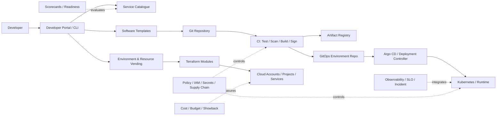

# CS08 — Internal Developer Platform & Golden Paths

**Portfolio category:** Platform Engineering / Kubernetes / Developer Experience / GitOps  
**Primary role evidence:** Director Platform Engineering · Head of Cloud Platform · Principal Platform Architect  
**Scenario type:** Fictional enterprise platform product using synthetic services and teams  
**Evidence status:** Platform-product architecture, service templates and policy patterns implemented as public scaffolds; live cluster and Backstage deployment require approved sandboxes

## 1. Executive summary

A large enterprise has adopted cloud, containers and DevOps, but delivery remains slow because every application team must understand networking, Kubernetes, CI/CD, security, observability, secrets, cost and operational readiness. Teams copy pipelines and Helm charts, platform engineers become a ticket queue, and production standards are enforced late through manual review.

This case study designs an Internal Developer Platform (IDP) that provides paved roads—golden paths—for creating, deploying and operating services. It treats the platform as a product with users, outcomes, service levels and an adoption roadmap rather than a collection of tools.

The platform demonstrates:

- service catalogue and ownership metadata;
- self-service application and environment creation;
- versioned service templates for APIs, workers and scheduled jobs;
- Kubernetes/GitOps deployment and environment promotion;
- integrated identity, secrets, policy, observability and FinOps;
- software templates and developer portal patterns;
- platform APIs and reusable Terraform/Helm modules;
- scorecards, production-readiness checks and exception workflow;
- platform SLOs, support and product metrics;
- AI-workload golden paths as an extension;
- CI/CD, test and evidence strategy.

## 2. Synthetic customer and current state

`Vertex Retail & Logistics` is a fictional enterprise with 450 application teams and more than 2,000 services.

### Current problems

- New service setup takes four to eight weeks.
- CI/CD pipelines vary by team and contain duplicated security logic.
- Kubernetes manifests are copied without lifecycle ownership.
- Teams open tickets for namespaces, secrets, DNS, databases and monitoring.
- Security and architecture reviews occur near release dates.
- Ownership, on-call and cost metadata are incomplete.
- Platform engineers perform repetitive delivery work rather than platform improvements.
- Developers perceive governance as friction because safe defaults are not automated.

### Target outcomes

| Outcome | Synthetic target | Evidence |
|---|---:|---|
| New service to first non-prod deployment | < 30 minutes | template/pipeline timestamps |
| Standard production readiness | >= 90% automated | scorecard |
| Platform adoption | >= 70% eligible teams | catalogue data |
| Ticket volume for standard requests | -60% | service desk trend |
| Deployment failure rate | -30% | DORA/platform telemetry |
| Ownership metadata completeness | >= 98% | catalogue checks |
| Cost allocation | >= 98% platform spend | FinOps report |
| Developer satisfaction | > 8/10 | periodic survey |

Targets are synthetic program objectives.

## 3. Platform-product principles

1. Build for developer journeys, not tool inventory.
2. Provide a paved road, not an absolute prison.
3. Defaults should be safe, observable and cost-aware.
4. Platform APIs and templates are versioned products.
5. Teams own their services; the platform team owns shared capabilities.
6. Self-service includes clear guardrails and evidence.
7. Exceptions are possible but explicit, owned and time-bound.
8. Measure adoption, lead time, reliability and satisfaction.
9. Reduce cognitive load while preserving transparency.
10. AI workloads follow the same product and operational disciplines.

## 4. Personas and journeys

### Application developer

- create a new service;
- run locally;
- open a pull request;
- receive test/security feedback;
- deploy to development;
- view logs, metrics and traces;
- request production promotion;
- respond to an incident.

### Team lead / service owner

- set ownership, criticality, SLO and budget;
- approve dependencies and environment promotion;
- inspect scorecard and risks;
- manage service lifecycle.

### Platform engineer

- publish templates and platform capabilities;
- operate shared services;
- monitor adoption and SLOs;
- improve developer journeys;
- support exceptions and migrations.

### Security / architecture

- encode controls and scorecards;
- review high-risk exceptions;
- inspect evidence and control coverage.

### FinOps

- define allocation and budgets;
- provide unit cost and optimization signals.

## 5. Platform capability map

| Capability | Developer experience |
|---|---|
| Service catalogue | Search services, owners, APIs, dependencies and docs |
| Software templates | Create API, worker, job, frontend or AI service |
| Repository bootstrap | Standard files, branch rules, CODEOWNERS and CI |
| Environment vending | Namespace/account/project/subscription and policy |
| CI/CD | Build, test, scan, sign, deploy, verify and promote |
| Runtime | Kubernetes/serverless patterns with safe defaults |
| Secrets/config | Managed secret integration and schema validation |
| Observability | Dashboards, logs, traces, alerts and SLO starter |
| Security | Dependency, image, IaC and policy gates |
| Data services | Approved database/cache/event provisioning |
| FinOps | Ownership, budget, unit cost and optimization |
| Operations | Runbook, on-call, incident and recovery integration |
| Documentation | Tech docs generated from source |

## 6. High-level architecture



## 7. Service catalogue data model

```yaml
apiVersion: platform.digiscience/v1
kind: Service
metadata:
  name: synthetic-orders-api
  owner: team-orders
  lifecycle: production
spec:
  type: api
  criticality: tier-1
  repository: https://github.com/example/synthetic-orders-api
  system: order-management
  dataClass: confidential
  onCall: orders-primary
  costCenter: CC-1001
  slo:
    availability: 99.9
    latencyP95Ms: 400
  dependencies:
    - payments-api
    - orders-postgres
```

Required metadata is validated in CI and visible through scorecards.

## 8. Golden paths

### 8.1 API service

Generates:

- repository and ownership file;
- application skeleton;
- unit/integration test structure;
- Dockerfile and local development configuration;
- CI workflow;
- Kubernetes/Helm manifests;
- workload identity and secret references;
- health/readiness endpoints;
- metrics/tracing starter;
- SLO and alert definitions;
- runbook and threat-model prompts;
- cost/budget metadata;
- documentation site.

### 8.2 Event worker

Adds event contract, retry/DLQ pattern, idempotency guidance and queue-depth alerts.

### 8.3 Scheduled job

Adds concurrency policy, deadlines, replay/compensation and completion evidence.

### 8.4 AI/RAG service

Adds AI gateway contract, model/prompt metadata, evaluation dataset, guardrail hooks, token/cost telemetry and human-approval pattern.

### 8.5 Exception path

A team can deviate when it documents rationale, owner, risk, support model and expiry/review. The platform measures off-road cost and failure patterns to decide whether a new paved road is needed.

## 9. Environment and resource vending

A single service request can provision:

- namespace/project/account/subscription binding;
- workload identity;
- secrets path;
- database/cache/event resource from approved catalogue;
- DNS and certificate;
- budget and allocation tags;
- dashboards and alerts;
- GitOps application registration;
- access groups and on-call integration.

### Request contract

- owner/team;
- service and environment;
- criticality/data class;
- regions and residency;
- capacity and scaling;
- dependencies;
- RTO/RPO;
- budget;
- lifecycle/expiry;
- support ownership.

Unsafe or incomplete requests fail before resource creation.

## 10. CI/CD and GitOps

### CI stages

1. source and metadata validation;
2. unit/integration tests;
3. dependency, secret and static analysis;
4. container build;
5. SBOM and image scan;
6. image signing/provenance;
7. configuration/IaC validation;
8. publish immutable artifact;
9. update environment manifest through pull request;
10. post-deployment smoke/verification evidence.

### GitOps principles

- environment state is declarative and reviewed;
- deployment controller pulls approved state;
- production changes do not rely on developer laptop credentials;
- drift is detected and reconciled;
- promotion uses immutable artifact references;
- emergency changes are documented and reconciled back to source.

## 11. Security architecture

### Identity

- enterprise SSO to portal;
- workload identity for CI and runtime;
- no long-lived cloud keys;
- least privilege by service/environment;
- privileged platform changes require approval;
- team ownership maps to access groups.

### Supply chain

- protected branches and CODEOWNERS;
- dependency and secret scanning;
- SBOM, signed images and provenance;
- trusted registries and admission policy;
- pinned actions and dependencies;
- approved base images;
- vulnerability policy with severity/exception lifecycle.

### Runtime

- default-deny network policy;
- restricted security context;
- secrets from managed store;
- encrypted service/data path;
- pod/resource limits;
- policy admission;
- environment/tenant separation;
- runtime and Kubernetes audit telemetry.

### Threats

| Threat | Control |
|---|---|
| Malicious template update | review, tests, signed release and staged rollout |
| CI credential compromise | OIDC/workload identity and scoped trust |
| Untrusted image | signed registry/admission policy |
| Secret in repository | scan, secret manager and blocking policy |
| Developer bypass | IAM/network/GitOps enforcement and transparent exception path |
| Platform blast radius | tenancy, progressive delivery, SLO and recovery |
| Supply-chain dependency compromise | SBOM, pinning, scanning and provenance |

## 12. Production-readiness scorecard

Categories:

- ownership and lifecycle;
- architecture and dependencies;
- security and data classification;
- build and supply chain;
- availability, capacity and SLO;
- observability and alerting;
- backup, DR and recovery test;
- runbooks, on-call and incident process;
- cost allocation and budget;
- documentation and support;
- compliance evidence;
- AI evaluation/guardrails when applicable.

### Example levels

- Bronze: non-production baseline.
- Silver: production-ready standard service.
- Gold: critical service with advanced resilience and evidence.

Scorecards inform risk; they do not replace accountable review for high-impact systems.

## 13. Platform SRE

### Platform SLOs

| Platform service | Example objective |
|---|---:|
| Portal/catalogue | 99.9% |
| Template generation | 99% successful within 5 min |
| CI shared services | 99.9% |
| GitOps reconciliation | 99.9% within target time |
| Environment vending | 99% within 30 min after approval |
| Secret/identity integration | critical-path objective |
| Observability ingestion | source-specific freshness |

### Reliability patterns

- multi-zone platform services;
- backups and configuration rebuild;
- versioned templates and rollback;
- progressive platform changes;
- dependency health and graceful degradation;
- platform incident and status communication;
- error budgets governing platform change;
- disaster recovery exercises for catalogue, GitOps and state.

## 14. Developer experience metrics

- time to first deployment;
- time to create environment/resource;
- deployment frequency and lead time;
- change failure and recovery time;
- ticket volume and wait time;
- template adoption;
- scorecard pass rate;
- developer satisfaction;
- documentation success/search;
- platform-induced incident rate;
- percentage of engineering time spent on undifferentiated platform work.

Metrics are segmented by team and workload type to avoid hiding outliers.

## 15. FinOps

### Platform costs

- shared clusters/control planes;
- CI runners and artifact storage;
- observability;
- portal/catalogue;
- network and security services;
- shared databases/caches;
- platform engineering/support.

### Allocation

- direct resource cost to service/team;
- shared costs using transparent drivers such as compute, requests or seats;
- platform product cost reported separately;
- environment and lifecycle tags mandatory;
- sandbox expiry and budget default;
- optimization recommendations exposed in portal.

### Unit metrics

```text
platform_cost_per_service
platform_cost_per_team
cost_per_deployment
cost_per_environment
shared_cluster_cost_per_workload
engineering_minutes_saved
```

A platform is justified by total delivery and reliability economics, not only its infrastructure bill.

## 16. Operating model and team structure

### Platform team

- platform product manager;
- platform architects/engineers;
- SRE/reliability;
- security engineering partner;
- developer experience/documentation;
- FinOps partner;
- support/onboarding.

### Responsibilities

Platform team owns shared capability and paved roads. Application teams own application code, business functionality, SLO and on-call. Security defines controls with the platform rather than acting only as a late gate.

### Engagement model

- service catalogue and documentation first;
- office hours and onboarding cohorts;
- platform support with clear escalation;
- roadmap based on journey pain and adoption data;
- architecture exceptions and feedback loop;
- community of practice and champions.

## 17. Delivery roadmap

| Phase | Duration | Result |
|---|---:|---|
| Discovery and product framing | 2–3 weeks | personas, journeys, baseline and roadmap |
| Minimum viable platform | 4–6 weeks | catalogue, first template, CI/CD and non-prod runtime |
| Production paved road | 4–6 weeks | security, SRE, GitOps, scorecard and support |
| Resource vending | 3–5 weeks | database, events, secrets, DNS and budgets |
| Scale/adoption | ongoing | templates, migrations, metrics and self-service |
| AI golden path | 3–5 weeks | gateway, evaluation, GPU/RAG patterns |

## 18. Architecture decisions

### ADR-001 — Platform as product

**Decision:** Assign product ownership, roadmap, adoption and SLOs.  
**Reason:** A tool project without user focus becomes a new form of ticket queue.  
**Trade-off:** Requires sustained investment and stakeholder discipline.

### ADR-002 — Opinionated defaults with exception path

**Decision:** Golden paths are recommended and optimized, not universal mandates.  
**Reason:** Most teams need reduced choice; legitimate edge cases remain.  
**Trade-off:** Exception governance and multiple support tiers.

### ADR-003 — GitOps for runtime state

**Decision:** Approved declarative state is the source of deployment truth.  
**Reason:** Audit, reproducibility and drift control.  
**Trade-off:** Emergency and dynamic changes require careful reconciliation.

### ADR-004 — Metadata is part of the service contract

**Decision:** Owner, criticality, on-call, cost and data class are mandatory.  
**Reason:** Automation and governance cannot work with anonymous services.  
**Trade-off:** Upfront friction at creation time.

### ADR-005 — Scorecards guide, not gamify

**Decision:** Use scorecards to expose gaps and support decisions.  
**Reason:** Blind scoring can encourage checkbox behavior.  
**Trade-off:** Requires contextual reviews for critical systems.

## 19. Risks

| Risk | Treatment |
|---|---|
| Platform becomes central bottleneck | APIs, self-service, capacity and product prioritization |
| Developers avoid platform | journey research, fast paved roads and transparent benefits |
| Over-standardization | exception path and multiple workload templates |
| Tool sprawl continues | capability ownership and deprecation roadmap |
| Template updates break teams | versioning, compatibility, staged migration |
| Shared cluster blast radius | tenancy, limits, isolation and dedicated options |
| Security gate slows delivery | controls encoded early and risk-tiered approval |
| Platform cost questioned | adoption, time saved, reliability and unit economics |

## 20. Repository implementation map

```text
README.md
catalog/examples/                  # service and system metadata
software-templates/api-service/    # starter skeleton
software-templates/worker/         # event-worker path
software-templates/ai-service/     # AI gateway/evaluation path
gitops/environments/               # declarative deployment examples
terraform/modules/                 # resource vending interfaces
policies/                           # metadata, security and readiness rules
tests/                              # template and policy validation
evidence/                           # synthetic scorecard and DX report
```

## 21. Acceptance criteria

1. A developer can create and deploy a sample service without a manual platform ticket.
2. Generated repository includes owner, CI, security, deployment, observability and runbook starters.
3. CI uses immutable signed artifacts and workload identity.
4. GitOps promotion is reviewable and drift visible.
5. Production readiness scorecard blocks critical missing controls.
6. Cost and ownership metadata are complete.
7. Exception process is documented and time-bound.
8. Platform SLOs, support and recovery exist.
9. Template updates are versioned and tested.
10. CI validates all public scaffolds without secrets.

## 22. Demo walkthrough

1. Select the API-service golden path in the synthetic portal flow.
2. Enter owner, criticality, data class, SLO and budget.
3. Generate repository and environment manifests.
4. Run CI tests/scans/build/sign stages conceptually or through public scaffold.
5. Promote through GitOps and show deployment evidence.
6. Open catalogue, dashboards, SLO and scorecard.
7. Request a database through resource vending.
8. Show an exception and expiry.
9. Review developer lead-time, adoption and platform unit-cost metrics.

## 23. Implementation status

| Capability | Status |
|---|---|
| Platform architecture, product and operating model | Implemented in documentation |
| Catalogue and metadata examples | Implemented scaffold |
| Software templates | Implemented scaffold |
| GitOps and resource-vending interfaces | Implemented reference patterns |
| Scorecard/policy model | Implemented scaffold |
| Live developer portal | Design-only / planned sandbox |
| Live Kubernetes and cloud resources | Not provisioned publicly |
| Enterprise adoption metrics | Synthetic only |

## 24. Interview story

**Situation:** DevOps adoption created tool complexity and platform tickets rather than self-service.  
**Task:** Reduce developer cognitive load while strengthening security, reliability and cost controls.  
**Action:** Designed an IDP as a product with catalogue, golden paths, automated environments, GitOps, supply-chain controls, observability, scorecards, SLOs and transparent exceptions.  
**Result:** A scalable operating model that can reduce setup time and ticket volume while making production readiness part of the developer workflow.

## 25. Resume / profile proof line

Designed an internal developer-platform case study with service catalogue, golden paths, self-service resource vending, GitHub Actions, signed supply chain, GitOps/Argo CD, Kubernetes, workload identity, observability, production-readiness scorecards, platform SLOs and unit economics.

## 26. Honest-use statement

This is synthetic public proof of platform-product architecture and implementation scaffolding. Adoption, lead-time and reliability targets are hypotheses, not claimed enterprise results.