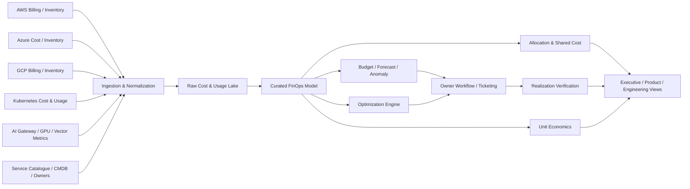

# CS09 — Cloud & AI FinOps Control Tower

**Portfolio category:** FinOps / Cloud Economics / AI Unit Economics / Governance  
**Primary role evidence:** Cloud FinOps Leader · Enterprise Architect · Director Cloud Platform · AI Platform Architect  
**Scenario type:** Fictional multi-cloud cost-governance program using synthetic billing and usage data  
**Evidence status:** Allocation, anomaly, optimization and unit-economics models implemented as public scaffolds; no real billing exports or savings claims

## 1. Executive summary

A multinational enterprise has rapidly expanded AWS, Azure, GCP, Kubernetes and generative-AI consumption. Monthly cloud invoices are visible, but leaders cannot reliably answer which products, environments or business outcomes consume the spend. Traditional rightsizing reports do not explain model token cost, GPU idle capacity, vector-search cost, shared-platform allocation or the financial impact of reliability decisions.

This case study designs a Cloud & AI FinOps Control Tower that combines billing, inventory, utilization, ownership, application, Kubernetes and AI-gateway telemetry. It converts raw spend into accountable unit economics and creates governed workflows for allocation, anomaly management, optimization and commitment decisions.

The solution demonstrates:

- multi-cloud billing normalization;
- mandatory allocation and ownership model;
- shared-cost distribution with transparent drivers;
- budget, forecast and anomaly workflows;
- rightsizing, scheduling, storage and commitment optimization;
- Kubernetes namespace/workload allocation;
- GPU, model, token, vector and successful-answer economics;
- engineering action tracking and realized-savings verification;
- FinOps operating model integrated with architecture, platform and product teams;
- dashboards, policy, synthetic data, Python analysis and CI validation.

## 2. Synthetic customer and current state

`Atlas Digital Group` is a fictional global enterprise spending the equivalent of USD 48 million per year across cloud, SaaS and AI services.

### Synthetic estate

| Area | Annualized synthetic spend | Problem |
|---|---:|---|
| AWS | $20M | incomplete tags, commitments and idle non-prod |
| Azure | $14M | subscription/shared-service allocation gaps |
| GCP | $8M | fast-growing data and AI projects |
| Kubernetes | $4M | cluster spend not allocated to workloads accurately |
| GenAI / GPU | $2M and growing | token/GPU/model cost disconnected from outcomes |

All values are fictional.

### Current problems

- 24% of spend is unallocated or mapped to generic cost centers.
- Optimization tools generate recommendations without business context.
- Teams claim savings when resources are deleted, but finance cannot verify baseline and realization.
- Commitment purchases are made before demand stability is understood.
- Shared network, logging, security and platform costs create disputes.
- AI teams compare token prices but not cost per accepted answer or business result.
- GPU capacity is reserved for launches and remains idle afterward.
- Budget alerts arrive after large spend changes rather than before architecture decisions.

### Target outcomes

| Outcome | Synthetic target | Evidence |
|---|---:|---|
| Allocated spend | >= 98% | billing allocation report |
| Monthly forecast accuracy | within +/- 5% | forecast vs actual |
| Anomaly acknowledgement | < 1 business day | workflow timestamps |
| Verified optimization realization | >= 80% approved actions | baseline/after evidence |
| Commitment utilization | >= 90% | provider reports |
| Non-production scheduled coverage | >= 80% eligible | policy report |
| AI cost allocation | 100% applications/models | gateway/GPU data |
| Unit-cost coverage | top 20 products/use cases | dashboard |

These are program objectives, not claimed results.

## 3. FinOps principles

1. Cost is an engineering and product signal, not only a finance report.
2. Allocation precedes optimization.
3. Savings are realized only when baseline, action and after-state are verified.
4. Commitments follow stable usage, architecture and risk analysis.
5. Shared-cost methods are transparent and reviewed.
6. Unit cost connects consumption to business value.
7. Reliability, security and performance constraints are explicit in recommendations.
8. AI economics use successful outcomes, not token price alone.
9. Teams receive timely, actionable signals in their existing workflow.
10. The control tower supports decisions; accountable owners approve actions.

## 4. Stakeholders

| Role | Responsibility |
|---|---|
| CFO / finance | financial governance and forecast |
| CIO / CTO | technology strategy and investment |
| FinOps lead | practice, allocation, reporting and optimization |
| Cloud platform teams | shared services and technical controls |
| Product owners | unit economics and value decisions |
| Engineering teams | architecture and optimization actions |
| Procurement | contracts, commitments and vendor negotiation |
| SRE / security | reliability and risk constraints |
| AI platform team | model/GPU/vector cost and routing |
| Data owners | billing/export quality and lineage |

## 5. Data architecture

### Sources

- AWS Cost and Usage Report, inventory and utilization;
- Azure Cost Management exports, Resource Graph and Advisor;
- GCP billing export, Cloud Asset Inventory and recommender;
- Kubernetes cost/allocation metrics;
- CMDB/service catalogue and ownership;
- budgets, contracts and commitment data;
- observability metrics;
- AI gateway token/request/model telemetry;
- GPU/DCGM and inference-service metrics;
- vector/search and data-platform usage;
- ticket/workflow status for optimization actions.

### High-level architecture



### Curated dimensions

- provider/account/subscription/project;
- resource and service;
- application/product/business unit;
- team and owner;
- environment and region;
- criticality/data class;
- Kubernetes cluster/namespace/workload;
- AI application/model/provider/endpoint;
- commitment/contract;
- tag/label quality;
- amortized and effective cost;
- currency and exchange-rate date;
- forecast and baseline version.

## 6. Allocation strategy

### Direct allocation

Use resource ownership metadata, account/project boundary, Kubernetes labels and AI gateway application IDs.

### Shared costs

Examples:

| Shared service | Allocation driver |
|---|---|
| Network hub / egress | bytes, connections or agreed business rule |
| Central logging | ingested/retained volume |
| Security tooling | resources, accounts or risk tier |
| Shared Kubernetes control plane | workload resource requests/usage |
| Platform team/shared services | services/teams or usage-based driver |
| AI gateway | requests/tokens by application |
| Model/vector shared endpoint | requests, tokens, storage and compute |

The chosen method is documented and visible. Artificial precision is avoided where data quality does not support it.

### Unallocated spend workflow

```text
new unallocated item
 -> identify likely owner
 -> notify and classify
 -> correct metadata or allocation rule
 -> backfill history where material
 -> track aged unallocated spend
 -> enforce provisioning policy
```

## 7. Tag and ownership policy

Mandatory fields:

- application/product;
- business unit/cost center;
- owner/team;
- environment;
- lifecycle/expiry;
- data class;
- criticality;
- managed-by/IaC source;
- AI use case/model where applicable.

Controls:

- validate during account/project/resource vending;
- policy-as-code for required metadata;
- quarantine or deny non-compliant resource classes where safe;
- report inherited/shared allocations;
- automated owner reminders;
- exception with owner and expiry.

## 8. Budgeting and forecasting

### Budget hierarchy

- enterprise/provider;
- business unit;
- product/application;
- account/subscription/project;
- environment;
- AI use case/model;
- experiment/sandbox.

### Forecast methods

- baseline trend and seasonality;
- known product launches/campaigns;
- migration waves and decommission dates;
- commitment purchases/expiry;
- capacity reservations;
- model/GPU adoption plan;
- unit-volume forecasts;
- architecture changes.

Forecast variance is explained by volume, rate, mix, one-time change and data-quality effects.

## 9. Anomaly detection and response

### Detection

- provider-native anomaly tools;
- statistical change against service/team baseline;
- unit-cost anomaly;
- sudden AI token/request growth;
- GPU idle or allocation change;
- data-transfer spike;
- unexpected region/service introduction;
- resource created outside pipeline;
- commitment utilization drop.

### Workflow

1. Detect and assign severity.
2. Enrich with owner, service, deployment/change and resource context.
3. Notify through engineering/ticket workflow.
4. Confirm expected/unexpected.
5. Contain if runaway and authorized.
6. Identify root cause.
7. Implement correction.
8. Verify spend returned to expected pattern.
9. Record prevention action.

### Severity examples

- critical: security incident or large runaway agent/GPU cost;
- high: material daily variance or commitment risk;
- medium: persistent optimization or allocation issue;
- low: hygiene or small anomaly.

## 10. Optimization framework

### Compute

- rightsizing using representative peak and percentile data;
- autoscaling and scale-to-zero where appropriate;
- non-production scheduling;
- spot/preemptible for fault-tolerant work;
- family/generation migration;
- orphan/idle resources;
- architecture changes such as serverless/containerization only with value case.

### Storage/data

- lifecycle and archive;
- unattached volumes/snapshots;
- backup retention alignment;
- query/partition optimization;
- data duplication and egress;
- vector-index dimension/retention and re-index frequency.

### Network

- cross-zone/region transfer;
- NAT/egress architecture;
- CDN and caching;
- private connectivity economics;
- log/data routing.

### Commitments

- normalized eligible baseline;
- forecast and growth/decline;
- application and migration risk;
- provider discount alternatives;
- term and coverage scenario;
- utilization and break-even;
- approval and renewal calendar.

### Optimization decision record

```text
baseline cost and period
recommendation and owner
technical/reliability/security constraints
estimated gross and net savings
implementation cost
approval and target date
after-state and realized savings
```

## 11. AI FinOps

### AI cost components

- provider input/output/cache tokens;
- model endpoint capacity;
- GPU compute, idle capacity and fragmentation;
- embeddings and re-indexing;
- vector/search storage and query;
- data pipelines and OCR;
- evaluation/guardrails/observability;
- human review;
- retries, long contexts and failed requests.

### Unit metrics

```text
cost_per_model_request
cost_per_1m_input_tokens
cost_per_1m_output_tokens
cost_per_grounded_answer
cost_per_approved_summary
cost_per_agent_task_completed
cost_per_1,000_documents
cost_per_gpu_hour
cost_per_successful_inference
GPU_productive_utilization
```

### Model-routing economics

Compare:

- quality and acceptance rate;
- latency;
- token usage;
- retry/review rate;
- provider and infrastructure cost;
- data/security constraints;
- failure/fallback impact.

A smaller model is financially superior only if cost per accepted outcome is lower at required quality.

### GPU optimization

- whole GPU versus MIG/time-slicing;
- queue and demand schedule;
- warm capacity by SLO tier;
- spot/preemptible for batch/evaluation;
- model quantization after quality test;
- continuous batching;
- cross-team consolidation when isolation permits;
- reservation/commitment after stable demand;
- idle and fragmentation reporting.

## 12. Kubernetes cost allocation

Allocate by:

- cluster and namespace;
- workload/deployment/stateful set;
- requested versus used CPU/memory/GPU;
- storage and network;
- shared/system overhead;
- idle capacity;
- team/service/owner;
- environment and criticality.

Recommendations distinguish request tuning, autoscaling, bin packing, cluster shape and application architecture.

## 13. Reliability and security constraints

FinOps does not recommend:

- removing required redundancy without approved SLO/RTO analysis;
- reducing security logging below policy;
- moving restricted data to an unapproved region/provider;
- replacing tested capacity with spot for non-interruptible services;
- lowering backup/retention without business/compliance approval;
- routing AI prompts to cheaper unapproved models;
- consolidating tenants where isolation requirements prevent it.

Each recommendation records constraints and accountable approval.

## 14. Dashboards

### Executive

- total and forecast spend;
- business unit/product allocation;
- budget variance;
- verified savings;
- commitments and risk;
- cloud/AI unit-cost trend;
- major anomalies and decisions.

### Product owner

- product spend by environment/service;
- unit volume and unit cost;
- SLO/reliability alongside cost;
- forecast and budget;
- actions and realized savings;
- AI model/use-case cost where relevant.

### Engineering

- resource/workload cost;
- utilization and rightsizing;
- idle/orphaned items;
- deployment/change correlation;
- cost anomaly details;
- implementation backlog;
- policy/metadata gaps.

### AI platform

- model/provider/application tokens and cost;
- GPU utilization/idle/fragmentation;
- vector/search and evaluation cost;
- quality/acceptance alongside cost;
- routing and fallback economics;
- budgets and runaway agent controls.

## 15. FinOps operating model

### Cadence

- daily anomaly and runaway spend response;
- weekly engineering optimization review;
- monthly product/business forecast and unit economics;
- quarterly commitment and architecture review;
- annual provider/commercial strategy.

### RACI summary

- FinOps: methodology, data, reporting and facilitation.
- Engineering: technical action and validation.
- Product: value, demand and priority.
- Finance: budget/forecast/accounting.
- Procurement: contracts and commitments.
- Platform: automation and shared-service economics.
- Security/SRE: constraint and risk decisions.

## 16. Savings verification

### Gross estimate versus realized value

Realized monthly savings:

```text
normalized_baseline_cost
- normalized_after_cost
- workload_volume_or_rate_effect
- implementation_and_operating_cost
```

Normalize for business growth, seasonality, price changes and migrations. Record avoided future cost separately from invoice reduction.

### Status

- identified;
- validated;
- approved;
- in progress;
- implemented;
- verified;
- rejected/deferred with reason;
- expired/reopened.

## 17. Data quality and controls

- reconcile exports to provider invoice totals;
- version allocation rules;
- track late/missing data;
- currency and tax treatment documented;
- amortized versus cash views separated;
- data lineage and access control;
- no sensitive business payload in cost lake;
- owner correction process;
- test shared-cost rules;
- audit changes to budgets and commitments.

## 18. Architecture decisions

### ADR-001 — Build normalized semantic layer

**Decision:** Preserve raw provider data and create a curated cross-cloud model.  
**Reason:** Provider billing schemas differ and change; analysis needs consistent dimensions.  
**Trade-off:** Data engineering and governance overhead.

### ADR-002 — Allocation before optimization

**Decision:** Prioritize owner/product mapping.  
**Reason:** Recommendations without accountability do not convert.  
**Trade-off:** Savings work may start more slowly.

### ADR-003 — Verify realized savings

**Decision:** Separate recommendation estimate from after-state evidence.  
**Reason:** Avoid inflated savings claims.  
**Trade-off:** More measurement and finance collaboration.

### ADR-004 — Unit economics for AI

**Decision:** Report cost per successful/accepted outcome, not only tokens.  
**Reason:** Quality, retries and review determine true economics.  
**Trade-off:** Requires application outcome integration.

### ADR-005 — Commitment governance is architecture-linked

**Decision:** Purchase commitments after workload and migration risk review.  
**Reason:** Discount can become waste when architecture changes.  
**Trade-off:** May delay some savings.

## 19. Risks

| Risk | Treatment |
|---|---|
| Billing data mismatch | reconciliation, lineage and quality alerts |
| Teams dispute allocation | transparent driver, owner forum and versioned rule |
| Savings claims inflated | baseline/after normalization and finance sign-off |
| Cost controls harm reliability | SRE/security constraints and approval |
| Commitment overpurchase | scenario model, coverage limits and renewal governance |
| AI cost grows faster than value | budget, unit outcome, routing and product review |
| Dashboard overload | role-specific views and action workflow |
| FinOps becomes finance-only | engineering integration and platform automation |

## 20. Repository implementation map

```text
README.md
data/synthetic-billing.csv        # multi-cloud/AI sample data
src/finops_control_tower.py       # normalization, allocation and anomaly logic
config/allocation-rules.yaml      # direct/shared allocation
config/budgets.yaml               # synthetic thresholds
notebooks-or-reports/             # generated analysis outputs
tests/                             # reconciliation, allocation and anomaly tests
terraform/main.tf                 # reference data-platform scaffold
evidence/                          # forecast, anomaly and realization reports
```

## 21. Acceptance criteria

1. Curated spend reconciles to synthetic source totals.
2. At least 98% of spend is allocated or explicitly categorized.
3. Shared-cost rules are documented and deterministic.
4. Anomalies include owner, context and workflow state.
5. Optimization estimates distinguish gross, net and realized value.
6. Commitment model includes risk and break-even.
7. AI/GPU spend is attributable to application/model/team.
8. Unit cost combines quality/business outcome where sample data permits.
9. Security/reliability constraints block unsafe recommendations.
10. CI runs data and logic tests without external credentials.

## 22. Demo walkthrough

1. Load synthetic AWS/Azure/GCP/Kubernetes/AI billing data.
2. Reconcile raw totals and show unallocated spend.
3. Apply direct/shared allocation rules.
4. Trigger a spend and AI-token anomaly.
5. Generate owner-enriched action record.
6. Review rightsizing/scheduling/commitment recommendations.
7. Show estimated versus realized savings logic.
8. Compare two model routes using cost per accepted answer.
9. Review executive, product, engineering and AI platform views.

## 23. Implementation status

| Capability | Status |
|---|---|
| FinOps architecture and operating model | Implemented in documentation |
| Synthetic billing/usage model | Implemented / simulated |
| Normalization, allocation and anomaly logic | Implemented scaffold |
| AI/GPU unit-economics model | Implemented synthetic analysis |
| Optimization workflow | Simulated |
| Provider billing exports | Design-only; no real credentials |
| Live dashboards/data warehouse | Planned sandbox implementation |
| Claimed real savings | None |

## 24. Interview story

**Situation:** Multi-cloud and AI spend is growing, but invoices cannot be connected reliably to owners or business outcomes.  
**Task:** Build an operating and data model that converts recommendations into verified value.  
**Action:** Normalized billing/usage, enforced allocation, designed shared-cost rules, anomaly workflows, optimization evidence, commitment governance and AI/GPU unit economics integrated with SRE/security constraints.  
**Result:** A decision-ready FinOps control-tower blueprint that makes spend accountable and compares cost against successful product outcomes rather than vanity savings.

## 25. Resume / profile proof line

Built a cloud and AI FinOps control-tower case study covering AWS/Azure/GCP billing normalization, allocation and showback, Kubernetes cost, budgets/forecast/anomalies, rightsizing and commitments, verified savings, GPU/model/token economics and cost per successful AI outcome.

## 26. Honest-use statement

This case study uses synthetic cost and usage data. It demonstrates FinOps architecture and analytical logic but makes no claim of actual customer spend or realized savings.