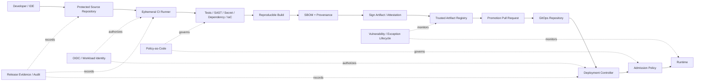

# CS10 — Zero-Trust DevSecOps Software Supply Chain

**Portfolio category:** DevSecOps / Cloud Security / CI/CD / Software Supply Chain  
**Primary role evidence:** DevSecOps Director · Cloud Security Architect · Principal Platform Architect  
**Scenario type:** Fictional regulated-enterprise delivery platform using synthetic services and repositories  
**Evidence status:** Pipeline, policy, provenance and deployment-control patterns implemented as public scaffolds; enterprise security integrations require approved environments

## 1. Executive summary

A regulated enterprise delivers hundreds of applications through multiple CI/CD platforms. Credentials, third-party actions, base images and deployment methods vary across teams. Security checks exist but are inconsistent, findings are reviewed late, and production environments still accept mutable images or manual changes. The organization wants faster software delivery and stronger assurance without turning security into a manual approval bottleneck.

This case study defines a zero-trust DevSecOps software-supply-chain architecture that verifies identity, source, dependencies, build environment, artifact provenance, policy and deployment state at every stage.

The solution demonstrates:

- protected source and review controls;
- workload identity for CI/CD instead of static cloud keys;
- reproducible build, SBOM and signed provenance;
- dependency, secret, SAST, IaC and container scanning;
- policy-as-code gates based on risk and environment;
- trusted artifact registries and admission control;
- GitOps and progressive delivery;
- vulnerability/exception lifecycle;
- audit evidence from commit through production;
- recovery, incident and key-compromise response;
- reusable GitHub Actions and Terraform/Kubernetes patterns;
- measurable developer, security and reliability outcomes.

## 2. Synthetic customer and current state

`Regulus Banking Technologies` is a fictional financial-services engineering organization with 300 product repositories and 1,500 production deployments each month.

### Current problems

- CI workflows use long-lived cloud secrets.
- Third-party pipeline actions are not consistently pinned or reviewed.
- Base images are selected by teams without lifecycle controls.
- SBOMs are generated for some systems but not linked to deployed artifacts.
- Security scans produce high noise and weak ownership.
- Production clusters accept images from multiple registries.
- Manual emergency changes create drift.
- Vulnerability exceptions have no expiry.
- Audit evidence requires manual collection across tools.
- Security checks delay releases because they occur too late.

### Target outcomes

| Outcome | Synthetic target | Evidence |
|---|---:|---|
| Static production cloud keys in CI | 0 | credential/IAM scan |
| Production artifacts signed with provenance | 100% | registry/admission evidence |
| Critical secrets in committed source | 0 accepted | scanner and remediation logs |
| Critical/high findings past SLA | < agreed threshold | vulnerability dashboard |
| Deployment through approved GitOps/pipeline | 100% | audit trail |
| Mean remediation time | reduced by 40% | issue lifecycle |
| Audit evidence generation | automated | release bundle |
| Change failure rate | improved without weakening gates | DORA/SRE data |

Targets are synthetic objectives.

## 3. Zero-trust principles

1. Never trust a workflow because it runs inside the enterprise.
2. Authenticate every human and workload identity.
3. Authorize narrowly by repository, branch, environment and action.
4. Verify source, dependency, build and artifact integrity.
5. Use immutable references and signed promotion.
6. Encode policy before production, close to developers.
7. Separate build, approval and deploy authority.
8. Preserve auditable evidence.
9. Continuously evaluate deployed state and vulnerability risk.
10. Assume credentials or dependencies may be compromised and design revocation/recovery.

## 4. Scope

### In scope

- source-control governance;
- CI identity and runner security;
- dependency and secret controls;
- build, SBOM, signature and provenance;
- artifact registry and promotion;
- IaC and configuration policy;
- GitOps, admission and deployment verification;
- vulnerability and exception workflow;
- audit evidence and incident response;
- reusable pipeline and policy scaffolds.

### Out of scope

- claiming formal compliance certification;
- replacing application threat modelling and secure design;
- storing real secrets or proprietary source;
- unrestricted third-party workflow execution;
- guaranteeing that scanning finds every vulnerability;
- live production deployment from the public repository.

## 5. High-level architecture



## 6. Source-control controls

### Repository baseline

- protected default branch;
- pull request required;
- CODEOWNERS by application/platform/security risk;
- signed commits/tags where policy requires;
- required status checks;
- no force push/deletion on protected branches;
- secret scanning and push protection;
- dependency update automation;
- repository visibility and collaborator review;
- issue/security reporting process;
- release and support ownership metadata.

### Change risk

Risk is derived from:

- production environment;
- security/IAM/network policy change;
- destructive database/infrastructure change;
- critical service;
- new external dependency/action;
- exception or suppression;
- model/AI tool permission change;
- emergency path.

Higher risk triggers additional reviewers/tests, not a universal manual gate for every change.

## 7. CI identity and runner security

### Workload identity

- GitHub Actions OIDC or equivalent federation;
- trust restricted by organization, repository, branch/tag and environment;
- short-lived provider role/token;
- separate plan/read and apply/deploy roles;
- no wildcard subject trust;
- environment approval for production;
- session and action logged.

### Runner controls

- ephemeral runners for sensitive builds;
- clean workspace per job;
- restricted network egress;
- minimal base image;
- patched runner and tools;
- no untrusted fork code with privileged secrets;
- concurrency and timeout;
- artifact/log retention policy;
- isolation for high-risk builds.

### Third-party actions

- pinned to immutable commit SHA;
- reviewed/allowlisted;
- permissions declared minimally;
- version update process;
- mirrored/internal action where risk justifies;
- no automatic trust based on marketplace popularity.

## 8. Pipeline stages

### 8.1 Validate source and metadata

- formatting/lint;
- ownership and service metadata;
- conventional or governed release metadata;
- prohibited file/content checks;
- license/dependency policy.

### 8.2 Test

- unit and integration;
- contract/API;
- security regression;
- policy tests;
- data/migration tests where relevant.

### 8.3 Scan

- SAST;
- dependency/SCA and license;
- secret detection;
- IaC misconfiguration;
- container/base-image vulnerability;
- malware/artifact checks where appropriate;
- AI model/data artifact checks for AI pipelines.

### 8.4 Build and attest

- reproducible/pinned toolchain;
- immutable artifact version;
- SBOM;
- build provenance including source commit/workflow/runner;
- signature using managed keyless or protected key;
- artifact uploaded only by authorized workflow.

### 8.5 Deploy and verify

- update environment manifest by PR;
- policy validates image/signature/configuration;
- deployment controller applies desired state;
- canary/progressive rollout;
- health, SLO and security verification;
- automatic rollback or stop on threshold;
- release evidence published.

## 9. SBOM, signature and provenance

A production artifact must answer:

- which source commit produced it;
- which workflow and builder identity ran;
- which dependencies and base image were included;
- which tests/scans/policies passed;
- who approved promotion;
- which immutable digest was deployed;
- where and when it is running;
- whether a current vulnerability affects it.

### Example evidence manifest

```json
{
  "artifact": "registry.example/synthetic-api@sha256:abc...",
  "source_commit": "synthetic123",
  "workflow": "build-release-v4",
  "sbom": "sbom-spdx.json",
  "provenance": "provenance.intoto.jsonl",
  "signature_verified": true,
  "policy_result": "pass",
  "environment": "production",
  "release": "2026.07.13.1"
}
```

## 10. Policy-as-code

### Build policy examples

- disallow mutable action references;
- disallow excessive workflow permissions;
- require SBOM/provenance/signature;
- block critical secrets;
- enforce approved base image;
- require exception for vulnerabilities over threshold;
- require Terraform plan evidence for infrastructure.

### Deployment policy examples

- allow only trusted registry;
- require immutable image digest;
- verify signature/attestation;
- prohibit privileged container/host access;
- require resource requests/limits;
- require workload identity and approved service account;
- restrict public LoadBalancer/Ingress;
- require owner, environment and data-class labels;
- restrict capabilities and root execution;
- require network policy for defined workload classes.

### Policy rollout

```text
observe -> warn -> block non-production -> block production
```

Use test suites and exception process to avoid breaking workloads unexpectedly.

## 11. Secrets management

- no secrets committed to source;
- secret references rather than values in configuration;
- runtime retrieval from managed secret store;
- workload identity controls access;
- rotation and revocation tested;
- short-lived credentials where possible;
- separate secrets by environment/tenant;
- sensitive values redacted from logs;
- emergency compromise workflow.

### Secret incident response

1. Revoke/rotate credential.
2. Identify exposure scope and usage.
3. Remove from current and historical accessible paths as required.
4. Review logs and affected systems.
5. Correct pipeline/permission cause.
6. Add detection/prevention test.
7. Document incident evidence.

## 12. Vulnerability management

### Risk context

Prioritize using:

- severity/exploitability;
- internet exposure;
- data/criticality;
- deployed usage and reachability;
- available fix;
- compensating controls;
- threat intelligence;
- package runtime relevance.

### Workflow

```text
finding -> owner assignment -> triage
-> fix / mitigate / exception
-> validation -> deploy
-> verify deployed state -> close
```

### Exception

Requires owner, business reason, risk, compensating controls, scope, expiry and approval. Expired exceptions automatically reopen/block according to policy.

## 13. GitOps and environment separation

- application repo produces artifact;
- environment repo references immutable artifact;
- production promotion uses a separate approved PR;
- deploy controller has environment-scoped identity;
- developers do not require direct cluster admin;
- manual emergency change is time-bound, audited and reconciled;
- drift detection alerts or corrects according to policy;
- environment configuration and secrets remain separated.

## 14. Kubernetes/runtime controls

- private cluster/API where appropriate;
- RBAC and workload identity;
- namespace/tenant boundaries;
- default-deny network policy;
- restricted pod-security profile;
- admission verification;
- runtime security and audit;
- resource limits/quotas;
- encrypted storage and secrets;
- node-image lifecycle;
- backup and recovery;
- patch/vulnerability posture;
- service mesh only where value justifies complexity.

## 15. Infrastructure as Code controls

- remote protected state;
- separate environments/accounts/projects;
- plan in CI with policy/security scan;
- production apply through scoped identity and approval;
- provider/module versions pinned;
- destructive/replacement changes surfaced;
- state locking and backup;
- drift detection;
- no secrets in state where avoidable; protect state rigorously;
- reusable modules with owner, tests and upgrade path.

## 16. Security testing strategy

### Shift left

- secure coding and template defaults;
- IDE/pre-commit fast feedback;
- unit security tests;
- SAST/SCA/secret/IaC scans;
- API/contract tests.

### Pre-production

- DAST and integration security tests;
- container/runtime policy;
- threat-model validation;
- penetration testing based on risk;
- data/identity negative tests;
- disaster/rollback exercise.

### Continuous

- vulnerability re-scan;
- configuration drift and CSPM;
- runtime detections;
- attack-surface and certificate monitoring;
- dependency and base-image updates;
- access review.

No single scanner is treated as complete assurance.

## 17. Reliability and release safety

- progressive rollout and canary;
- automated health/SLO verification;
- deployment freeze controls;
- rollback to previous immutable artifact;
- database change compatibility and rollback/roll-forward plan;
- feature flags for risky functionality;
- idempotent deployment;
- release timeout and stop;
- incident linkage for emergency change;
- post-deployment evidence.

Security gates are designed to preserve delivery flow; long-running checks may run asynchronously before production promotion rather than blocking every developer feedback loop.

## 18. Observability and audit

Track:

- source/PR/reviewer;
- workflow identity and permissions;
- dependency/action versions;
- tests/scans/policy results;
- artifact digest, SBOM, signature and provenance;
- approval and environment;
- deployment and verification result;
- drift/manual change;
- vulnerability and exception lifecycle;
- key/secret access;
- rollback and incident correlation.

Audit bundles can be generated per release or control period.

## 19. Metrics

### Delivery

- deployment frequency;
- lead time;
- change failure rate;
- mean time to restore;
- pipeline duration and failure reasons.

### Security

- critical findings and age;
- secret incidents;
- signed artifact coverage;
- provenance/SBOM coverage;
- exception count/age;
- unauthorized or drifted deployments;
- remediation time;
- policy failure trend.

### Developer experience

- feedback time;
- false-positive/waiver burden;
- template adoption;
- time to remediate;
- satisfaction.

Security success is not measured by number of blocked builds alone.

## 20. FinOps

- ephemeral runners and right-sized concurrency;
- artifact/log retention tiers;
- scan duplication reduction;
- shared caching without integrity compromise;
- policy and pipeline cost per build/deployment;
- security tooling license/utilization;
- cost of failed/repeated pipelines;
- cost avoided by earlier defect detection;
- showback by team/repository.

Do not remove necessary evidence or scans solely to lower pipeline cost.

## 21. Delivery roadmap

| Phase | Duration | Result |
|---|---:|---|
| Baseline and threat model | 2 weeks | risk, controls, current pipeline map |
| Trusted build minimum | 3–4 weeks | OIDC, scans, immutable build, SBOM/sign |
| Trusted deployment | 3–4 weeks | registry, GitOps, admission and canary |
| Vulnerability/evidence | 2–3 weeks | exception lifecycle and audit bundles |
| Scale/migration | ongoing | templates, repository onboarding and metrics |
| Continuous assurance | ongoing | runtime, drift and attack simulation |

## 22. Architecture decisions

### ADR-001 — OIDC/workload identity for CI/CD

**Decision:** Eliminate static cloud keys.  
**Reason:** Short-lived, scoped credentials reduce leakage/rotation risk.  
**Trade-off:** More complex trust-policy setup.

### ADR-002 — Artifact promotion, not rebuild

**Decision:** Promote the same immutable artifact across environments.  
**Reason:** Production must run what was tested.  
**Trade-off:** Configuration must be externalized safely.

### ADR-003 — Verify signature at deployment

**Decision:** Build signing alone is insufficient; admission/deploy verifies.  
**Reason:** Prevent untrusted registry content from running.  
**Trade-off:** Admission dependency and recovery planning.

### ADR-004 — Risk-tiered gates

**Decision:** Controls vary by change and environment risk.  
**Reason:** Preserve flow while adding assurance where impact is high.  
**Trade-off:** Requires accurate classification and policy tests.

### ADR-005 — Exceptions expire

**Decision:** Every vulnerability/policy waiver has an expiry.  
**Reason:** Temporary risk must not become hidden permanent architecture.  
**Trade-off:** Ongoing review workload.

## 23. Risks

| Risk | Treatment |
|---|---|
| Pipeline compromise | ephemeral runner, least privilege, isolation and audit |
| Third-party action compromise | pin, review, allowlist and reduce permissions |
| False positives block delivery | tuning, context, fast exception and metrics |
| Security tools inconsistent | shared templates and centralized policy contracts |
| Signing key compromise | managed/keyless signing, rotation and revocation |
| GitOps controller compromise | scoped identity, protected repo and admission verification |
| Emergency changes create drift | time-bound access and reconciliation |
| Teams bypass platform | IAM enforcement and usable paved road |

## 24. Repository implementation map

```text
README.md
.github/workflows/secure-build.yml  # reusable synthetic pipeline
policies/                           # workflow, IaC and admission rules
kubernetes/                         # secure deployment and network policy
terraform/                          # OIDC and registry reference modules
scripts/verify_evidence.py          # release manifest validation
sample-app/                         # minimal synthetic service
tests/                              # policy and evidence tests
evidence/                           # sample SBOM/provenance/release bundle
```

## 25. Acceptance criteria

1. CI obtains short-lived scoped identity without stored cloud key.
2. Third-party actions/dependencies are pinned and reviewed.
3. Artifact has SBOM, provenance and signature.
4. Deployment accepts only trusted immutable artifact.
5. Critical findings follow policy and approved exception lifecycle.
6. Production promotion is separate and auditable.
7. Drift/manual emergency changes are visible and reconciled.
8. Release evidence links source, build, artifact and deployment.
9. Secrets are absent from public source and standard logs.
10. CI validates pipeline, policies, IaC and sample app.

## 26. Demo walkthrough

1. Show protected-source and workload-identity design.
2. Run synthetic build/test/scan stages.
3. Generate SBOM/provenance and immutable digest.
4. Validate signature/attestation and policy.
5. Promote through GitOps to a synthetic environment.
6. Demonstrate admission rejection of unsigned/mutable image.
7. Open a vulnerability exception with expiry.
8. Generate release audit bundle.
9. Simulate credential/action compromise and revocation response.

## 27. Implementation status

| Capability | Status |
|---|---|
| DevSecOps architecture and control model | Implemented in documentation |
| Reusable GitHub Actions scaffold | Implemented/planned in public branch |
| Policy and secure Kubernetes examples | Implemented scaffold |
| SBOM/provenance/evidence validator | Implemented scaffold |
| OIDC/Terraform trust pattern | Reference scaffold; no live apply |
| Real signing/registry/admission service | Planned sandbox validation |
| Formal compliance certification | Not claimed |
| Production workloads | Out of scope |

## 28. Interview story

**Situation:** CI/CD is fast but fragmented, with long-lived keys, inconsistent scans and unverifiable production artifacts.  
**Task:** Strengthen supply-chain assurance without returning to manual security gates.  
**Action:** Designed OIDC identities, ephemeral builds, SBOM/provenance/signing, risk-tiered policy, trusted registry, GitOps, admission verification, progressive delivery and expiring exceptions with automated evidence.  
**Result:** A zero-trust delivery blueprint that improves traceability and security while preserving developer feedback and release velocity.

## 29. Resume / profile proof line

Designed a zero-trust DevSecOps supply-chain case study using GitHub Actions OIDC, ephemeral builds, SAST/SCA/secret/IaC scanning, SBOM, signed provenance, trusted registries, policy-as-code, GitOps, Kubernetes admission, progressive delivery and automated audit evidence.

## 30. Honest-use statement

This public case study demonstrates architecture and safe implementation scaffolds. It does not claim certification, complete vulnerability detection or a live production deployment.