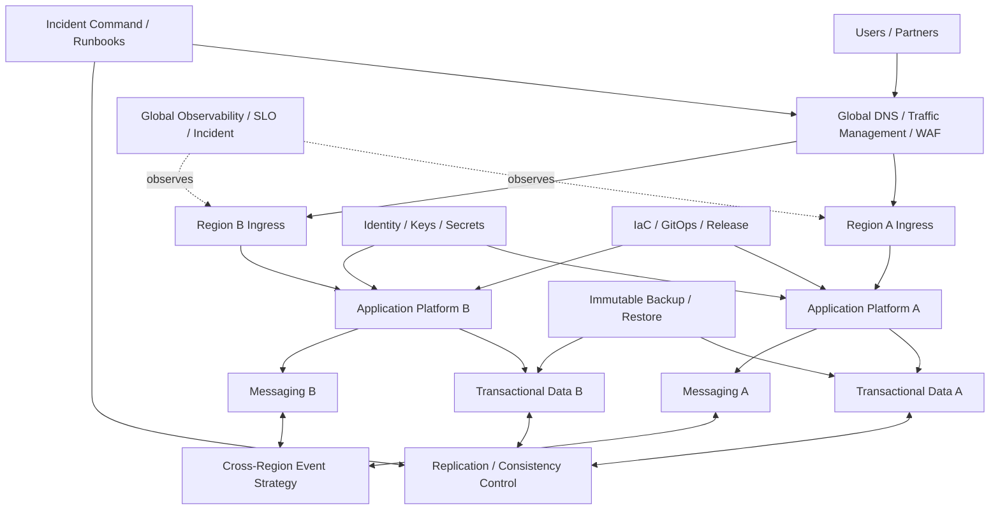

# CS11 — Multi-Region Resilience, Disaster Recovery & Chaos Engineering

**Portfolio category:** SRE / Business Continuity / Multi-Region Cloud / Chaos Engineering  
**Primary role evidence:** Principal Cloud Architect · SRE / Resilience Director · Enterprise Architect  
**Scenario type:** Fictional critical digital service using synthetic traffic, data and failure events  
**Evidence status:** Resilience architecture, runbooks and failure-simulation scaffolds implemented publicly; live regional failover requires approved cloud environments

## 1. Executive summary

A critical digital platform has high availability within one cloud region but no proven end-to-end recovery for regional loss, identity/DNS failure, corrupted data, deployment defects or third-party dependency outages. Existing disaster-recovery documents list infrastructure components but do not connect business impact, service dependencies, RTO/RPO, data consistency, observability, decision authority and regular exercises.

This case study designs a multi-region resilience and disaster-recovery program combining architecture, SRE, operational governance and chaos testing. The goal is not “zero downtime” marketing. The goal is measurable, tested recovery appropriate to business impact and cost.

The solution demonstrates:

- business-impact analysis and service tiering;
- SLO, error-budget, RTO and RPO alignment;
- multi-zone and multi-region architecture options;
- traffic, DNS, identity, data, secrets and dependency recovery;
- active-active, active-passive and backup/restore decisions;
- failure-mode and dependency analysis;
- executable failover/failback runbooks;
- chaos experiments with safeguards and hypotheses;
- incident command, communications and evidence;
- infrastructure as code, validation and recovery testing;
- resilience cost and risk economics.

## 2. Synthetic customer and service

`PulsePay Digital` is a fictional payments platform serving consumers and merchants across India and Southeast Asia.

### Synthetic service profile

| Attribute | Value |
|---|---|
| Transactions | 12,000 per second peak |
| Primary region | fictional Region A |
| Recovery region | fictional Region B |
| Availability target | 99.99% for payment authorization path |
| RTO | 15 minutes for Tier 0 path |
| RPO | near-zero for approved ledger pattern |
| Data | transactional, audit, analytics and configuration |
| Dependencies | identity, DNS, messaging, database, fraud, notifications, third-party networks |

Values are synthetic and do not represent a real payment system.

### Current problems

- Regional architecture exists on diagrams but has not been exercised end to end.
- Application teams use inconsistent RTO/RPO values.
- DNS and certificate recovery are absent from runbooks.
- Data replication lag is monitored but not tied to failover decisions.
- Third-party and identity dependencies create hidden single points of failure.
- Backups are successful, but restore duration is not measured.
- Chaos tests are ad hoc and not linked to business risk.
- Failback and reconciliation receive less attention than failover.
- Executives lack evidence of achieved recovery.

## 3. Business-impact and service-tier model

| Tier | Business impact | Availability direction | RTO | RPO | Typical pattern |
|---|---|---:|---:|---:|---|
| Tier 0 | immediate severe financial/regulatory impact | >= 99.99% | <= 15 min | near zero | multi-region data and traffic strategy |
| Tier 1 | material customer/operations impact | >= 99.9% | <= 2 hr | <= 15 min | warm standby / replicated services |
| Tier 2 | moderate impact | >= 99.5% | <= 8 hr | <= 4 hr | pilot light / restore |
| Tier 3 | low/non-critical | business hours | <= 24 hr | <= 24 hr | backup and rebuild |

Actual objectives require business approval. Engineering does not assign every component the same expensive recovery pattern.

## 4. Resilience principles

1. Availability, RTO and RPO are business decisions supported by engineering evidence.
2. Multi-region does not automatically mean resilient.
3. Data correctness and reconciliation matter as much as service startup.
4. Dependencies, identity, DNS, certificates, secrets and operations are part of recovery.
5. Failover and failback are both designed and tested.
6. Recovery automation has human command and safety controls.
7. Chaos experiments test hypotheses, not create uncontrolled outages.
8. Backups are valuable only when restore works within objectives.
9. Resilience cost is visible and justified by risk.
10. Every exercise produces corrective actions and retest.

## 5. Failure-mode analysis

### Infrastructure

- availability-zone failure;
- regional control-plane/service outage;
- network partition;
- capacity exhaustion;
- load balancer or DNS issue;
- certificate/key failure;
- storage corruption;
- Kubernetes cluster/node failure.

### Application

- bad deployment/configuration;
- dependency timeout cascade;
- queue backlog;
- memory/resource exhaustion;
- incompatible schema change;
- feature-flag failure;
- runaway retry storm.

### Data

- replication lag;
- split brain;
- logical corruption replicated to standby;
- failed backup/restore;
- data loss during cutover;
- duplicate or out-of-order events;
- reconciliation failure.

### Security/operations

- IAM/identity-provider outage;
- secret/key compromise;
- operator error;
- monitoring blind spot;
- incident communications failure;
- third-party outage;
- unavailable approver or unclear authority.

## 6. High-level architecture



## 7. Architecture patterns

### Active-active

Both regions serve traffic. Suitable when application and data architecture support concurrency and conflict handling.

**Benefits:** fast recovery, capacity used, continuous validation.  
**Risks:** data consistency, duplicate processing, global dependency and operational complexity.

### Active-passive / warm standby

Primary serves traffic; secondary maintains deployed or rapidly scalable services and replicated data.

**Benefits:** simpler consistency, lower run-rate than full active-active.  
**Risks:** standby drift, cold components, capacity/quota and failover time.

### Pilot light

Critical data and minimal services remain; compute scales/deploys during recovery.

**Benefits:** lower cost.  
**Risks:** longer RTO and more recovery steps.

### Backup and restore

Recreate infrastructure and restore data.

**Benefits:** lowest ongoing cost.  
**Risks:** highest RTO/RPO and restore uncertainty.

The case study uses different patterns by service tier rather than one architecture for everything.

## 8. Data resilience

### Questions

- Is strong consistency required across regions?
- Can writes be limited to one region?
- What happens to in-flight transactions?
- How is replication lag measured and used in decisions?
- Can corruption be detected before it reaches standby?
- How are duplicate events handled?
- How is ledger/business reconciliation performed?
- What is the authoritative source during failback?

### Patterns

- synchronous or strongly consistent multi-region database for Tier 0 where available/economic;
- single-writer with promoted standby;
- asynchronous replication with explicit RPO;
- event outbox/idempotency and replay;
- immutable audit/ledger records;
- point-in-time recovery and isolated backup;
- reconciliation jobs before and after failover;
- replication pause/quarantine for corruption scenarios.

### Data failover gate

```text
replication_health acceptable
AND lag <= approved threshold
AND target integrity checks pass
AND write authority can be fenced
AND reconciliation team is active
```

## 9. Traffic and DNS strategy

- health-based global traffic management;
- short enough DNS TTL balanced against query/caching behavior;
- pre-provisioned certificates and edge/WAF configuration;
- region health checks test critical business path, not only TCP;
- weighted/canary shift before full failover where time permits;
- partner/firewall allowlists include recovery endpoints;
- static/mobile clients can reach alternate region;
- DNS provider and account access included in recovery test;
- manual override and rollback are documented.

## 10. Identity, keys and secrets

Recovery requires:

- federated workforce access to recovery environment;
- workload identities and trust policies in both regions;
- replicated or independently available secrets;
- KMS/key strategy compatible with recovery data;
- certificates and renewal paths;
- break-glass access tested and monitored;
- provider/account separation that does not lock responders out;
- audit preserved during identity degradation.

A secondary region that cannot decrypt data or authenticate workloads is not recovery-ready.

## 11. Messaging and asynchronous workflows

- define regional ownership and replication;
- idempotency key for commands/events;
- deduplication and ordering strategy;
- DLQ and replay;
- consumer offset/checkpoint recovery;
- backlog capacity after regional outage;
- cross-region event cost/latency;
- poison-message handling;
- business reconciliation for incomplete workflows.

## 12. Infrastructure and configuration recovery

- Terraform/modules versioned and tested;
- remote state protected and recoverable;
- images/artifacts available in recovery region;
- GitOps environment definitions;
- configuration/feature flags backed up and versioned;
- quotas and capacity pre-approved;
- dependencies and marketplace licenses validated;
- bootstrap path does not depend solely on the failed region;
- drift and standby freshness monitored.

## 13. Failover runbook

### Preconditions

- incident commander appointed;
- business and technical severity confirmed;
- change freeze initiated;
- data replication/consistency assessed;
- target region health and capacity verified;
- required teams and partners engaged;
- communication cadence established;
- latest safe decision/rollback points known.

### Execution

1. Fence or stop unsafe writes in primary.
2. Confirm target data state and promote/write authority.
3. Scale/start recovery services.
4. Validate identity, secrets, dependencies and queues.
5. Shift small traffic percentage or synthetic probes.
6. Validate business transactions and observability.
7. Increase traffic in controlled steps or perform emergency full shift.
8. Monitor error, latency, saturation, data and customer signals.
9. Declare service restored when acceptance gates pass.
10. Preserve evidence and start reconciliation.

### Rollback / alternate decision

If target fails before write authority/data changes make rollback unsafe, restore primary traffic. Otherwise proceed with recovery and later failback under a separate plan.

## 14. Failback and reconciliation

Failback is a planned change, not the reverse of failover.

- repair and validate original region;
- decide new primary and business window;
- synchronize data and resolve divergence;
- replay/reconcile events and transactions;
- validate capacity and dependencies;
- shift traffic progressively;
- preserve write fencing;
- confirm downstream systems;
- close temporary controls;
- update runbooks and architecture.

## 15. Chaos engineering program

### Safety model

Every experiment defines:

- hypothesis;
- blast radius;
- steady-state metrics;
- expected resilience mechanism;
- abort thresholds;
- owner and incident authority;
- time window;
- rollback/cleanup;
- customer and compliance constraints;
- evidence and follow-up.

### Experiment ladder

1. Local/unit fault injection.
2. Non-production dependency timeout/error.
3. Pod/node termination.
4. Zone/network impairment.
5. Data replication lag simulation.
6. Provider-service dependency failure.
7. Controlled production canary experiment.
8. Full regional exercise where approved.

### Example hypotheses

- Losing one Kubernetes node does not breach latency SLO.
- Dependency timeout triggers circuit breaker before thread-pool exhaustion.
- Region B can handle Tier 0 minimum traffic within ten minutes.
- DNS shift reaches 95% of synthetic clients within target time.
- Backup restore completes and passes integrity checks within Tier 1 RTO.

Chaos is paused when error budget or business conditions do not permit risk.

## 16. SLOs and error budgets

### Service indicators

- successful business transactions;
- end-to-end latency;
- data consistency/reconciliation;
- dependency availability;
- queue delay;
- replication lag;
- recovery readiness and exercise pass rate.

### Error budget use

- control release velocity;
- prioritize reliability work;
- restrict chaos experiments when risk is elevated;
- trigger architecture review for recurring consumption;
- inform business trade-offs.

DR exercise success is not simply “traffic moved”; it verifies business and data objectives.

## 17. Observability and incident command

### Global dashboards

- regional business transaction success;
- traffic distribution;
- latency/error/saturation;
- data replication lag and write authority;
- queue backlog and replay;
- identity/key/secret health;
- DNS and certificate;
- third-party dependency;
- recovery capacity;
- RTO/RPO timer and milestones.

### Incident roles

- incident commander;
- operations/technical lead;
- data/reconciliation lead;
- communications lead;
- business liaison;
- security/compliance;
- scribe/evidence;
- vendor/partner coordinator.

One clear commander prevents conflicting infrastructure and traffic changes.

## 18. Backup and restore

- immutable/isolated copies where policy requires;
- cross-region/account protection;
- encryption key recoverability;
- retention aligned to business/regulation;
- application-consistent backup where required;
- restore tests, not only backup success;
- measured data rate and duration;
- catalogue/index/configuration included;
- ransomware/corruption scenario;
- evidence of integrity and application usability.

## 19. Security during recovery

Emergency does not remove security obligations.

- break-glass is time-bound and monitored;
- least privilege remains where possible;
- temporary firewall/IAM changes have owners and expiry;
- evidence and chain of custody preserved;
- compromised identity/key scenarios have alternate access;
- security incident and availability incident coordination;
- recovery environment receives equivalent critical controls;
- temporary exceptions are removed after stabilization.

## 20. FinOps and resilience economics

### Cost components

- duplicate regional capacity;
- data replication and transfer;
- standby databases/services;
- backup and retention;
- global traffic/DNS;
- observability and exercises;
- operational staffing and vendor commitments.

### Decision model

Compare:

```text
annual_resilience_cost
versus
expected_loss = incident_probability * business_impact
plus regulatory/reputation considerations
```

Not every service needs active-active. Tiering directs investment.

### Unit metrics

- resilience cost per critical transaction;
- standby utilization;
- cost per recovery exercise;
- recovery capacity coverage;
- downtime and data-loss exposure;
- avoided loss estimate;
- duplicate capacity optimization.

## 21. Delivery roadmap

| Phase | Duration | Result |
|---|---:|---|
| Business impact and dependency discovery | 2–3 weeks | tiers, RTO/RPO, failure map |
| Architecture and runbooks | 3–5 weeks | target pattern, data/traffic/identity recovery |
| IaC and standby readiness | 3–6 weeks | recovery environment and automation |
| Component exercises | 2–4 weeks | restore, node/zone/dependency tests |
| Regional game day | 1–2 weeks prep/execution | measured failover/failback evidence |
| Continuous resilience | ongoing | chaos, corrective backlog and retest |

## 22. Architecture decisions

### ADR-001 — Tiered patterns

**Decision:** Use different resilience patterns by business impact.  
**Reason:** Active-active for everything is expensive and complex.  
**Trade-off:** Multiple patterns and runbooks.

### ADR-002 — Business transaction health drives traffic

**Decision:** Global health checks include critical service journey.  
**Reason:** Infrastructure may be healthy while business path fails.  
**Trade-off:** More synthetic monitoring and dependency care.

### ADR-003 — Data fencing before promotion

**Decision:** Prevent uncontrolled dual writers.  
**Reason:** Availability without correctness is unacceptable.  
**Trade-off:** Potential recovery delay.

### ADR-004 — Failback has a separate runbook

**Decision:** Do not reverse failover blindly.  
**Reason:** Data and dependency state change during recovery.  
**Trade-off:** More planning and exercises.

### ADR-005 — Chaos follows error-budget and blast-radius policy

**Decision:** Experiments require safety gates.  
**Reason:** Learning should not create unmanaged customer harm.  
**Trade-off:** Slower progression to large experiments.

## 23. Risks

| Risk | Treatment |
|---|---|
| Standby drift | continuous validation, GitOps and scheduled exercises |
| Insufficient target capacity/quota | reservation, load test and headroom monitoring |
| Data divergence | fencing, idempotency, ledger and reconciliation |
| DNS propagation slower than expected | measured clients, TTL and alternate controls |
| Identity/key dependency fails | independent paths and tested break-glass |
| Third-party cannot use recovery endpoint | partner coordination and pre-approval |
| Exercise harms production | staged ladder, abort thresholds and incident readiness |
| DR cost cut without impact analysis | tier/economic governance and business sign-off |

## 24. Repository implementation map

```text
README.md
src/resilience_simulator.py        # synthetic region/service state machine
runbooks/failover.md                # executable command/decision checklist
runbooks/failback.md
chaos/experiments.yaml              # hypotheses, scope and abort thresholds
terraform/regions/                  # reference multi-region scaffold
kubernetes/                         # topology, PDB and health patterns
tests/                              # idempotency, fencing and runbook validation
evidence/                           # synthetic RTO/RPO and exercise report
```

## 25. Acceptance criteria

1. Every in-scope service has approved tier, RTO, RPO and owner.
2. Recovery includes identity, DNS, certificates, secrets, data and dependencies.
3. Target region capacity and quotas are verified.
4. Data write authority is fenced during failover.
5. Business-transaction probes pass before restoration declaration.
6. Achieved RTO/RPO and reconciliation are measured.
7. Failback is tested separately.
8. Backup restore passes integrity and application checks.
9. Chaos experiments enforce scope and abort thresholds.
10. CI validates runbooks, simulation, IaC and configuration without credentials.

## 26. Demo walkthrough

1. Present service tiers, dependencies and target objectives.
2. Show steady-state global dashboard.
3. Inject synthetic Region A failure.
4. Start incident command and RTO timer.
5. Validate replication, fence writes and promote Region B.
6. Shift synthetic traffic and validate business transactions.
7. Display achieved RTO/RPO and reconciliation.
8. Demonstrate failed target check and abort condition.
9. Walk through failback and corrective actions.
10. Explain resilience cost by tier.

## 27. Implementation status

| Capability | Status |
|---|---|
| BIA, architecture, runbooks, SRE and security | Implemented in documentation |
| Synthetic region/service simulator | Implemented scaffold |
| Chaos experiment definitions | Implemented scaffold |
| Multi-region Terraform/Kubernetes patterns | Reference scaffold |
| RTO/RPO evidence format | Implemented synthetic report |
| Live cloud regional failover | Planned only with approved sandbox |
| Real payment data/partners | Out of scope |
| Claimed production recovery result | None |

## 28. Interview story

**Situation:** A critical service has regional architecture but no evidence that business recovery, data correctness and operational authority work together.  
**Task:** Turn DR diagrams into a measurable resilience program.  
**Action:** Tiered services by impact, mapped failure modes/dependencies, designed data fencing and traffic recovery, created failover/failback runbooks, SLO/RTO/RPO dashboards, chaos safety gates and recovery economics.  
**Result:** An executable program blueprint that can prove recovery and drive corrective engineering rather than relying on untested documentation.

## 29. Resume / profile proof line

Designed a multi-region resilience, DR and chaos-engineering case study covering business tiering, SLO/error budgets, RTO/RPO, data fencing and reconciliation, global traffic/DNS, identity/secrets recovery, Terraform, failover/failback runbooks, game days and resilience economics.

## 30. Honest-use statement

This is a synthetic portfolio architecture and simulation. No live regional failover or payment-production result is claimed until corresponding sandbox and test evidence exists.