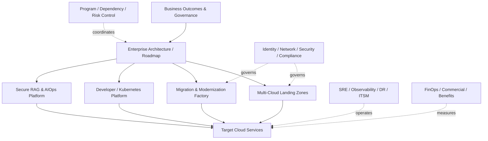

# CS12 — Enterprise Cloud & AI RFP, Proposal and Bid Factory

**Portfolio category:** Presales / Enterprise Architecture / Consulting / Commercial Solutioning  
**Primary role evidence:** Presales Director · Principal Solution Architect · Cloud & AI Transformation Leader  
**Scenario type:** Fictional enterprise procurement and proposal lifecycle using synthetic requirements and commercials  
**Evidence status:** Requirements, qualification, solution, estimation, governance and executive-story frameworks implemented publicly; no claim of a real customer bid or awarded contract

## 1. Executive summary

A global enterprise issues an RFP for cloud modernization and an AI-enabled operations platform. The procurement document mixes strategic goals, technical requirements, incomplete estate data, aggressive timelines and ambiguous responsibilities. Bid teams frequently respond with generic capability statements, optimistic estimates and disconnected architecture diagrams. Commercial, security, delivery and operational assumptions are discovered too late.

This case study designs an enterprise bid factory that converts an ambiguous RFP into a qualified, traceable and executable proposal. It demonstrates the work expected from a principal solution architect or presales leader: discovery, compliance mapping, solution architecture, delivery model, estimation, risk, commercials, value, governance and executive communication.

The synthetic bid includes:

- data-center exit and cloud migration;
- AWS/Azure/GCP landing-zone and platform engineering;
- secure RAG/AI operations capability;
- DevSecOps, SRE, FinOps and managed services;
- transition, knowledge transfer and service governance;
- implementation roadmap and acceptance;
- resource, effort, cost and pricing scenarios;
- assumptions, dependencies, exclusions and risk contingencies;
- bid review gates and oral-presentation storyline.

## 2. Synthetic RFP scenario

`Crescent Global Insurance` is a fictional insurer seeking a strategic partner for a three-year transformation.

### Stated objectives

- exit one legacy data center within 15 months;
- migrate and modernize 420 applications and 3,200 workloads;
- establish governed multi-cloud foundations;
- improve release velocity and resilience;
- reduce infrastructure run-rate;
- introduce secure AI-assisted service operations and knowledge search;
- transition to a product/platform operating model;
- provide managed operations with measurable service levels.

### Procurement constraints

- fixed submission date in six weeks;
- incomplete application and dependency inventory;
- pricing requested in fixed-price, T&M and outcome-based options;
- penalties for critical milestones and service levels;
- regulated data and residency obligations;
- incumbent vendor and licensing constraints;
- mandatory local and global delivery coverage;
- proof of technical and commercial governance.

All quantities and terms are fictional.

## 3. Bid objectives

The bid team must answer:

1. Should the opportunity be pursued?
2. What problem and business outcome are actually being bought?
3. What is known, unknown and assumed?
4. What solution is credible within timeline and risk?
5. Which responsibilities belong to client, bidder and third parties?
6. How are effort, price, contingency and margin derived?
7. Which differentiators are evidenced rather than claimed?
8. How will transition, operations and benefits be governed?
9. What contractual terms could make the bid unacceptable?
10. How will the executive oral presentation build confidence?

## 4. Bid governance and roles

| Role | Accountability |
|---|---|
| Executive sponsor | strategic decision and client relationship |
| Bid director | schedule, governance, compliance and submission |
| Lead solution architect | integrated solution and traceability |
| Tower architects | cloud, network, security, apps, data, AI, operations |
| Delivery lead | plan, staffing, transition and execution risk |
| Commercial lead | price, margin, cash flow and terms |
| Finance | model validation and approvals |
| Legal/contracts | liabilities, IP, data and terms |
| Security/privacy | controls and risk |
| HR/workforce | people transfer, locations and skills |
| Procurement/alliance | provider/vendor commercials |
| Proposal manager/writers | narrative, evidence and consistency |
| Red team | independent challenge and scoring |

## 5. Qualification framework

### Strategic fit

- target services and industries;
- reference capability and capacity;
- account relationship and competitive position;
- reusable assets and partner support;
- delivery geography and talent.

### Commercial attractiveness

- realistic budget and procurement model;
- revenue, margin and cash flow;
- investment and transition cost;
- liability, penalty and termination exposure;
- pricing flexibility and negotiation room.

### Win probability

- access to decision makers;
- clarity of evaluation criteria;
- incumbent/competitor strength;
- differentiators valued by client;
- ability to shape requirements;
- reference/evidence strength;
- solution credibility and price position.

### Delivery risk

- scope and data uncertainty;
- timeline;
- dependency on client/third parties;
- skill and capacity;
- technology maturity;
- security/regulatory constraints;
- transition complexity;
- contract obligations.

### Bid/no-bid gate

A weighted score is reviewed with explicit disqualifiers. A large contract is not automatically a good opportunity.

## 6. Discovery and clarification questions

### Business

- Which outcomes are mandatory versus aspirational?
- What is the cost/impact of missing the data-center exit date?
- Which products/regions have highest strategic priority?
- What baseline will measure savings and velocity?
- Who owns benefit realization?

### Estate

- Is the application/workload inventory complete and reconciled?
- Which dependencies, peak periods and blackout windows exist?
- What are current RTO/RPO, incident and capacity baselines?
- Which licenses and hardware contracts constrain target choices?
- Which systems must remain on premises?

### Cloud/platform

- Is there a preferred provider or workload-placement policy?
- Which landing-zone and security capabilities already exist?
- What network, identity, logging and key-management standards apply?
- What level of self-service/platform engineering is expected?

### AI

- Which workflows and data are approved for AI?
- Are managed and self-hosted models both permitted?
- What human approval and responsible-AI controls are required?
- What model-provider contracts and regions are approved?
- How will quality and value be evaluated?

### Delivery/operations

- What client resources and decision turnaround are committed?
- Is staff transition in scope?
- What tooling/ITSM/observability is mandated?
- What service levels and penalty regimes apply?
- Who owns third-party coordination?

### Commercial/contract

- Is pricing evaluated on total contract value, run-rate or outcome?
- Are cloud consumption and licenses pass-through?
- What inflation, currency and volume protections apply?
- What liability caps, credits and milestone penalties are proposed?
- What assumptions may be formally included?

## 7. Requirements traceability

Every RFP requirement is classified:

- compliant;
- partially compliant;
- compliant with assumption;
- alternative proposed;
- clarification required;
- not compliant / exclusion.

### Traceability example

| RFP ID | Requirement | Response | Solution element | Evidence | Assumption / gap |
|---|---|---|---|---|---|
| CLD-101 | secure multi-cloud foundation | compliant | landing-zone workstream | CS05 patterns | client IdP available |
| MIG-220 | 3,200 workloads in 15 months | qualified | migration factory | CS02 patterns | inventory accuracy gate |
| AI-310 | autonomous incident remediation | alternative | governed AIOps | CS04 patterns | high-risk actions human approved |
| OPS-410 | 99.99% all services | partial | tiered SLO model | CS11 patterns | service tiering required |

Traceability prevents generic prose from hiding a missed contractual requirement.

## 8. Solution strategy

### Transformation workstreams

1. Program mobilization and governance.
2. Discovery, portfolio and business case.
3. Multi-cloud landing zones and shared services.
4. Network, identity, security and compliance.
5. Migration factory and application modernization.
6. Data, integration and database modernization.
7. Platform engineering and DevSecOps.
8. Secure RAG and AIOps pilots.
9. SRE, observability, DR and service transition.
10. FinOps and benefit realization.
11. Managed services and continuous improvement.

### High-level integrated architecture



## 9. Solution narrative

### Phase 1 — Prove and establish foundations

- validate inventory and business priorities;
- establish minimum viable landing zone;
- select pilot migration and AI workflows;
- baseline security, service and cost;
- prove factory timings and acceptance;
- refine commercials from evidence.

### Phase 2 — Scale migration and platform adoption

- execute dependency-led waves;
- onboard product teams to golden paths;
- modernize high-value applications;
- expand SRE/FinOps controls;
- decommission source assets;
- mature AI platform based on evaluated use cases.

### Phase 3 — Operate and optimize

- managed operations and SLO governance;
- automation and AIOps with human control;
- cost and commitment optimization;
- resilience exercises;
- technical-debt and modernization roadmap;
- benefit realization and continuous improvement.

## 10. Assumptions, dependencies and exclusions

### Example assumptions

- client provides accurate inventory and named owners within agreed time;
- cloud accounts/tenants and provider agreements are available;
- client identity and network teams meet design/cutover commitments;
- application testing and business acceptance remain client-accountable;
- migration windows and freezes are approved on schedule;
- third-party vendor cooperation is available;
- real AI data/use cases receive privacy/security approval;
- volume beyond defined baseline follows change control.

### Dependencies

- data-center lease and hardware schedules;
- carrier/interconnect lead times;
- software/vendor licensing;
- regulatory approvals;
- client decisions and access;
- source-system remediation;
- provider capacity and quotas;
- staffing and transition obligations.

### Exclusions

- unknown application functional defects;
- business-process redesign unless specified;
- unsupported systems without vendor path;
- penalties caused by client/third-party dependency failure unless contract allocates otherwise;
- autonomous high-risk AI action;
- unbounded data remediation.

Assumptions are quantified and linked to price/schedule impact where possible.

## 11. Effort estimation model

### Bottom-up work breakdown

For each workstream:

```text
activity
x quantity/volume
x complexity factor
x productivity rate
+ governance/management
+ transition/knowledge transfer
+ testing/hypercare
+ contingency
```

### Migration example

```text
workloads_by_complexity
x assessment_hours
+ remediation_hours
+ build_and_migration_hours
+ test_and_cutover_hours
+ hypercare_hours
```

### Complexity drivers

- application criticality and dependencies;
- data/database size;
- downtime and RPO/RTO;
- regulatory and security requirements;
- modernization depth;
- geographic/organizational complexity;
- tooling and automation reuse;
- source data quality;
- client and third-party readiness.

### Estimation validation

- compare bottom-up, analogous and parametric views;
- run scenario and sensitivity analysis;
- identify assumptions driving most variance;
- separate one-time and recurring effort;
- validate delivery calendar and available staffing, not only person-month totals.

## 12. Resource and organization model

### Core leadership

- program director;
- chief/lead architect;
- transformation/migration lead;
- cloud/platform/security/data/AI tower leads;
- service transition and operations lead;
- PMO, quality, commercial and FinOps.

### Delivery pods

- discovery/assessment;
- foundation/network/security;
- migration/application;
- database/data;
- platform/DevSecOps;
- AI/RAG/AIOps;
- testing/cutover;
- SRE/operations.

### Location model

Onsite/nearshore/offshore allocation considers client interaction, regulatory/data access, time zones, transition risk, cost and talent. Percentages are not chosen solely to reduce price.

## 13. Delivery plan and milestones

| Milestone | Indicative timing | Acceptance |
|---|---:|---|
| Mobilization complete | Month 1 | governance, access, plan and baseline |
| Minimum landing zone | Month 3 | security/network/logging and pilot ready |
| Pilot migrations/AI use case | Month 4 | acceptance and refined factory metrics |
| Factory scale gate | Month 5 | wave capacity, tooling and controls ready |
| 50% migration | Month 10 | accepted workloads and decommission progress |
| Data-center exit | Month 15 | source closure criteria |
| Managed-service steady state | Month 18 | SLA, support and optimization baseline |

Schedule includes decision, dependency and procurement lead times rather than only engineering duration.

## 14. Governance

### Forums

- executive steering committee;
- program management office;
- architecture review board;
- security/risk forum;
- migration control tower;
- service and SLO review;
- FinOps/commercial review;
- change and release forum;
- benefits-realization review.

### Decision rights

The proposal defines who recommends, approves, executes and accepts architecture, exceptions, waves, failover, commercial change and service transition.

### Reporting

- outcome and milestone status;
- scope and requirement traceability;
- risk/issues/dependencies/decisions;
- migration and modernization throughput;
- security/control evidence;
- SLO/incident/service performance;
- cost, forecast and benefits;
- resource/capacity;
- client obligations.

## 15. Risk model

| Risk | Commercial/delivery impact | Mitigation |
|---|---|---|
| Inventory inaccurate | effort/schedule variance | discovery gate and rebaseline mechanism |
| Client decisions delayed | idle cost/milestone delay | decision SLA and dependency log |
| Network lead time | pilot/factory delay | early order and alternate pattern |
| Application remediation higher | scope growth | complexity bands and change control |
| Data migration exceeds windows | outage/delay | PoC, rehearsal and alternative tooling |
| AI use case lacks data approval | pilot blocked | select alternate synthetic/approved case |
| Staff transition attrition | service risk | retention, shadow/support and capacity reserve |
| Fixed-price ambiguity | margin loss | assumptions, units, bands and contingency |
| SLA penalties disproportionate | commercial exposure | tiered SLA and liability negotiation |
| Cloud cost benefit not realized | client dissatisfaction | baseline, FinOps and joint ownership |

## 16. Commercial model

### Cost components

- bid and mobilization investment;
- labor by role/location/phase;
- tooling and platform licenses;
- cloud/provider consumption;
- travel/facilities;
- third-party services;
- transition and parallel run;
- contingency/risk reserve;
- inflation/currency;
- managed-service operations;
- subcontractor/alliance cost.

### Pricing options

#### Time and materials

Best when scope/estate is uncertain. Use rates, capacity and governance with transparent backlog.

#### Fixed price by defined scope/unit

Use clear quantities, complexity bands, assumptions, acceptance and change control.

#### Managed service / recurring

Price by service scope, volumes, tier and SLA. Separate consumption/pass-through where appropriate.

#### Outcome/gain share

Use only when baseline, measurement and causal ownership are agreed. Avoid tying the supplier to outcomes controlled predominantly by client decisions or business demand.

### Example unit prices

- per assessed application/workload;
- per migration complexity band;
- per account/project/onboarded product team;
- per managed service tier;
- per approved AI use case/pilot;
- per platform service or environment.

## 17. Margin, cash flow and risk

The commercial model includes:

- revenue recognition/milestone timing;
- payment terms and working capital;
- ramp and bench risk;
- productivity and automation assumptions;
- discount and rate erosion;
- subcontractor/provider exposure;
- inflation and currency;
- penalty/service credit probability;
- change-order potential;
- transition investment and recovery;
- termination and stranded cost.

A technically attractive bid can still be commercially unacceptable.

## 18. Contractual review

Key clauses:

- scope and acceptance;
- change control;
- client dependencies;
- data protection/residency;
- security obligations and incident notification;
- IP and reusable assets;
- model/data rights for AI;
- warranties and fitness;
- liability/indemnity;
- service credits and penalties;
- audit and regulatory access;
- subcontractors;
- termination/transition assistance;
- benchmarking and price reductions;
- volume bands and inflation.

Solution and contract must be consistent. A proposal cannot promise flexibility while the contract fixes every assumption.

## 19. Value case and benefits

### Benefit categories

- avoided lease/hardware refresh;
- source operations and license reduction;
- faster environment and release lead time;
- incident/downtime reduction;
- automation productivity;
- cloud rightsizing/commitments;
- application modernization value;
- AI-assisted workflow savings;
- risk/compliance improvement;
- business agility and time to market.

### Benefit governance

- baseline owner and date;
- calculation method;
- target and confidence;
- supplier/client contribution;
- evidence source;
- realization date;
- dependency and risk;
- recurring versus one-time.

Benefits are not counted twice across migration, platform and managed service workstreams.

## 20. Differentiation strategy

Credible differentiators are tied to evidence:

- migration factory with explainable 6R/wave planning;
- AI-ready multi-cloud landing-zone modules;
- internal developer-platform golden paths;
- secure RAG and governed AIOps controls;
- cloud/AI FinOps unit economics;
- resilience and game-day program;
- reusable delivery documents, runbooks and CI evidence;
- transparent synthetic portfolio demonstrating the proposed methods.

Avoid generic statements such as “best-in-class,” “world-leading” or “seamless” unless supported.

## 21. Compliance matrix and proposal structure

### Proposal structure

1. Executive summary.
2. Understanding of client objectives.
3. Solution and architecture.
4. Transformation roadmap.
5. Delivery and organization.
6. Security, risk and compliance.
7. Operations, SRE and managed services.
8. FinOps, commercials and value.
9. Assumptions, dependencies and exclusions.
10. Experience, evidence and differentiators.
11. Compliance matrix.
12. Appendices: diagrams, CVs, methods and pricing.

### Quality checks

- every mandatory requirement answered;
- consistent quantities/dates/names;
- architecture matches scope and price;
- assumptions reflected in contract/commercials;
- no unsupported customer claims;
- graphics readable and labelled;
- executive narrative is outcome-led;
- red-team findings resolved or accepted.

## 22. Bid review gates

### Pink team

Early solution and story: Does the response address the buyer’s real problem?

### Red team

Independent buyer/evaluator review: Is it compliant, credible, differentiated and easy to score?

### Gold team

Executive/commercial approval: Is the final offer strategically and financially acceptable?

### Final production

Compliance, proofreading, cross-reference, file/portal validation and submission evidence.

## 23. Oral presentation

### Storyline

1. Reflect the client’s business urgency and risk.
2. Explain the transformation choices and why.
3. Show integrated architecture and phased roadmap.
4. Demonstrate migration, platform, AI and operations evidence.
5. Explain governance, decision rights and risk control.
6. Present value, commercials and flexibility honestly.
7. Introduce accountable leaders and first 90 days.
8. Answer likely evaluator concerns directly.

### Demonstration

Use one end-to-end scenario: a business application assessed, placed into a wave, onboarded to the landing zone and platform, operated through SRE/AIOps and measured through FinOps.

## 24. Transition to delivery

Before contract signature or mobilization:

- transfer solution assumptions and decision log;
- baseline scope/volumes;
- confirm resources and partners;
- convert bid plan into integrated delivery plan;
- establish architecture and commercial change control;
- create risk and dependency register;
- confirm client obligations;
- hand over estimation model and productivity assumptions;
- preserve proposal/contract traceability;
- avoid sales-to-delivery information loss.

## 25. Architecture decisions

### ADR-001 — Qualify before solutioning deeply

**Decision:** Use explicit bid/no-bid and disqualifier review.  
**Reason:** Bid investment and delivery exposure must be justified.  
**Trade-off:** May decline large but unattractive opportunities.

### ADR-002 — Trace every requirement

**Decision:** Maintain compliance/solution/evidence/assumption mapping.  
**Reason:** Prevent missed requirements and contract surprises.  
**Trade-off:** Significant bid-management discipline.

### ADR-003 — Price uncertainty transparently

**Decision:** Use units, complexity bands, assumptions and change mechanisms.  
**Reason:** False precision in an incomplete estate creates margin and delivery risk.  
**Trade-off:** Client may prefer a simpler headline price.

### ADR-004 — Start AI with bounded use cases

**Decision:** Do not promise autonomous enterprise AI transformation in the initial scope.  
**Reason:** Data, governance and value must be proven.  
**Trade-off:** Less dramatic proposal, higher credibility.

### ADR-005 — Preserve sales-to-delivery traceability

**Decision:** Bid assumptions and model become delivery controls.  
**Reason:** Most proposal risk appears after handover if context is lost.  
**Trade-off:** More structured mobilization.

## 26. Repository implementation map

```text
README.md
rfp/synthetic-rfp.md                # buyer requirements
qualification/bid-scorecard.yaml    # bid/no-bid model
traceability/compliance-matrix.csv  # requirement mapping
solution/architecture.md            # integrated HLD
commercials/estimation-model.csv    # synthetic effort and pricing model
commercials/scenarios.md            # T&M/fixed/managed/outcome options
risks/risk-register.csv
proposal/executive-summary.md
oral-presentation/storyboard.md
scripts/validate_bid.py             # completeness/consistency checks
tests/                              # traceability and commercial tests
evidence/                           # synthetic review outputs
```

## 27. Acceptance criteria

1. Every mandatory RFP item is traceable to response and evidence.
2. Scope, architecture, plan, estimate and price use consistent volumes.
3. Assumptions/dependencies/exclusions are explicit.
4. Estimation includes complexity, governance, transition, testing and contingency.
5. Commercial scenarios show margin/risk sensitivity.
6. Contract risks have recommended negotiation positions.
7. Value targets have baseline, owner and measurement method.
8. Red-team issues are resolved or accepted.
9. Oral story can explain the first 90 days and critical decisions.
10. No fictional customer reference is presented as real.

## 28. Demo walkthrough

1. Open the synthetic RFP and identify ambiguity.
2. Run qualification scorecard and explain pursue decision.
3. Show clarification questions and assumptions.
4. Trace selected requirements into solution components.
5. Present integrated cloud, migration, platform and AI architecture.
6. Walk through work breakdown, complexity and staffing.
7. Compare T&M, fixed-price and managed-service scenarios.
8. Review risks, liability and client dependencies.
9. Deliver a five-minute executive oral presentation.
10. Show delivery-handover package and validation report.

## 29. Implementation status

| Capability | Status |
|---|---|
| Bid lifecycle, governance and architecture | Implemented in documentation |
| Synthetic RFP and compliance model | Implemented/planned public artifacts |
| Qualification and estimation model | Implemented synthetic logic |
| Commercial and risk scenarios | Implemented synthetic examples |
| Proposal/oral structure | Implemented |
| Automated completeness checks | Implemented scaffold |
| Real client pricing or contracts | Not included |
| Awarded deal / revenue claim | None |

## 30. Interview story

**Situation:** A large cloud/AI RFP combines incomplete estate data, ambitious outcomes, fixed timelines and risky commercial terms.  
**Task:** Create a credible and winnable proposal without hiding uncertainty.  
**Action:** Qualified the pursuit, built requirement traceability, integrated cloud/migration/platform/AI/operations architecture, estimated bottom-up with complexity bands, modelled commercial scenarios, documented assumptions and contract risks, and shaped an executive outcome story.  
**Result:** A decision-ready bid approach that aligns architecture, delivery, price, risk and value from pursuit through mobilization.

## 31. Resume / profile proof line

Built an enterprise cloud and AI bid-factory case study covering bid/no-bid qualification, RFP clarification, compliance traceability, integrated architecture, bottom-up estimation, staffing, fixed/T&M/managed-service commercials, risk and contract review, value case, red-team governance and executive oral presentation.

## 32. Honest-use statement

This is a fictional bid and public presales demonstration. It contains no real client documents, prices, contracts or awarded-deal claims.